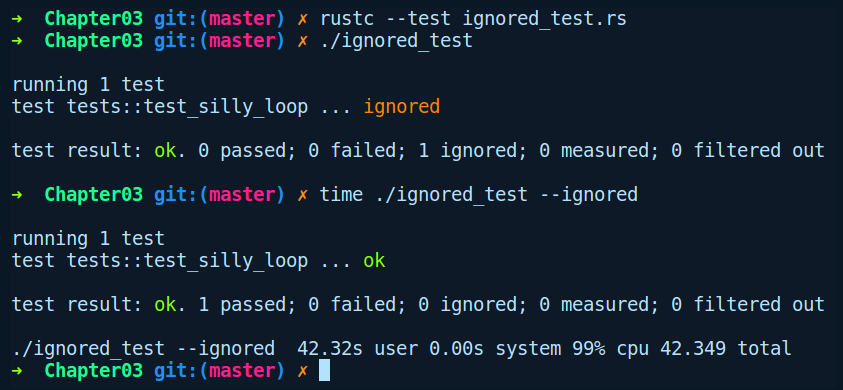

### 3.3.5　忽略测试

编写测试时另一个有用的属性是#[ignore]。如果你的测试代码量非常庞大，那么可以使用#[ignore]属性标记告知测试工具在执行cargo test命令时忽略此类测试功能。然后你可以向测试工具或cargo test命令传递--ignored参数来单独运行这些测试。下面的代码包含一个笨拙的循环操作，当运行cargo test命令时，默认情况下会被忽略：

```rust
// silly_loop.rs
pub fn silly_loop() {
    for _ in 1..1_000_000_000 {};
}
#[cfg(test)]
mod tests {
    #[test]
    #[ignore]
    pub fn test_silly_loop() {
        ::silly_loop();
    }
}
```

注意test_silly_loop函数上方的#[ignore]属性，下面是忽略测试后的输出结果：




**注意**

也可以通过向Cargo提供测试函数名称来运行单个测试，例如cargo test some_test_func。


