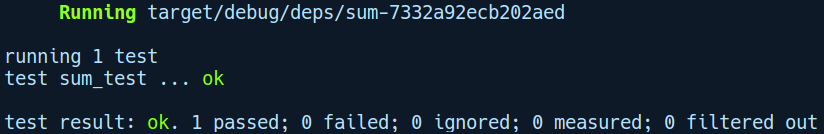

### 3.4.1　第一个集成测试

如前所述，Rust希望所有集成测试都在tests/目录下进行。在我们对程序库进行测试时，tests/目录中的文件会被编译成相对独立的二进制程序包。在接下来的示例中，我们将通过运行cargo new integration_test --lib命令创建一个新的程序库。和前面的单元测试一样，其中还包含相同的sum函数，不过我们现在添加了一个tests/目录，其中包含一个集成测试函数，定义如下所示：

```rust
// integration_test/tests/sum.rs
use integration_test::sum;
#[test]
fn sum_test() {
    assert_eq!(sum(6, 8), 14);
}
```

首先，将sum函数纳入作用域。其次，我们使用一个sum_test函数，它在返回值时会调用sum函数和断言函数。当我们尝试运行cargo test命令时，会出现以下错误：


这个错误似乎很合理。我们希望程序库的用户调用sum函数，但是在程序库中却默认将其定义为私有的。因此，在sum函数之前添加pub修饰符，再次运行cargo test命令后，编译顺利通过：


这里是我们的integration_test示例程序库的目录树视图：

```rust
.
├── Cargo.lock
├── Cargo.toml
├── src
│   └── lib.rs
└── tests
     └── sum.rs
```

作为一个集成测试的例子，这是非常简单的。它的关键在于，当我们编写集成测试时，可以像程序库的任何其他用户那样使用被测试的软件包。

