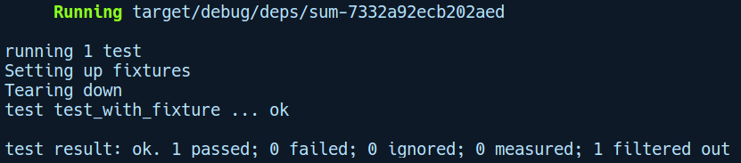

### 3.4.2　共享通用代码

和集成测试的情况类似，在实际运行测试之前，我们可能需要设置一些与安装和拆卸有关的代码，通常希望它们由tests/目录下的所有文件共享。对于共享代码，我们可以将它们创建为共享通用代码的文件目录模块，或者使用模块foo.rs，在我们的集成测试文件中使用 mod 关键字来声明和引用它。因此，在我们之前添加的 tests/目录中，将会添加一个common.rs模块，其中有两个名为setup和teardown的函数：

```rust
// integration_test/tests/common.rs
pub fn setup() {
    println!("Setting up fixtures");
}
pub fn teardown() {
    println!("Tearing down");
}
```

在这两个函数中，我们可以使用任何类型与基础固件相关的代码，例如一个依赖文本文件的集成测试。在setup函数中，我们可以创建该文本文件，同时在teardown函数中，我们可以通过删除该文件来清理资源。

为了在tests/sum.rs的集成测试代码中使用这些函数，我们将添加如下mod声明：

```rust
// integration_test/tests/sum.rs
use integration_test::sum;
mod common;
use common::{setup, teardown};
#[test]
fn sum_test() {
    assert_eq!(sum(6, 8), 14);
}
#[test]
fn test_with_fixture() {
    setup();
    assert_eq!(sum(7, 14), 21);
    teardown();
}
```

我们添加了另外一个函数test_with_fixture，其中包括对函数setup和teardown的调用。可以使用cargo test test_with_fixture命令运行此测试。从测试结果中可以发现，我们没有在任何地方发现setup或teardown函数对println!宏的调用。这是因为默认情况下，测试工具会在测试函数中隐藏或捕获printIn!语句，以使测试结果更整洁，并仅显示测试工具的输出。如果我们想在测试中查看printIn!语句的输出，那么可以使用cargo test test_with_fixture -- --nocapture命令运行测试，它的输出结果如下所示：


现在我们可以看到printIn!语句的输出结果。我们需要在cargo test test_with_fixture -- --nocapture命令中用到“--”，是因为实际上我们将“--nocapture”标记参数传递给测试运行器。“--”是Cargo自身参数结束的标记，并且之后的任何参数都是传递给Cargo调用的二进制文件的，该文件由我们的测试工具编译。

这是和集成测试有关的内容。在本章的最后，我们将创建一个项目，你会看到单元测试和集成测试同时运作。接下来，我们将学习如何文档化Rust代码，这是一个在软件开发中容易被忽视但非常重要的部分。

