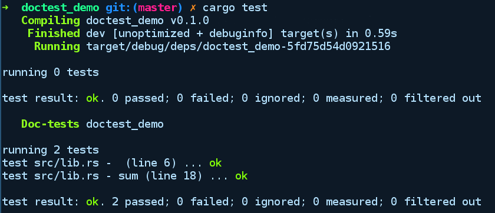

### 3.5.5　文档化测试

将代码示例嵌入软件包公共API的任何文档通常是一种很好的做法。在维护这些示例时需要注意，你的代码可能会发生变化，但是可能会忘记更新这些示例。文档化测试（doctests）也可以提醒你更新代码示例。Rust 允许你在文档注释中使用“'”来嵌入代码。Cargo可以运行嵌入文档中的代码，并将其视为单元测试套件的一部分。这意味着每次运行单元测试时都会运行文档示例，从而强制你更新它们。

文档化测试也是通过Cargo执行的。我们创建了一个项目doctest_demo来演示文档化测试的过程。在lib.rs中，我们有以下代码：

```rust
// doctest_demo/src/lib.rs
//! This crate provides functionality for adding things
//!
//! # Examples
//! '''
//! use doctest_demo::sum;
//!
//! let work_a = 4;
//! let work_b = 34;
//! let total_work = sum(work_a, work_b);
//! '''
/// Sum two arguments
///
/// # Examples
///
/// '''
/// assert_eq!(doctest_demo::sum(1, 1), 2);
/// '''
pub fn sum(a: i8, b: i8) -> i8 {
    a + b
}

```

如你所见，模块级和函数级之间的文档测试差异并不大。它们的使用方式几乎相同。只是模块级的文档化测试显示了软件包的总体使用方法，涵盖了多个API，而函数级的文档化测试只涵盖了它们拥有的特定功能。

运行cargo run命令时，文档化测试将与所有其他测试一起运行。下面是我们在doctest_demo程序库中运行cargo test命令后的输出结果：


