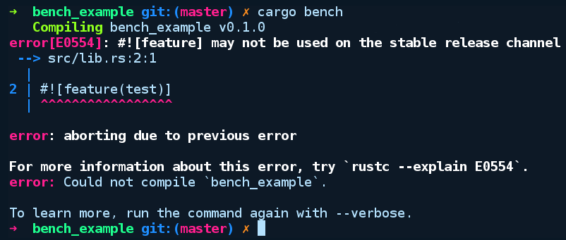

### 3.6.1　内置的微观基准工具

Rust内置的基准测试框架通过运行多次迭代来评估代码的性能，并报告相关操作的平均时间。这得益于以下两件事。

+ 函数上方的#[bench]注释，这表示该函数是一个基准测试。
+ 内部编译器软件包libtest包含一个Bencher类型，基准函数通过它在多次迭代中运行相同的基准代码，此类型是针对编译器内部的，只适用于测试模式。

现在，我们将编写并运行一个简单的基准测试。让我们通过cargo new --lib bench_example命令创建一个新的项目。不需要对Cargo.toml文件做任何修改。src/lib.rs中的内容如下所示：

```rust
// bench_example/src/lib.rs
#![feature(test)]
extern crate test;
use test::Bencher;
pub fn do_nothing_slowly() {
    print!(".");
    for _ in 1..10_000_000 {};
}
pub fn do_nothing_fast() {
}
#[bench]
fn bench_nothing_slowly(b: &mut Bencher) {
    b.iter(|| do_nothing_slowly());
}
#[bench]
fn bench_nothing_fast(b: &mut Bencher) {
    b.iter(|| do_nothing_fast());
}
```

注意，我们必须在test前面使用extern crate来声明内部软件包测试，以及#[feature(test)]属性注释。extern声明对于编译器内部的软件包而言是必须的。在编译器未来的版本中，可能不需要这样，并且你可以像使用普通的软件包一样使用它们。

如果我们通过cargo bench命令运行基准测试代码，将会得到以下输出结果：


不幸的是，基准测试是一个不稳定的特性，所以我们必须使用夜间版的编译器。但幸运的是，通过rustup，在Rust编译器的不同发布通道之间切换很容易。首先，我们将通过运行rustup update nightly命令确保已经安装了夜间版的编译器。其次，在bench_example目录中，我们将通过运行rustup override set nightly命令来覆盖此目录的默认工具链。现在，运行cargo bench命令后将得到以下输出结果：


这是以纳秒（ns）为单位的执行每次迭代花费的时间，括号内的数字表示每次运行之间的差异。性能较差的实现的运行速度非常慢，并且运行时间不固定（用+/−符号所示）。

在标有#[bench]注释的函数内部，iter的参数是一个没有参数的闭包函数。如果闭包有参数，那么它们将位于“||”之内。这实际上意味着iter传递的函数可以使基准测试重复运行。我们在函数中输出一个“.”，这样Rust就不至于对空循环进行优化。如果其中不存在println!()宏调用，编译器将会优化代码不执行该循环，那么会得到错误的结果。有多种办法来解决此问题，如可以通过使用tests模块中的black_box函数来完成。不过，即使使用该函数也不能保证优化器不会优化你的代码。现在，我们还有第三方的解决方案——在稳定版Rust上执行基准测试。

