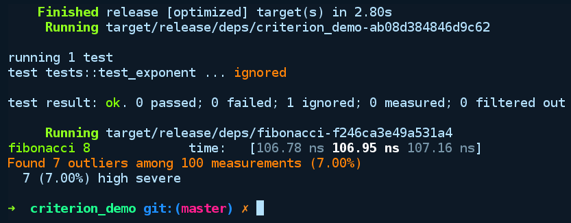
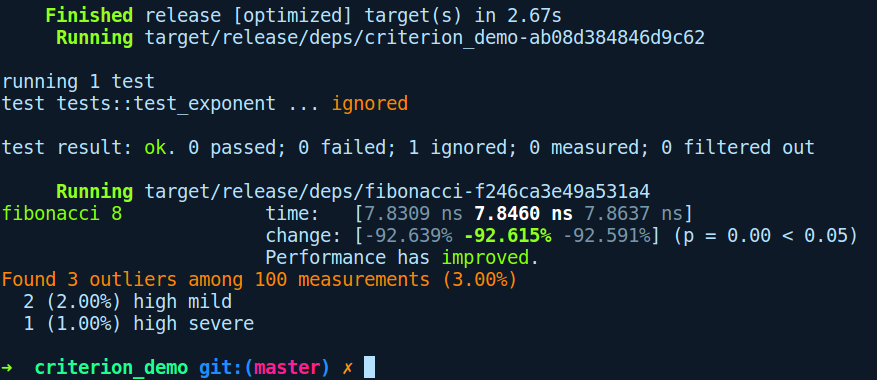

### 3.6.2　稳定版Rust上的基准测试

Rust内置的基准测试框架不稳定，幸运的是，社区开发的基准测试软件包能够兼容稳定版的Rust。这里我们将介绍的一款当前非常流行的软件包是criterion-rs。该软件包在简单、易用的同时提供有关基准代码的详细信息。它还能够维护上次运行的状态，报告程序每次运行时的性能差异（如果有的话）。criterion-rs会生成比内置基准测试框架更多的统计报告，并使用gnuplot生成实用的图形和报表，使用户更容易理解。

为了演示该软件包的使用，我们将通过cargo new criterion_demo --lib命令创建一个新的软件包。然后在Cargo.toml中将criterion软件包作为dev-dependencies下的依赖项来引入它：

```rust
[dev-dependencies]
criterion = "0.1"
[[bench]]
name = "fibonacci"
harness = false
```

我们还添加了一个名为“[[bench]]”的新属性，它向Cargo表明我们有一个名为fibonacci的新基准测试，并且它不使用内置的基准测试工具（harness=false）。因为我们正在使用criterion软件包的测试工具。

在我们的scr/lib.rs文件中，包含计算第n个fibonacci数函数的一个快速版本和一个慢速版本（初始值n0=1，n1=1）：

```rust
// criterion_demo/src/lib.rs
pub fn slow_fibonacci(nth: usize) -> u64 {
    if nth <= 1 {
        return nth as u64;
    } else {
        return slow_fibonacci(nth - 1) + slow_fibonacci(nth - 2);
    }
}
pub fn fast_fibonacci(nth: usize) -> u64 {
    let mut a = 0;
    let mut b = 1;
    let mut c = 0;
    for _ in 1..nth {
        c = a + b;
        a = b;
        b = c;
    }
    c
}
```

函数fast_fibonacci是通过自下而上的方式迭代获得第n个fibonacci数的，而slow_fibonacci是慢速递归版本的函数。现在，criterion-rs要求我们将基准测试代码放到benches/目录下，该目录一般位于我们创建的项目根目录。在benches/目录下，我们也创建了一个名为fibonacci.rs的文件，该文件与Cargo.toml文件中“[[bench]]”项下的名称匹配，它具有以下内容：

```rust
// criterion_demo/benches/fibonacci.rs
#[macro_use]
extern crate criterion;
extern crate criterion_demo;
use criterion_demo::{fast_fibonacci, slow_fibonacci};
use criterion::Criterion;
fn fibonacci_benchmark(c: &mut Criterion) {
    c.bench_function("fibonacci 8", |b| b.iter(|| slow_fibonacci(8)));
}
criterion_group!(fib_bench, fibonacci_benchmark);
criterion_main!(fib_bench);
```

这里完成了很多操作！在上述代码中，我们首先声明需要用到的软件包，并导入希望对fibonacci函数进行基准测试的函数（fast_fibonacci和slow_fibonacci）。此外，“extern crate criterion”上面有一个#[macro_use]属性，这意味着要使用来自此软件包的任何宏时，我们需要使用此属性来选择它，因为默认情况下它们是非公开的。它类似于 use 语句，用于公开模块中的元素。

现在criterion已经具有可以保存相关基准测试代码基准组的标记。此外，我们创建了一个名为 fibonacci_benchmark 的函数，之后会将其传递给宏 criterion_group!。这会将fib_bench的基准名称分配给基准组。fibonacci_benchmark函数会接收一个指向criterion对象的可变引用，它保存了基准代码的运行状态，公开了一个名为bench_function的函数，通过它传递基准代码以在具有给定名称的闭包中运行（在fibonacci 8之上）。然后，我们需要创建主要的基准测试工具，在传入基准测试组fib_bench之前，它会生成带有main函数的代码，以便通过宏criterion_main!运行所有代码。现在闭包中将cargo bench命令和第一个slow_fibonacci函数一起运行。我们得到以下输出结果：


我们可以看到，递归版本的fibonacci函数运行时间平均约为106.95ns。现在，在相同的基准测试闭包中，如果我们使用fast_fibonacci函数替换slow_fibonacci函数，并再次运行cargo bench命令，将会得到以下输出结果：


fast_fibonacci函数运行时间平均约为7.8460ns。差异非常明显，但更重要的是详细的基准测试报告，它显示了一条友好的信息：“Performance has improved”（性能得到了改善）。criterion能够显示性能差异报告的原因是它会维护基准测试先前的状态，并使用其历史记录来报告程序的性能变化。

