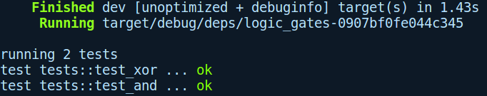
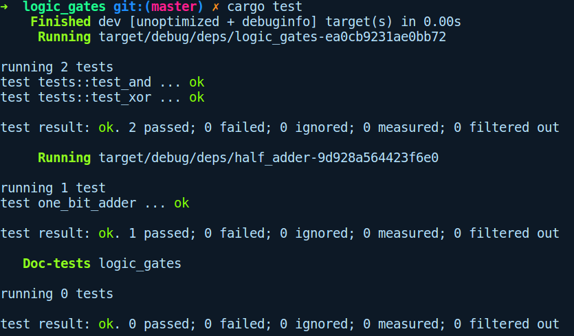
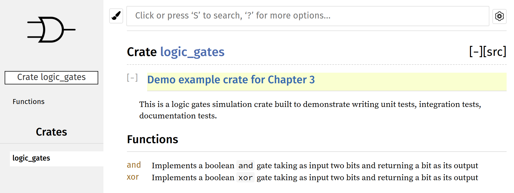

### 3.7　编写和测试软件包——逻辑门模拟器

掌握上述所有知识后，让我们学以致用，编写一个逻辑门模拟器程序。通过运行cargo new logic_gates --lib命令创建一个新项目。然后从实现诸如与（and）、异或（xor）等基本的逻辑门函数入手，为它们编写单元测试。接下来，将使用原始的逻辑门函数实现一个半加法器来编写集成测试。在此过程中，还将为程序编写文档。

首先，我们将从一些单元测试开始。以下是完整的初始代码：

```rust
//!这是一个逻辑门模拟器程序，用于演示编写单元测试和集成测试
unit tests and integration tests
// logic_gates/src/lib.rs
pub fn and(a: u8, b: u8) -> u8 {
    unimplemented!()
}
pub fn xor(a: u8, b: u8) -> u8 {
    unimplemented!()
}
#[cfg(test)]
mod tests {
    use crate::{xor, and};
    #[test]
    fn test_and() {
        assert_eq!(1, and(1, 1));
        assert_eq!(0, and(0, 1));
        assert_eq!(0, and(1, 0));
        assert_eq!(0, and(0, 0));
    }
    #[test]
    fn test_xor() {
        assert_eq!(1, xor(1, 0));
        assert_eq!(0, xor(0, 0));
        assert_eq!(0, xor(1, 1));
        assert_eq!(1, xor(0, 1));
    }
}
```

我们首先实现了两个逻辑门函数and和xor。还有一些运行失败的测试用例，因为它们还没有具体实现。注意，为了表示位0和1，我们使用u8类型，因为Rust中没有原生类型用于表示位。现在，让我们完善它们的实现以及一些文档：

```rust
/// 实现一个逻辑门and，将两个位作为输入，并返回一个位作为输出
bit as output
pub fn and(a: u8, b: u8) -> u8 {
    match (a, b) {
        (1, 1) => 1,
        _ => 0
    }
}
/// 实现一个逻辑门xor，将两个位作为输入，并返回一个位作为输出
a bit as output
pub fn xor(a: u8, b: u8) -> u8 {
    match (a, b) {
        (1, 0) | (0, 1) => 1,
        _ => 0
    }
}
```

在上述代码中，我们只是用match表达式表示了and和xor逻辑门的真值表。可以看到简洁的表达式如何表示我们的逻辑。现在，可以通过cargo test命令运行测试：


全部顺利执行！现在准备通过这些逻辑门实现半加法器来编写集成测试。半加法器非常适合用作集成测试的示例，因为它们一起使用可以测试程序库的单个组件。在tests/目录下，将创建一个名为half_adder.rs的文件，其中包含如下代码：

```rust
// logic_gates/tests/half_adder.rs
use logic_gates::{and, xor};
pub type Sum = u8;
pub type Carry = u8;
pub fn half_adder_input_output() -> Vec<((u8, u8), (Sum, Carry))> {
    vec![
        ((0, 0), (0, 0)),
        ((0, 1), (1, 0)),
        ((1, 0), (1, 0)),
        ((1, 1), (0, 1)),
    ]
}
/// 该函数使用原始的逻辑门实现了一个半加法器
fn half_adder(a: u8, b: u8) -> (Sum, Carry) {
    (xor(a, b), and(a, b))
}
#[test]
fn one_bit_adder() {
    for (inn, out) in half_adder_input_output() {
        let (a, b) = inn;
        println("Testing: {}, {} -> {}", a, b, out);
        assert_eq!(half_adder(a, b), out);
    }
}
```

在上述代码中，我们导入了原始的逻辑门函数and和xor。接下来，我们有“pub type Sum = u8”这样的代码，它被称为类型别名（type alias）。这在你需要每次输入烦琐的类型名称或者具有复杂特征的类型时非常有用。它为原始的类型赋予了另一个名称，其纯粹是为了提高可读性和消除歧义；这对Rust解析这些类型的方式没有任何影响。然后我们会在half_adder_input_output函数中使用Sum和Carry，通过它们实现半加法器的真值表。该函数是一个使用方便的辅助函数，可以用于测试后面的half_adder函数。half_adder_input_output函数接收两个位作为输入，并对Sum和Carry的值进行计算，并将它们作为(Sum,Carry)元组进行返回。然后我们有集成测试函数one_bit_adder，会对其中的输入/输出对进行迭代，并对half_adder的输出进行断言。通过运行cargo test命令，得到以下输出结果：


接下来让我们通过运行cargo doc --open命令为程序库生成文档。--open标记参数表示在浏览器中为我们打开文档页面。为了对文档进行自定义设置，我们可在程序库文档页面中添加一个图标。为此，我们需要在lib.rs文件的顶部添加如下属性：

```rust
#![doc(html_logo_url =
"https://d30y9cdsu7xlg0.cloudfront.net/png/411962-200.png")]
```

生成后，文档页面如下所示：


我们在“测试之旅”已经走了很长一段路。接下来，让我们了解一下自动化测试套件方面的内容。

