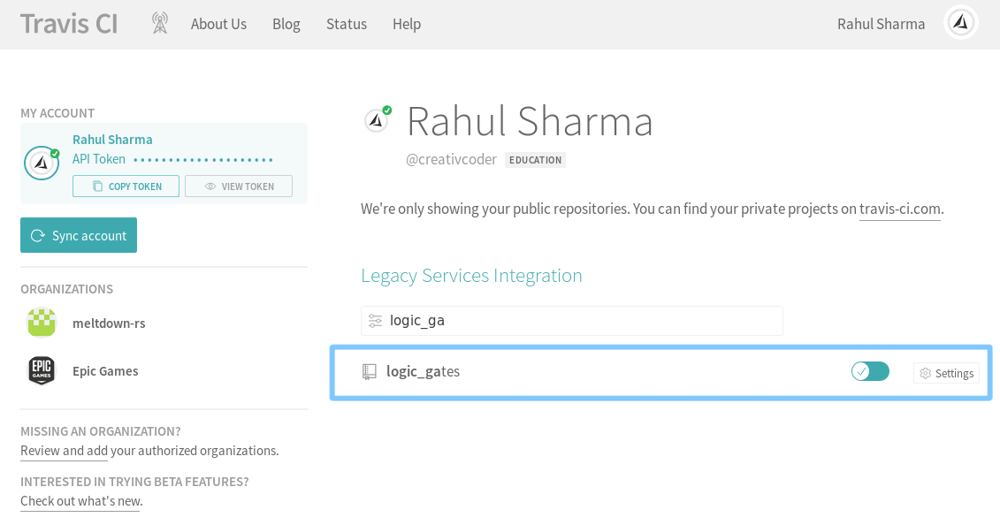
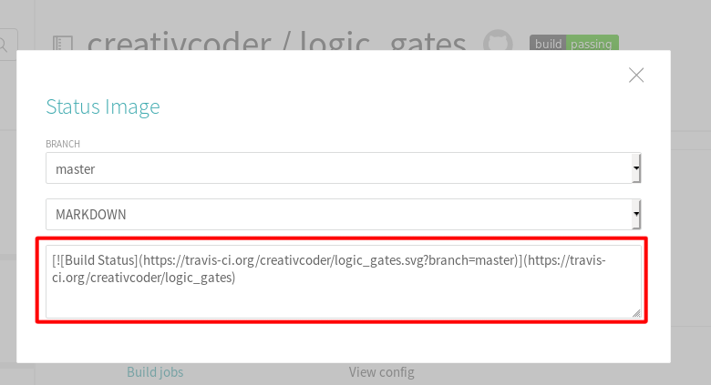
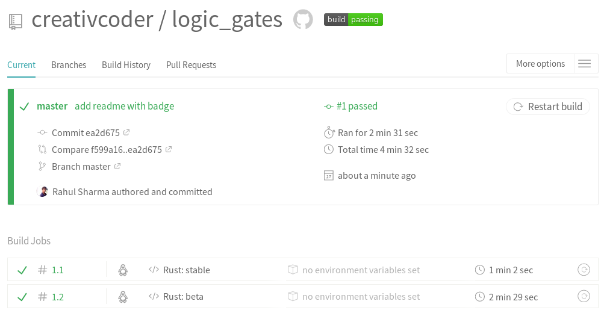

### 3.8　CI集成测试与Travis CI

在大型软件系统中经常出现的情况是，对于每次代码的更改，我们都希望单元测试和集成测试能够自动化执行。此外，在协作项目中，手动测试的方式是不切实际的。幸运的是，持续集成是一种旨在自动化软件开发的实践。Travis CI是一种公共的持续集成服务，允许你基于事件钩子在云端自动化运行项目测试。出现新的提交推送是事件钩子的示例之一。

Travis一般用于自动化构建和测试，并报告失败的构建操作，也可以用于创建软件版本，甚至在临时或生产环境部署软件。本节将会重点介绍Travis的某些特性，从而为我们的项目执行自动化测试。GitHub已经与Travis集成，可以在我们的项目发送新的提交时运行测试。要实现这一目标，我们需要具备以下条件。

+ 在GitHub上拥有一个项目。
+ 拥有Travis中的一个账户，用于登录GitHub。
+ 你的项目支持在Travis中构建。
+ 拥有一个位于你的版本库根目录下的.travis.yml文件，用于告知Travis执行哪些内容。

第一步是访问travis-ci网站，并使用自己的GitHub凭据登录。登录后，可以在Travis中添加我们的GitHub版本库。Travis对Rust项目提供了很好的原生支持，并能够确保及时更新Rust编译器的版本。它为Rust项目提供了基本的.travis.yml文件，如下所示：

```rust
language: rust
rust:
  - stable
  - beta
  - nightly
matrix:
  allow_failures:
  - rust: nightly
```

Rust项目也建议对测试版和夜间版通道进行测试，不过你也可以通过删除相应的行来仅针对单一版本进行测试。上述推荐的配置是在3种版本上运行测试，并且允许快速切换到夜间版编译器上执行失败的用例。

根据此版本库中的.travis.yml文件，GitHub将会在每次推送代码并自动运行测试时通知Travis CI。我们还可以将构建状态标记附加到版本库的README.md文件中，该文件在测试通过时显示绿色标记，在测试失败时显示红色标记。

我们将Travis与logic_gates整合到一起。为此，需要添加一个.travis.yml文件到程序库的根目录下。以下是.travis.yml文件中的内容：

```rust
language: rust
rust:
  - stable
  - beta
  - nightly
matrix:
  allow_failures:
    - rust: nightly
  fast_finish: true
cache: cargo
script:
  - cargo build --verbose
  - cargo test --verbose
```

在将其推送到GitHub上之后，我们需要在项目的相关配置页面上启用Travis，如下所示：


上图来自我的Travis CI账户。现在，我们将通过添加一个简单的README.md文件来触发Travis构建运行器，从而提交我们的logic_gates版本库。此外，我们还需要在README.md文件中添加一个构建标记，该文件将向用户显示版本库的状态。为此，我们将单击右侧的构建通过标记：


这将打开一个带有标记链接的弹出菜单：


我们将复制此链接，并将其添加到README.md文件的顶部，如下所示：

```rust
[]
(https://travis-ci.org/creativcoder/logic_gates)
```

你需要将$USERNAME和$REPO_NAME替换成自己的信息。

更改并提交README.md文件之后，我们将会看到Travis构建启动并成功执行：


如果你感觉意犹未尽，那么还可以尝试在GitHub版本库gh-pages分支页面上托管logic_gates程序库的文档，可以通过cargo-travis项目完成此操作。

对于兼容主流平台更通用的CI配置，可以使用trust项目的模板。

最后，如果要在crates.io上发布你的程序包，那么可以按照Cargo参考文档中的说明进行操作。

