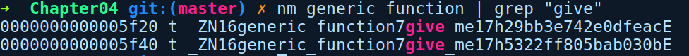

### 4.2.1　创建泛型

Rust允许我们将多种元素声明为泛型，例如结构体、枚举、函数、特征、方法及代码实现块。它们的一个共同特征是泛型的参数是由一对尖头括号分隔，并包含于其中。

你可以在其中放置以逗号分隔的任意数量泛型参数。让我们来看看如何创建泛型，首先从泛型函数开始。

#### 泛型函数

为了创建泛型函数，我们需要将泛型参数放在函数名之后和圆括号之前，如下所示：

```rust
// generic_function.rs
fn give_me<T>(value: T) {
    let _ = value;
}
fn main() {
    let a = "generics";
    let b = 1024;
    give_me(a);
    give_me(b);
}
```

在上述代码中，give_me是一个泛型函数，其名称后面带有<T>，value参数的类型为T。在main函数中，我们可以使用任何参数调用此函数。在编译期，已编译的目标文件将包含此函数的两个专用副本。

可以使用nm命令在生成的二进制对象文件中确认这一点，如下所示：


nm是GNU binutils软件包中的实用程序，用于查看已编译对象文件的符号。通过对二进制文件执行nm命令，我们可以使用pipe和grep查找give_me函数的前缀。如你所见，我们有两个函数副本，并附加了随机ID用于区分它们。其中一个会接收&str，而另一个会接收i32类型的参数，因为有两个包含不同参数的调用。

泛型函数是一种提供多态代码错觉的简易方法。所谓错觉是因为在编译之后，它们其实是包含具体类型参数的重复代码。因此其中存在一个缺点就是代码重复导致编译对象文件大小增加。这与使用具体类型的数量成正比。在后面的部分中，当讨论特征时，将会看到多态的真正形式，即特征对象。尽管如此，通过泛型实现多态仍然是首选的方案，因为它没有运行时开销，和特征对象类似。只有当泛型不能满足需要时，以及需要在集合中存储一系列类型的情况下，才会选择特征对象。当我们谈到特征对象时，将探讨泛型结构体和泛型枚举。首先我们将介绍如何声明它们，后续的部分将介绍如何创建和使用这些类型。

#### 泛型

泛型结构体—— 我们可以声明泛型的元组结构体和普通结构体，如下所示：

```rust
// generic_struct.rs
struct GenericStruct<T>(T);
struct Container<T> {
    item: T
}
fn main() {
    // stuff
}
```

如上述代码所示，泛型结构体在结构体名称后面包含泛型参数。因此，无论我们在代码中的任何地方表示上述结构体，都需要将“<T>”作为类型的一部分一起输入。

泛型枚举——同样，我们也可以创建泛型枚举：

```rust
// generic_enum.rs
enum Transmission<T> {
    Signal(T),
    NoSignal
}
fn main() {
    // stuff
}
```

我们的枚举Transmission包含一个名为Signal的变体（包含一个泛型值），还有一个名为NoSignal的变体（是一个无值变体）。

