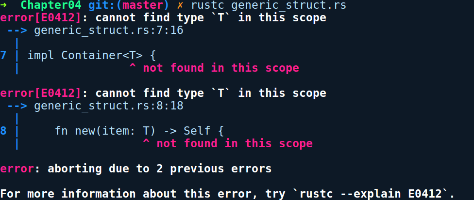

### 4.2.2　泛型实现

我们可以为泛型编写impl代码块，但由于额外的泛型参数，它在这里会变得冗长。让我们在结构体Container<T>上实现一个new()方法：

```rust
// generic_struct_impl.rs
struct Container<T> {
    item: T
}
impl Container<T> {
    fn new(item: T) -> Self {
        Container { item }
    }
}
fn main() {
    // stuff
}
```

让我们对它进行编译，得到以下错误提示信息：


错误提示信息提示我们无法找到泛型T。当为任何泛型编写impl代码块时，都需要在使用它之前声明泛型参数。T就像一个变量—— 一个类型变量，我们需要先声明它。因此，需要在impl之后添加<T>来稍微改动一下代码，如下所示：

```rust
impl<T> Container<T> {
    fn new(item: T) -> Self {
        Container { item }
    }
}
```

经过此修改，上述代码通过了编译。之前的impl代码块实际上意味着我们正在为所有类型T实现这些方法，它们会出现在Container<T>中。这个impl代码块是一个泛型实现。因此，生成的每个具体Container都将有这些方法。现在，我们也可以通过将T替换为任何具体类型来为Container<T>编写更具体的impl代码块。以下就是它的实例：

```rust
impl Container<u32> {
    fn sum(item: u32) -> Self {
        Container { item }
    }
}
```

在上述代码中，我们实现了一个名为sum的方法，它只会出现在Container<u32>类型中。在这里，由于u32是作为具体类型存在的，因此我们不需要impl之后的<T>，这是impl代码块的另外一个特性，它允许你通过独立实现方法来专门化泛型。

