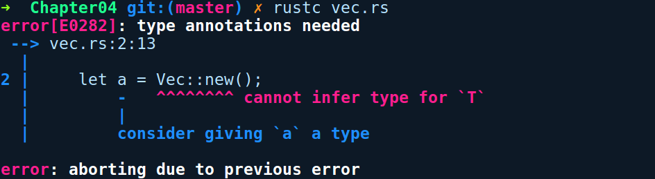

### 4.2.3　泛型应用

现在，我们实例化或使用泛型的方式也与非泛型略有不同。每当我们进行实例化时，编译器需要在其类型签名中知道T的具体类型以便替换，这为其提供了将泛型代码单态化的类型信息。大多数情况下，具体类型是基于类型的实例化推断的，或者对泛型函数调用某些方法来接收具体类型。在极个别情况下，我们需要通过使用turbofish (::<>)运算符输入具体类型来替代泛型以便辅助编译器识别。我们马上会看到该运算符的具体用法。

让我们看一下实例化Vec<T>的情况，这是一种泛型。在没有任何类型特征的情况下，下列代码将无法编译：

```rust
// creating_generic_vec.rs
fn main() {
    let a = Vec::new();
}
```

编译上述代码，将会给出如下错误提示信息：


这是因为在我们手动指定它或调用其中某个方法之前，编译器不知道a的类型，不便为其传入一个具体的值。如下面的代码片段所示：

```rust
// using_generic_vec.rs
fn main() {
    // 提供一种类型
    let v1: Vec<u8> = Vec::new();
    // 或者调用某个方法
    let mut v2 = Vec::new();
    v2.push(2);    // 现在v2的类型是Vec<i32>
    // 或者使用turbofish符号
    let v3 = Vec::<u8>::new();      // 不是那么容易理解
}
```

在第2个代码片段中，我们将v1的类型指定为u8的Vec，它能够通过编译。与v2一样，另一种方法是调用接收任何具体类型的方法。在调用push方法之后，编译器可以推断出v2的类型是Vec<i32>。创建Vec的另一种方法是使用turbofish运算符，就像前面代码中的v3绑定一样。

泛型函数中的turbofish运算符出现在函数名之后和圆括号之前。另一个示例是std::str模块的泛型解析函数parse。parse可以解析字符串中的值，并且支持多种类型，例如i32、f64及usize等，因此它是一种泛型。在使用parse时，你确实需要使用turbofish运算符，如下列代码所示：

```rust
// using_generic_func.rs
use std::str;
fn main() {
    let num_from_str = str::parse::<u8>("34").unwrap();
    println!("Parsed number {}", num_from_str);
}
```

需要注意的是，只有实现了FromStr接口或特征的类型才能传递给parse函数。u8有一个FromStr的实现，所以我们能够在前面的代码中解析它。parse函数用FromStr特征来限制传递给它的类型。在我们介绍了特征之后，将能够把泛型和特征很好地结合起来使用。

随着对泛型概念的深入理解，让我们聚焦于Rust中最常见的特性之一 ——特征！

