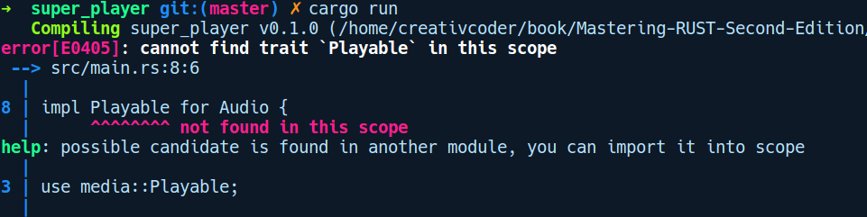
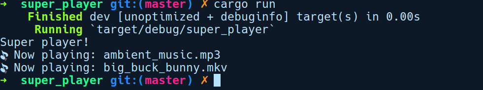
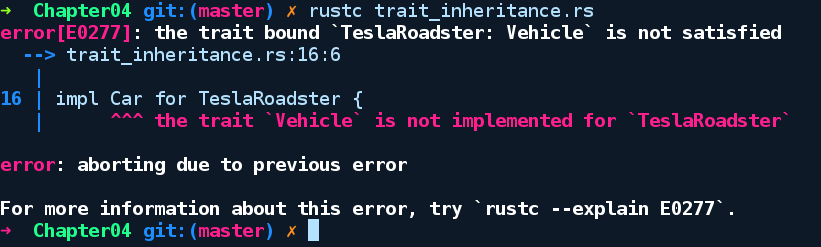

### 4.3.1　特征

特征是一个元素，它定义了一组类型可以选择性实现的“契约”或共享行为。特征本身并没有什么用，并且需要根据类型予以实现。特征有能力在不同类型之间建立关联，它们是许多语言特性的基础，例如闭包、运算符、智能指针、循环及编译期数据竞争校验等。Rust中相当多的高级语言特性要归功于调用某些类型实现的特征方法。为此，让我们看看如何在Rust中定义和使用特征。

假定我们正在构建一个可以播放音频和视频的简单多媒体播放器应用程序。要实现这个应用程序，我们将通过运行cargo new super_player命令创建一个新的项目。为了表达特征的理念，并简化它，在我们的main.rs文件中，会将音频和视频媒体表示为元组结构体，并将媒体名称作为字符串，如下所示：

```rust
// super_player/src/main.rs
struct Audio(String);
struct Video(String);
fn main() {
    // stuff
}
```

结构体Audio和Video至少需要有播放（play）和暂停（pause）功能，这是两者共享的功能，是我们使用特征的的好机会。在这里，将在单独模块media.rs中定义一个名为Playable的特征，其中包含两个方法，如下所示：

```rust
// super_player/src/media.rs
trait Playable {
    fn play(&self);
    fn pause() {
        println!("Paused");
    }
}
```

我们使用关键字trait创建一个特征，之后是其名称和一对花括号。在花括号内，我们可以提供零个或多个方法，任何可实现特征的类型都应该对其提供具体实现。我们还可以在特征中定义常量，所有实现者都可以共享它。实现者可以是任何结构体、枚举、基元类型、函数及闭包，甚至特征。

你应该已经注意到play的特点，它会接收一个引用符号（&）和self，但是没有函数体，并以分号作为结尾。self只是Self的类型别名，它指的是实现特征的类型。我们将在第7章详细介绍这些内容。这意味着特征中的方法和Java中的抽象方法类似。由类型实现此特征，并根据其用例定义函数。不过在特征中声明的方法也可以具有默认实现，就像上述代码中的pause函数一样。pause不会将self作为参数，因此它类似静态方法，不需要实现者的实例来调用它。

我们可以在特征中提供两种方法。

+ **关联方法** ：这些方法可以直接在实现特征的类型上使用，并不需要类型的实例来调用。在主流的编程语言中，这也被称为静态方法，例如标准库的特征FromStr的from_str方法。它是通过String实现的，因此允许你通过String::from_str("foo")从&str创建一个String。
+ **实例方法** ：这些方法需要将self作为其第一个参数。这仅适用于实现特征的类型实例，self将指向实现特征的类型实例。它可以有3种类型：self方法，被调用时会用到实例；&self方法，只对实例的成员（如果有的话）有读取权限；&mut self方法，它具有对成员的可变访问权限。可以修改它们甚至用另一个实例替换它们。例如标准库中的AsRef特征的as_ref方法是一个带有&self的实例方法，并且旨在由可以转换为引用或指针的类型实现。在第5章中，我们将介绍这些方法中的引用，以及类型签名的&和&mut部分。

现在，我们将在Audio和Video类型上实现前面的Playable特征，如下所示：

```rust
// super_player/src/main.rs
struct Audio(String);
struct Video(String);
impl Playable for Audio {
    fn play(&self) {
        println!("Now playing: {}", self.0);
    }
}
impl Playable for Video {
    fn play(&self) {
        println!("Now playing: {}", self.0);
    }
}
fn main() {
    println!("Super player!");
}
```

我们使用关键字impl后跟特征名称来声明特征实现，随后是关键字for和希望实现的特征类型，其后的花括号用于编写特征实现。在花括号中，我们需要提供方法的实现，并根据需要覆盖特征中存在的任何默认实现。让我们对代码进行编译，得到以下错误提示信息：


上述错误提示信息突出了特征的一个重要特性：在默认情况下，特征是私有的。要能够被其他模块或其他软件包调用，它们需要被声明为公有的。这需要两个步骤。首先，我们需要将特征暴露给外部世界。为此，我们需要在Playable特征声明前面添加关键字pub：

```rust
// super_player/src/media.rs
pub trait Playable {
    fn play(&self);
    fn pause() {
        println!("Paused");
    }
}
```

在公开了特征之后，我们需要使用关键字use将特征导入需要调用特征的模块的作用域中。这将允许我们调用它的方法，如下所示：

```rust
// super_player/src/main.rs
mod media;
struct Audio(String);
struct Video(String);
impl Playable for Audio {
    fn play(&self) {
        println!("Now playing: {}", self.0);
    }
}
impl Playable for Video {
    fn play(&self) {
        println!("Now playing: {}", self.0);
    }
}
fn main() {
    println!("Super player!");
    let audio = Audio("ambient_music.mp3".to_string());
    let video = Video("big_buck_bunny.mkv".to_string());
    audio.play();
    video.play();
}
```

这样我们就可以播放媒体的音频和视频：


这与任何实际的媒体播放器实现相差甚远，但我们的目的是探讨特征的用例。

特征也可以在声明中表明它们依赖于其他特征——这是一种被称为特征继承的特性。我们可以像下列代码那样声明继承性特征：

```rust
// trait_inheritance.rs
trait Vehicle {
    fn get_price(&self) -> u64;
}
trait Car: Vehicle {
    fn model(&self) -> String;
}
struct TeslaRoadster {
    model: String,
    release_date: u16
}
impl TeslaRoadster {
    fn new(model: &str, release_date: u16) -> Self {
        Self { model: model.to_string(), release_date }
    }
}
impl Car for TeslaRoadster {
    fn model(&self) -> String {
        "Tesla Roadster I".to_string()
    }
}
fn main() {
    let my_roadster = TeslaRoadster::new("Tesla Roadster II", 2020);
    println!("{} is priced at ${}", my_roadster.model,
my_roadster.get_price());
}
```

在上述代码中，我们声明了两个特征：Vehicle（更一般）和Car（更具体），Car依赖于Vehicle。因为TeslaRoadster是一辆车，我们为它实现了Car特征。另外，请注意TeslaRoadster的new方法主体，它采用Self作为返回类型，取代了我们从new方法返回的TeslaRoadster实例。Self只是特征的impl块中实现类型的简便类型别名，它还可以用于创建其他类型，例如元组结构体和枚举，以及match表达式。让我们尝试对这段代码进行编译：


看到那个错误了吗？在其定义中，Car特征指定了约束，任何实现特征的类型必须实现Vehicle特征，即Car: Vehicle。TeslaRoadster未实现Vehicle特征，Rust捕获了这个问题并报告给我们。因此，我们必须实现Vehicle，如下所示：

```rust
// trait_inheritance.rs
impl Vehicle for TeslaRoadster {
    fn get_price(&self) -> u64 {
        200_000
    }
}
```

满足上述实现后，我们的程序就能顺利通过编译，并得到以下输出：

```rust
Tesla Roadster II is priced at $200000
```


**提示**

get_price方法中200_000的下画线是一种方便的语法，用于创建可读的数字文本。


和面向对象语言相比，特征及其实现类似接口和实现这些接口的类。但是需要注意的是，特征与接口存在很大差异。

+ 尽管特征在Rust中具有一种继承形式，却没有具体实现。这意味着可以声明一个名为Panda的特征，然后通过实现Panda的类型实现另一个名为KungFu的特征。但是，类型本身并没有任何继承。因此采用的是类型组合而不是对象继承，它依赖于特征继承来为代码中的任何实际的实体建模。
+ 你可以在任何地方编写特征实现的代码块，而且无须访问实际类型。
+ 你还可以基于内置的基元类型到泛型之间的任何类型实现自定义特征。
+ 在函数中不能隐式地将返回类型作为特征，就像在Java中可以将接口作为返回类型，你必须返回一个被称为特征对象的东西，并且这种声明是显式的。当我们讨论特征对象时，将会了解如何做到这一点。

