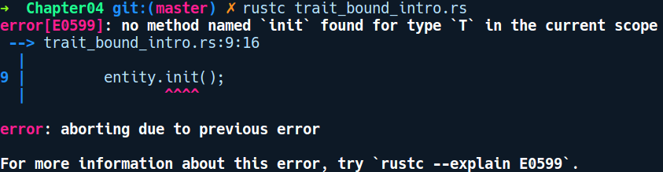
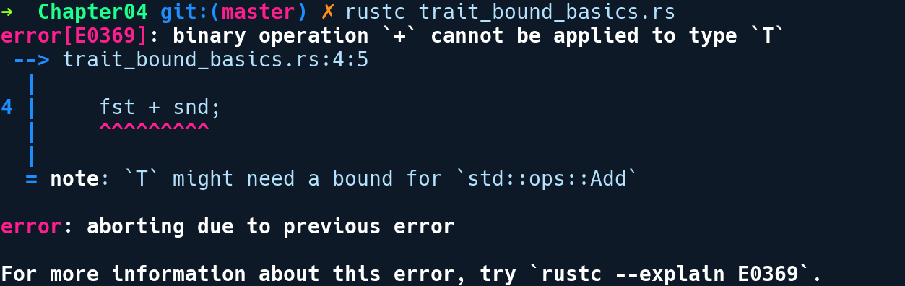

### 4.4　使用包含泛型的特征——特征区间

现在我们对泛型和特征都有了一个比较全面的了解，接下来可以探讨在编译期将它们组合起来表示更多关于接口的方法。请看如下代码：

```rust
// trait_bound_intro.rs
struct Game;
struct Enemy;
struct Hero;
impl Game {
    fn load<T>(&self, entity: T) {
        entity.init();
    }
}
fn main() {
    let game = Game;
    game.load(Enemy);
    game.load(Hero);
}
```

在上述代码中，在Game类型上我们有一个泛型函数load，它可以接收任何游戏实体，并通过任意T调用init()将其加载到我们的游戏世界中。但是，这个示例无法通过编译，且会有以下错误提示信息：


因此，任何类型为T的泛型函数都不能知道或默认假定init()方法存在于T之上。如果确实如此，那么它根本不是泛型，并且它们只能接收具有init()方法的类型。因此，有一种方法可以让编译器知道这一点，并约束load通过特征能够接收的类型集，这就需要用到特征区间。我们可以定义一个名为Loadable的特征，并在我们的Enemy和Hero类型上实现它。接下来，我们必须在泛型声明旁边放置几个符号来指定特征，我们称之为特征区间。更改后的代码如下所示：

```rust
// trait_bounds_intro_fixed.rs
struct Game;
struct Enemy;
struct Hero;
trait Loadable {
    fn init(&self);
}
impl Loadable for Enemy {
    fn init(&self) {
        println!("Enemy loaded");
    }
}
impl Loadable for Hero {
    fn init(&self) {
        println!("Hero loaded");
    }
}
impl Game {
    fn load<T: Loadable>(&self, entity: T) {
        entity.init();
    }
}
fn main() {
    let game = Game;
    game.load(Enemy);
    game.load(Hero);
}
```

在上述代码中，我们分别为Enemy和Hero实现了Loadable，还修改了load方法，如下所示：

```rust
fn load<T: Loadable>(&self, entity: T) { .. }
```

注意，“ `:Loadable` ”部分表明了我们指定特征范围的方式。特征区间允许我们限制泛型API可以接收的参数范围。指定泛型元素上的绑定的特征类似于我们为变量指定类型的方式，但是此处的变量是泛型T，类型是某些特征。例如T:SomeTrait。定义泛型函数时几乎总是会用到特征区间。如果定义的泛型函数中的T不包含任何特征区间，我们就不能通过任何方法调用，因Rust不知道给定方法实现的方式。它需要知道T是否具有某个foo方法，以便将代码单体化。来看看另一个例子：

```rust
// trait_bounds_basics.rs
fn add_thing<T>(fst: T, snd: T) {
    let _ = fst + snd;
}
fn main() {
    add_thing(2, 2);
}
```

我们有一个方法add_thing，它可以添加任何类型T。如果我们编译上述代码段，它不会通过编译且会有以下错误提示信息：


它向用户建议在T上添加特征区间Add。因为相加操作有Add特征，它是支持泛型的，并且不同类型具有不同的实现，甚至可能返回不同的类型。这意味着Rust需要用户的帮助才能提供注释。这需要我们修改函数定义，如下所示：

```rust
// trait_bound_basics_fixed.rs
use std::ops::Add;
fn add_thing<T: Add>(fst: T, snd: T) {
    let _ = fst + snd;
}
fn main() {
    add_thing(2, 2);
}
```

代码修改之后，我们将“:Add”添加到了T的后面，之后代码通过了编译。现在有两种方法可以指定特征，特征区间取决于类型特征在定义具有特征区间的泛型元素时的复杂程度。

#### 区间内泛型

```rust
fn show_me<T: Display>(val: T) {
    // 可以使用 {}格式化字符串, 因为有 Display特征区间
    println!("{}", val);
}
```

这是在泛型元素上指定特征区间的最常用语法。上述代码中的show_me函数是指定特征区间的一种方法，它会接收任何实现了Display特征的类型。这是在泛型函数的类型签名的长度较短时声明特征区间的常见语法。在指定类型的特征区间时，此语法也有效。现在，让我们看一下指定特征区间的第2种方法。

#### where语句

当任何泛型元素的类型签名变得太长而无法在一行上显示时，可使用此语法。例如，标准库的std::str模块中有一个parse方法，它具有以下签名：

```rust
pub fn parse<F>(&self) -> Result<F, <F as FromStr>::Err>
where F: FromStr { ... }
```

注意“where F: FromStr”部分告诉我们F类型必须实现FromStr特征。where语句将特征区间和函数签名解耦，并使其可读。

在了解如何编写特征区间之后，更重要的是知道在哪里可以指定这些区间。特征区间适用于用到泛型的任何地方。

