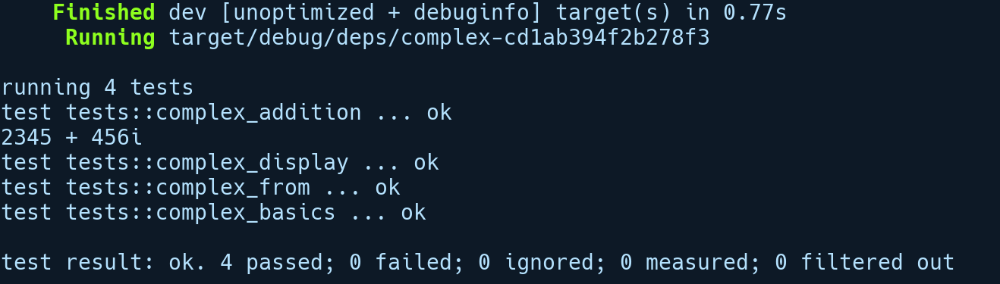

### 4.5　标准库特征简介

Rust的标准库有很多内置特征。Rust中的大多数语法糖都依赖于特征。这些特征提供了一个很好的基线，以便软件开发者可以为其程序库提供常用的接口。在本节中，我们将介绍标准库特征的一些抽象和特性，以便增强软件开发者和用户的使用体验。我们将从开发者的角度进行介绍，并创建一个为复数类型提供支持的程序库。如果你要创建自己的程序库，那么此示例很好地向你介绍了必须实现的常见特征。

我们将通过执行cargo new complex --lib命令创建一个新项目。首先，我们需要将复数表示为一种类型，并使用一个结构体表示它。复数结构体有两个字段：复数的实部和虚部。下列代码是它的定义：

```rust
// complex/src/lib.rs
struct Complex<T> {
    // 实部
    re: T,
    // 虚部
    im: T
}
```

我们通过T使复数结构体成为泛型，因为re和im可以是浮点数或整数。要使用此类型，我们需要先构造实例化它的方法。通常的做法是实现关联方法new，并传递re和im的值。如果我们还想使用默认值初始化复数的值（例如re=0，im=0）该怎么办呢？因此我们可使用一个名为Default的特征。对于用户自定义类型，实现Default特征非常简单。我们可以在复数结构体上放置一个#[derive(Default)]属性来自动为它实现Default特征。


**注意**

只有成员或字段自身都实现了Default特征的结构体、枚举及联合，结构体才能实现Default特征。


现在，我们使用new方法和Default特征注释后的代码，如下所示：

```rust
// complex/src/lib.rs
#[derive(Default)]
struct Complex<T> {
    //实部
    re: T,
    //虚部
    im: T
}
impl<T> Complex<T> {
    fn new(re: T, im: T) -> Self {
        Complex { re, im }
    }
}
#[cfg(test)]
mod tests {
    use Complex;
    #[test]
    fn complex_basics() {
        let first = Complex::new(3,5);
        let second: Complex<i32> = Complex::default();
        assert_eq!(first.re, 3);
        assert_eq!(first.im, 5);
        assert!(second.re == second.im);
    }
}
```

我们还在底部的测试模块中添加了一个简单的初始化测试用例。将#[derive(Defualt)]属性实现为一个过程宏，可以自动实现它修饰的类型的特征。此自动派生要求任何自定义类型的字段（例如结构体或枚举）本身必须实现Default特征。使用它们继承特征仅适用于结构体、枚举及联合。我们将在第9章详细介绍如何编写自定义派生过程宏。

此外，new函数实际上并不是一个特殊的构造函数（如果你只了解带有构造函数的语言），而是社区采用的一个常用名称（作为创建新类型实例的方法名）。

在我们介绍更复杂的特征实现之前，需要自动派生一些内置的特征，这有助于我们实现更高级的功能。让我们来看看其中的一些。

+ Debug：我们之前已经看到过该特征。顾名思义，这个特征有助于在控制台上输出类型以便进行调试。在组合类型的情况下，类型将以类似JSON的格式输出，其中带有花括号和其他括号，如果类型是字符串，将会用引号标识。这适用于Rust中的大多数内置类型。
+ PartialEq和Eq：这些特征允许两个元素相互比较以验证是否相等。对于我们的复数类型，只有PartialEq是有意义的，因为当我们的复数类型包含f 32或f64的值时，我们无法比较它们，这是由于f 32和f64的值没有实现Eq特征。PartialEq定义了局部排序，而Eq需要全局排序，浮点数的全局排序并未定义，因此两者的NaN和NaN并不相等。NaN是浮点类型中的一种类型，表示操作结果未定义，例如0.0 / 0.0。
+ Copy和Clone：这些特征定义了类型的复制方式。在第5章中，我们会独立论述它们。简而言之，当在任何自定义类型上自动派生时，这些特征允许用户从实例创建新的副本，可以在实现Copy时隐式创建，也可以在实现Clone时通过调用clone()显式创建。

请注意，Copy依赖于在类型上实现的Clone特征。

有了上述解释，我们将为这些内置特征添加自动派生，如下所示：

```rust
#[derive(Default, Debug, PartialEq, Copy, Clone)] 
struct Complex<T> {
    // 实部
    re: T,
    //虚部
    im: T
}
```

接下来，让我们再次对Complex<T>类型进行增强，以便获得更好的效果。我们将实现一些额外的特征（无特定顺序），如下所示。

+ 来自std::ops模块的Add特征允许我们使用“+”运算符将两个复数相加。
+ 来自std::convert模块的Into和From特征使用户能够根据其他类型创建复数类型。
+ Display特征使用户能够输出人类可读版本的复数类型。

让我们从实现Add特征开始，我们可以通过如下形式声明：

```rust
pub trait Add<RHS = Self> {
    type Output;
    fn add(self, rhs: RHS) -> Self::Output;
}
```

让我们对它进行逐行解释。

+ pub trait Add<RHS = Self>表示Add是一个具有泛型RHS的特征，并且RHS的默认值是Self。Self是实现此特征的类型别名，在我们的示例中是Complex。这是一种引用特征中实现者的简便方式。
+ Output是实现者需要声明的关联类型。
+ fn add(self, rhs: RHS) -> Self::Output是Add特征提供的核心功能，是我们在两种实现类型之间使用“+”运算符时调用的方法。它是一个实例方法，通过值获取self并接收rhs作为参数，即特征定义中的RHS。在我们的例子中，默认情况下，“+”运算符的左侧和右侧都是相同的类型，但是当我们编写impl代码块时，RHS可以更改为任何其他类型。例如，我们可以拥有添加了Meter和Centimeter类型的实现。在这种情况下，我们将在impl代码块中写入RHS=Centimeter。最后，它指明add方法必须使用Self::Output语法返回我们在第二行声明的Output类型。

接下来，让我们尝试实现它，以下是包括测试的代码：

```rust
// complex/src/lib.rs
use std::ops::Add;
#[derive(Default, Debug, PartialEq, Copy, Clone)]
struct Complex<T> {
    //实部
    re: T,
    //虚部
    im: T
}
impl<T> Complex<T> {
    fn new(re: T, im: T) -> Self {
        Complex { re, im }
    }
}
impl<T: Add<T, Output=T>> Add for Complex<T> {
    type Output = Complex<T>;
    fn add(self, rhs: Complex<T>) -> Self::Output {
        Complex { re: self.re + rhs.re, im: self.im + rhs.im }
    }
}
#[cfg(test)]
mod tests {
    use Complex;
    #[test]
    fn complex_basics() {
        let first = Complex::new(3,5);
        let second: Complex<i32> = Complex::default();
    }
    fn complex_addition() {
        let a = Complex::new(1,-2);
        let b = Complex::default();
        let res = a + b;
        assert_eq!(res, a);
    }
}
```

让我们深入研究一下Complex<T>的impl代码块：

```rust
impl<T: Add<T, Output=T> Add for Complex<T>
```

Add的impl代码块似乎更复杂，我们将对它们逐一进行说明。

+ impl<T: Add<T, Output=T>表示我们正在为泛型T实现Add，其中T实现Add<T, Output=T>。
+ <T, Output=T>部分表示Add特征的实现必须具有相同的输入和输出类型。
+ Add for Complex<T>部分表示为 Complex<T>类型实现Add特征。
+ T:Add表示必须实现Add特征。如果没有实现，那么我们不能使用“+”运算符。

接下来是From特征。如果我们可以从内置基元类型（例如双元素元组）构造Complex类型，其中第1个元素是实部，第2个元素是虚部，将会很方便。我们可以通过实现From特征来达到此目的。此特征定义了一个from方法，为我们提供了在类型之间进行转换的一般方法。

以下是该特征的定义：

```rust
pub trait From<T> {
    fn from(self) -> T;
}
```

这比前一个简单一些。它是一个泛型特征，其中T用于指定要转换的类型。当我们实现它时，只需要用我们希望实现它的类型替换T并实现from方法，然后我们就可以在相关类型上调用该方法。这是一个将Complex值转换为双元素元组类型的实现，Rust本身就能识别它：

```rust
// complex/src/lib.rs
// 为了保持简洁，省略了以前的代码
use std::convert::From;
impl<T> From<(T, T)> for Complex<T> {
    fn from(value: (T, T)) -> Complex<T> {
        Complex { re: value.0, im: value.1 }
    }
}
// 其他impl代码块被省略了
#[cfg(test)]
mod tests {
    // 其他测试
     use Complex;
     #[test]
     fn complex_from() {
         let a = (2345, 456);
         let complex = Complex::from(a);
         assert_eq!(complex.re, 2345);
         assert_eq!(complex.im, 456);
     }
}
```

让我们来看看impl代码块。它类似Add特征，不过我们不必通过任何特殊输出类型对泛型做出限制，因为From没有那些：

```rust
impl<T> From<(T, T)> for Complex<T> {
    fn from(value: (T, T)) -> Complex<T> {
        Complex { re: value.0, im: value.1 }
    }
}
```

第一个<T>是泛型T的声明，第二个和第三个<T>是泛型类型T的用途。我们会根据(T,T)类型创建它。

最后，为了让用户能够以数学符号的形式查看复数类型，我们应该实现Display特征。以下是特征的类型签名：

```rust
pub trait Display {
    fn fmt(&self, &mut Formatter) -> Result<(), Error>;
}
```

下列代码显示了Complex<T>类型的Display特征实现：

```rust
// complex/src/lib.rs
// 为了表述简洁，前面的代码已经省略
use std::fmt::{Formatter, Display, Result};
impl<T: Display> Display for Complex<T> {
    fn fmt(&self, f: &mut Formatter) -> Result {
        write!(f, "{} + {}i", self.re, self.im)
    }
}
#[cfg(test)]
mod tests {
    // other tests
    use Complex;
    #其他测试
    fn complex_display() {
        let my_imaginary = Complex::new(2345,456);
        println!("{}", my_imaginary);
    }
}
```

Display特征有一个fmt方法，它接收我们使用write!宏写入的Formatter类型。和之前一样，因为我们的Complex<T>类型对re和im字段使用泛型，所以需要声明它也必须满足Display特征。

运行cargo test -- --nocapture命令，我们得到以下输出结果：


我们可以看到复数类型是以“2345+456i”的可读格式输出的，并且所有测试的结果都是绿色。接下来，我们将介绍多态的概念，以及如何使用Rust特征对其进行建模。

