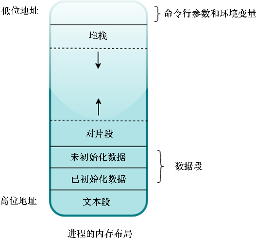

### 5.1　程序和内存

“如果你愿意限制方法的灵活性，那么总是会有意外的收获。”

——John Carmack

为了理解内存及其管理机制，我们必须大致了解程序如何被操作系统调用，以及允许其使用内存满足相关需求的原理。

每个程序都需要调用内存才能运行，无论是你最喜欢的命令行工具，还是复杂的流处理服务，它们都有各种各样的内存需求。在主流操作系统实现中，执行某个程序是以进程的形式实现的。进程就是程序运行实例。当我们在Linux中的shell执行./my_program，或者在Windows中双击my_program.exe时，操作系统会将my_program作为进程加载到内存中，并开始执行，和其他进程一起共享CPU和内存。它为进程分配了自己的虚拟地址空间，该空间与其他进程的虚拟地址空间不同，并且具有自己的内存视图。

在进程的生命周期中，它会使用很多系统资源。首先，进程需要内存来存储自己的指令，其次运行时需要一定的资源空间，然后它需要一种方法来跟踪函数的调用，以及任何局部变量和最后一次调用函数之后返回的地址。其中一些内存需求可以在编译期提前决定，例如在变量中存储基本类型，而其他内存需求只能在运行时满足，例如创建类似Vec<String>的动态数据类型。由于不同层次的内存需求不同和基于安全方面的考虑，进程的内存视图会被划分成被称为内存布局的区域。

在这里，我们有一个进程内存布局的基本展示：

根据它们存储的数据类型和提供的功能该布局可分为不同的区域。我们关注的主要内容如下。

+ **文本段** ：此部分包含已编译的二进制文件中执行的实际代码。文本段是只读的，禁止任何用户代码对其进行修改。因为这样做可能导致程序崩溃。
+ **数据段** ：它会进一步细分，即初始化数据段和未初始化数据段，后者通常被称为以符号开始的块（Block Started by Symbol，BSS），并保存程序中声明的所有全局和静态值。未初始化的值在加载到内存时会被初始化为零。
+ **堆栈段** ：该部分用于保存任何局部变量和函数的返回地址。预先知道大小的所有资源，以及程序创建的任何临时/中间变量都隐式存储在堆栈中。
+ **堆片段** ：该部分用于存储任何动态分配的数据，这些数据的大小是未知的，并且可以根据程序的需要在运行时进行更改。当我们希望值的寿命比声明它的函数更长时，这是比较理想的方式。

