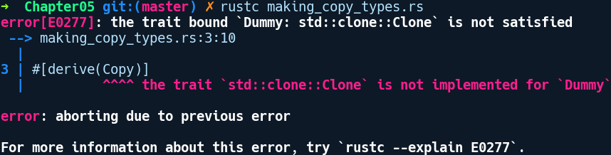

### 5.7.1　所有权

程序中资源的真正所有者的概念因语言而异。这里的含义是通过资源，我们共同引用在堆或堆栈上保存值的任何变量，或者是包含打开文件描述符、数据库连接套接字、网络套接字及类似内容的变量。从它们存在到完成程序调用及其之后的时间，都会占用一些内存。资源所有者的一个重要职责就是明智地释放它们使用的内存，因为如果无法在适当的位置和时间执行取消内存分配，就可能导致内存泄漏。

在使用Python等动态语言编程时，可以将多个所有者或别名添加到list对象中，从而使用执行该对象的众多变量之一添加或删除list中的项目。变量不需要关心如何释放对象使用过的内存，因为GC会处理这些事情，并且一旦指向对象的所有引用都消失，GC就会释放相关的内存。

对于C/C++之类的编译语言，在智能指针出现之前，程序库对代码使用完毕的相关资源API的调用方或者被调用方是否负责释放内存有明确的规定。存在这些规则是因为编译器不会在这些语言中强制限定所有权。在C++中不使用智能指针仍然有可能出现问题。在C++中，存在多个变量指向堆上的某个值是完全没问题的（尽管我们不建议这么做），这就是所谓的别名。由于具有指向资源的多个指针或别名的灵活性，程序员会遇到各种各样的问题，其中之一就是C++中的迭代器失效问题，我们在前面已经解释过它。

具体而言，当给定作用域中资源的其他不可变别名相对存在至少一个可变别名时，就会出现问题。

另一方面，Rust试图为程序中值的所有权设定适当的语义。Rust的所有权规则遵循以下原则。

+ 使用let语句创建值或资源，并将其分配给变量时，该变量将成为资源的所有者。
+ 当值从一个变量重新分配给另一个变量时，值的所有权将转移至另一个变量，原来的变量将失效以便另作他用。
+ 值和变量在其作用域的末尾会被清理、释放。

需要注意的是，Rust中的值只有一个所有者，即创建它们的变量。其理念很简单，但是它的含义让熟练使用其他语言的程序员感到惊讶。考虑以下代码，它以最基本的形式演示所有权原则：

```rust
// ownership_basics.rs
#[derive(Debug)]
struct Foo(u32);
fn main() {
    let foo = Foo(2048);
    let bar = foo;
    println!("Foo is {:?}", foo);
    println!("Bar is {:?}", bar);
}
```

我们创建了变量foo和bar，它们指向Foo实例。对某些熟悉允许多个所有者指向一个值的主流命令式语言的人来说，我们希望这个程序能够顺利编译。但是在Rust中，编译代码时可能遇到以下错误提示：


这里，我们创建了一个Foo的实例并将其分配给变量foo。根据所有权规则，foo是Foo实例的所有者。在代码中，我们将foo分配给bar。在main中执行第二行代码时，bar成为Foo实例的新所有者，而旧的foo是一个废弃变量，经过此变动之后不能在其他任何地方使用。这在main函数第三行的println!调用中表现非常明显。每当我们将变量分配给某个其他变量或从变量读取数据时，Rust会默认移动变量指向的值。所有权规则可以防止你通过多个访问点来修改值，这可能导致访问已被释放的变量，即使在单线程上下文中，使用允许多个值的可变别名的语言也是如此。比较典型的例子是C++中的迭代器失效问题。现在，为了分析某个值何时超出作用域，所有权规则还会考虑变量的作用域。接下来让我们探讨一下作用域。

#### 作用域简介

在我们进一步了解所有权之前，需要简要了解一下作用域。如果你熟悉C语言，那么可能已经对作用域的概念很熟悉了，但我们将在Rust的背景下回顾它，因为所有权与作用域协同工作。因此，作用域只不过是变量和值存在的环境。你声明的每个变量都与作用域有关。代码中的作用域是由一对花括号表示的。无论何时使用块表达式都会创建一个作用域，即任何以花括号开头和结尾的表达式。此外，作用域支持互相嵌套，并且可以在子作用域中访问父作用域的元素，但反过来不行。

这里是一些演示多个作用域和值的代码：

```rust
// scopes.rs
fn main() {
    let level_0_str = String::from("foo");
    {
        let level_1_number = 9;
        {
            let mut level_2_vector = vec![1, 2, 3];
            level_2_vector.push(level_1_number); //可以访问
        } // level_2_vector离开作用域
        level_2_vector.push(4); //不再有效
    } // level_1_number离开作用域
} // level_0_str离开作用域
```

为了解释这个问题，假定我们的作用域从0开始编号。通过这个假设，我们创建了名称中包含level_x前缀的变量。让我们逐行解释前面的代码。由于函数可以创建新的作用域，因此main函数引入了根级别作用域0，在上述代码中定义为level_0_str。在0级作用域中，我们创建了一个新的作用域，即作用域1，并且带有一个花括号，其中包含变量level_1_number。在1级作用域中，我们创建了一个块表达式，它成为2级作用域。在其中，我们声明了另一个变量level_2_vector，以便我们可以将level_1_number添加到其中，而level_1_number来自其父级作用域1。最后，当代码到达}末尾时，其中的所有值都会被销毁，相应作用域的生命周期也随之结束。作用域结束之后，我们就不能使用其中定义的任何值。

请注意，在推断所有权规则时，作用域是一个非常重要的属性。它也会被用来推断后续介绍的借用和生命周期。当作用域结束时，拥有值的任何变量都会运行相关代码以取消分配该值，并且其自身在作用域之外是无效的。特别是对在堆上分配的值，drop方法会被放在作用域结束标记}之前调用。这类似于在C语言中调用free函数，但这里是隐式的，并且可以避免程序员忘记释放值。drop方法来自Drop特征，它是为Rust中大部分堆分配类型实现的，可以轻松地自动释放资源。

在了解了作用域之后，让我们看看类似之前在ownership_basics.rs中看到的示例，但这一次，我们将会使用原始值：

```rust
// ownership_primitives.rs
fn main() {
    let foo = 4623;
    let bar = foo;
    println!("{:?} {:?}", foo, bar);
}
```

尝试编译并运行此程序，你可能会感到惊讶，因为这个程序能够通过编译并正常工作。到底发生了什么？在该程序中，4623的所有权不会从foo转移到bar，但bar会获得4623的单独副本。看起来基元类型在Rust中会被特殊对待，它们会被移动而不是复制。这意味着根据我们在Rust中使用的类型，存在不同的所有权语义，这将引入移动和复制语义的概念。

#### 移动和复制语义

在Rust中，变量绑定默认具有移动语义。但这究竟意味着什么？要理解这一点，我们需要考虑如何在程序中使用变量。我们创建值或资源并将它们分配给变量，以便在程序中可以方便地引用它们。这些变量是指向值所在内存地址的名称。现在，诸如读取、赋值、添加及将它们传递给函数等对变量的操作，在访问变量指向值的方式上可能具有不同的语义或含义。在静态类型语言中，这些语义大致分为移动语义和复制语义。接下来让我们对它们进行定义。

移动语义：通过变量访问或重新分配给变量时移动到接收项的值表示移动语义。由于Rust的仿射类型系统，它默认会采用移动语义。仿射类型系统的一个突出特点是值或资源只能使用一次，而Rust通过所有权规则展示此属性。

复制语义：默认情况下，通过变量分配或访问，以及从函数返回时复制的值（例如按位复制）具有复制语义。这意味着该值可以使用任意次数，每个值都是全新的。

这些语义对C++社区的人来说非常熟悉。默认情况下，C++具有复制语义。后来的C++ 11版本提供了对移动语义的支持。

Rust中的移动语义有时会受到限制。幸运的是，通过实现Copy特征可以更改类型的行为以遵循复制语义。基元和其他仅适用于堆栈的数据类型在默认情况下实现了上述特征，这也是前面的基元代码能够正常工作的原因。考虑下列尝试显式创建类型的代码片段：

```rust
// making_copy_types.rs
#[derive(Copy, Debug)]
struct Dummy;
fn main() {
    let a = Dummy;
    let b = a;
    println!("{}", a);
    println!("{}", b);
}
```

在编译代码时，我们得到以下错误提示信息：


有趣的是，Copy特征似乎依赖于Clone特征。这是因为Copy特征在标准库的定义如下：

```rust
pub trait Copy: Clone { }
```

Clone是Copy的父级特征，任何实现Copy特征的类型必须实现Clone。我们可以在派生注释中的Copy旁边添加Clone特征来让该示例通过编译：

```rust
// making_copy_types_fixed.rs
#[derive(Copy, Clone, Debug)]
struct Dummy;
fn main() {
    let a = Dummy;
    let b = a;
    println!("{}", a);
    println!("{}", b);
}
```

现在程序能够正常运行。但是Clone和Copy之间的差异并不是很明显。接下来让我们对它们进行区分。

