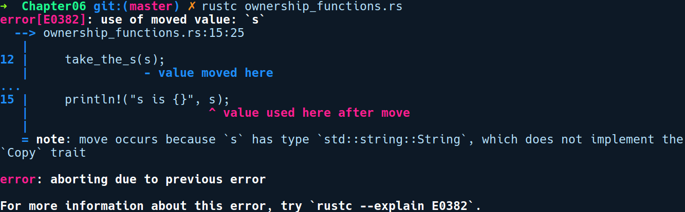
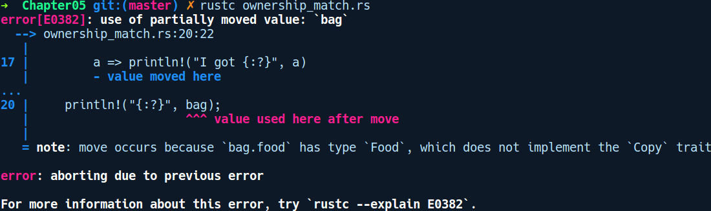
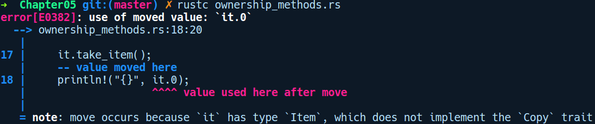
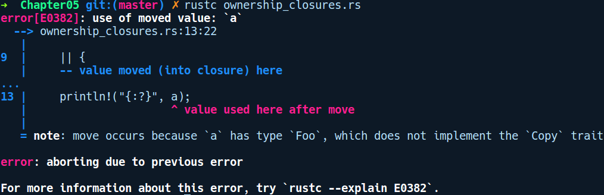

### 5.7.2　通过特征复制类型

Copy和Clone特征传达了在代码中使用类型时如何进行复制的原理。

#### Copy

Copy特征通常用于可以在堆栈上完全表示的类型，也就是说它们自身没有任何部分位于堆上。如果出现了这种情况，那么Copy将是开销很大的操作，因为它必须从堆中复制值。这直接影响到赋值运算符的工作方式。如果类型实现了Copy，则从一个变量到另一个变量的赋值操作将隐式复制数据。

Copy是一种自动化特征，大多数堆栈上的数据类型都自动实现了它，例如基元类型和不可变引用，即&T。Copy特征复制类型的方式与C语言中的memcpy函数类似，后者用于按位复制值。默认情况下不会为自定义类型实现Copy特征，因为Rust希望显式指定复制操作，并且要求开发人员必须选择实现该特征。当任何人都想在自定义类型上实现Copy特征时，Copy还取决于Clone特征。

没有实现Copy特征的类型包括Vec<T>、String和可变引用。为了获得这些值的复制，我们需要使用目的性更明确的Clone特征。

#### Clone

Clone特征用于显式复制，并附带clone方法，类型可以实现该方法以获取自身的副本。Clone特征的定义如下：

```rust
pub trait Clone {
    fn clone(&self) -> Self;
}
```

Clone有一个名为clone的方法，用于获取接收者的不可变引用，即&self，并返回相同类型的新值。用户自定义类型或任何需要提供能够复制自身的包装器类型，应通过实现clone方法来实现Clone特征。

但是Clone与Copy特征的不同之处在于，其中的赋值操作是隐式复制值，要复制Clone值，我们必须显式调用clone方法。clone方法是一种更通用的复制机制，Copy是它的一个特例，即总是按位复制。

String和Vec这类元素很难进行复制，只实现了Clone特征。智能指针类型也实现了Clone特征，它只是在指向堆上相同数据的同时复制指针和额外的元数据（例如引用计数）。

这是能够帮助我们确定如何复制类型，以及为Clone特征提供灵活性的示例之一。

下面是一个通过Clone特征复制类型的示例：

```rust
// explicit_copy.rs
#[derive(Clone, Debug)]
struct Dummy {
    items: u32
}
fn main() {
    let a = Dummy { items: 54 };
    let b = a.clone();
    println!("a: {:?}, b: {:?}", a, b);
}
```

我们在derive属性中添加了一个Clone特征。有了它，我们就可以在a上调用clone方法来获得它的新副本。

现在，你可能想知道何时应该实现这些类型中的某一种。以下是一些指导原则。

何时在类型上实现Copy。

可以在堆栈上单独表示的小型值如下所示。

+ 如果类型仅依赖于在其上实现了Copy特征的其他类型，则Copy特征是为其隐式实现的。
+ Copy特征隐式影响赋值运算符的工作方式。使用Copy特征构建自定义外部可见类型需要考虑它是否会对赋值运算符产生影响。如果在开发的早期阶段，你的类型是Copy，后续将它移除之后则会影响使用该类型进行赋值的所有环节。你可以通过这种方式轻松地破坏API。

何时在类型上实现Clone。

+ Clone特征只是声明一个clone方法，需要被显式调用。
+ 如果你的类型在堆上还包含一个值作为其表示的一部分，那么可选择实现Clone特征，这也需要向复制堆数据的用户明确表示。
+ 如果要实现智能指针类型（例如引用计数类型），那么应该在类型上实现Clone特征，以便仅复制堆栈上的指针。

现在我们已经学习了Copy和Clone的基础知识，接下来我们看看所有权对代码产生的一些影响。

#### 所有权的应用

除了let绑定示例之外，还可以在其他地方找到所有权的用武之地，重要的是我们能够识别它和编译器给出的错误提示信息。

如果将参数传递给函数，那么相同的所有权规则也同样有效：

```rust
// ownership_functions.rs
fn take_the_n(n: u8) { }
fn take_the_s(s: String) { }
fn main() {
    let n = 5;
    let s = String::from("string");
    take_the_n(n);
    take_the_s(s);
    println!("n is {}", n);
    println!("s is {}", s);
}
```

编译过程以类似方式失败：


String并没有实现Copy特征，因此值的所有权在take_the_s函数中会发生移动。当函数返回时，相关值的作用域也随之结束，并且会在s上调用drop方法，这会释放s所使用的堆内存。因此，在函数调用结束后s将失效。但是，由于String实现了Clone特征，我们可以通过在函数调用时添加一个.clone()调用来让代码正常工作：

```rust
take_the_s(s.clone());
```

我们的take_the_n函数能够正常工作，是因为u8（基元类型）实现了Copy特征。

也就是说，将移动语义类型传递给函数之后，我们后续将不能再使用该值。如果要使用该值，那么必须复制该类型并将副本发送到该函数。现在，如果我们只需要变量s的读取访问权限，那么可以让该代码正常工作的另一种方法是将字符串s传递回main函数，如以下代码所示：

```rust
// ownership_functions_back.rs
fn take_the_n(n: u8) { }
fn take_the_s(s: String) -> String {
    println!("inside function {}", s);
    s
}
fn main() {
    let n = 5;
    let s = String::from("string");
    take_the_n(n);
    let s = take_the_s(s);
    println!("n is {}", n);
    println!("s is {}", s);
}
```

我们在take_the_s函数中添加了一个返回类型，并将传递的字符串返回给调用者。在main函数中，我们在s中接收它。因此，main函数中的最后一行代码能够正常运行。

在match表达式中，移动类型默认也会被移动，如以下代码所示：

```rust
// ownership_match.rs
#[derive(Debug)]
enum Food {
    Cake,
    Pizza,
    Salad
}
#[derive(Debug)]
struct Bag {
    food: Food
}
fn main() {
    let bag = Bag { food: Food::Cake };
    match bag.food {
        Food::Cake => println!("I got cake"),
        a => println!("I got {:?}", a)
    }
    println!("{:?}", bag);
}
```

在上述代码中，我们创建了一个Bag实例并将其分配给bag。接下来，我们将匹配它的food字段，并输出一些文本。之后，我们用println!输出bag中的内容，编译时出现以下错误提示信息：


如你所见，错误提示信息提示bag已被match表达式中的变量移动和使用。这使得变量bag失效并无法再使用。当我们介绍借用这一概念时，将会了解到如何让上述代码正常工作。

方法：在impl代码块中，任何以self作为第一个参数的方法都将获取调用该方法的值的所有权。这意味着对值调用方法后，你无法再次使用该值。如以下代码所示：

```rust
// ownership_methods.rs
struct Item(u32);
impl Item {
    fn new() -> Self {
        Item(1024)
    }
    fn take_item(self) {
        // 什么也不做
    }
}
fn main() {
    let it = Item::new();
    it.take_item();
    println!("{}", it.0);
}
```

编译时，我们得到以下错误提示信息：


take_item是一个以self作为第1个参数的实例方法。在调用之后，它将在方法内移动，并在函数作用域结束时被释放。后续我们将不能再使用它。当介绍借用这一概念时，我们将会解释如何让上述代码正常运行。

**闭包中的所有权**

闭包也会出现类似的情况。请考虑如下代码段：

```rust
// ownership_closures.rs
#[derive(Debug)]
struct Foo;
fn main() {
    let a = Foo;
    let closure = || {
        let b = a;
    };
    println!("{:?}", a);
}
```

如你所见，Foo的所有权在闭包中已经默认移动到了b，用户将无法再次访问a。编译上述代码时，我们得到以下输出结果：


要获得a的副本，我们可以在闭包内调用a.clone()并将它分配给b，或者在闭包前面放置一个关键字move，如下所示：

```rust
let closure = move || {
    let b = a;
};
```

这将使我们的程序通过编译。


**注意**

闭包接收不同的值取决于在其内部使用变量的方式。


通过这些观察，我们已经发现所有权规则非常严格，因为它只允许我们使用类型一次。如果函数只需要对值的读取访问权限，那么我们需要再次从函数返回值，或者在它传递给函数之前复制它。如果类型没有实现Clone特征，那么后者可能无法实现其目的。

复制类型看起来似乎很容易绕过所有权规则，但是由于Clone总是复制类型，可能会调用内存分配器API，这是一种涉及系统调用，并且开销高昂的操作，因此它无法满足零成本抽象承诺的所有要点。

随着移动语义和所有权规则的实施，在Rust中编写程序很快就会变得困难重重。幸运的是，我们引入了借用和引用类型的概念，它们放宽了规则所施加的限制，但仍然能够在编译期确保兼容所有权规则。

