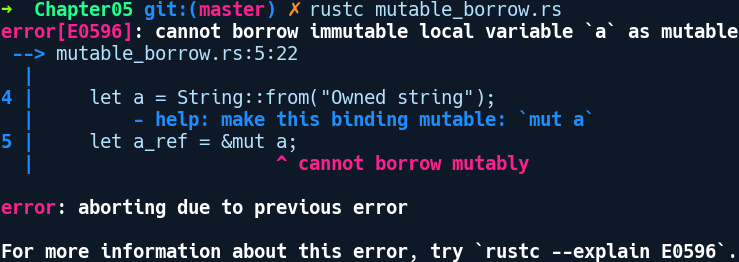
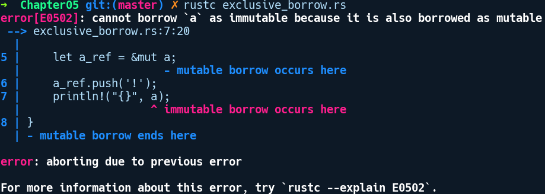
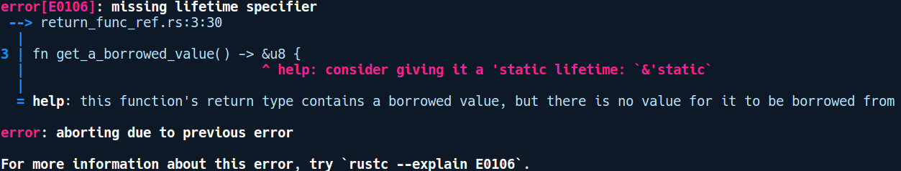

### 5.7.3　借用

借用的概念是规避所有权规则的限制。进行借用时，你不会获取值的所有权，而是根据需要提供数据。这是通过借用值，即获取值的引用来实现的。为了借用值，我们需要将运算符&放在变量之前，&表示指向变量的地址。在Rust中，我们可以通过两种方式借用值。

不可变借用：当我们在类型之前使用运算符&时，就会创建一个不可变借用。之前的部分所有权示例可以使用借用进行重构：

```rust
// borrowing_basics.rs
#[derive(Debug)]
struct Foo(u32);
fn main() {
    let foo = Foo;
    let bar = &foo;
    println!("Foo is {:?}", foo);
    println!("Bar is {:?}", bar);
}
```

这一次，程序通过编译，因为main函数中的第二行已经修改为如下代码：

```rust
let bar = &foo;
```

注意变量foo之前的&。我们借用foo并将借用结果分配给bar。bar的类型为&Foo，这是一种引用类型。作为一个不可变借用，我们不能通过bar改变Foo中的值。

可变借用：可以使用&mut运算符对某个值进行可变借用。通过可变借用，你可以改变该值。请考虑如下代码：

```rust
// mutable_borrow.rs
fn main() {
    let a = String::from("Owned string");
    let a_ref = &mut a;
    a_ref.push('!');
}
```

在这里，我们有一个声明为a的String实例，但我们还是用&mut a创建了一个该值的可变借用。这并没有将a移动到b ——只是可变地对它借用。然后我们将一个字符“!”推送给该字符串。对该程序进行编译：


我们有一个错误。编译器提示我们不能进行相互借用。这是因为可变借用需要原有的变量自身使用关键字mut进行修饰声明。这应该是显而易见的，因为我们不能改动不可变绑定背后的东西。因此，我们将a的声明改为如下内容：

```rust
let mut a = String::from("Owned string");
```

上述修改使代码通过编译。这里a是一个执行堆分配值的堆栈变量，a_ref是a所拥有的值的可变借用。a_ref可以改变String值，但是不能销毁该值，因为它不是所有者。如果a在借用它的代码行之前被销毁，则借用失效。

现在，我们在上述程序的末尾添加一个printlin!来输出修改后的a：

```rust
// exclusive_borrow.rs
fn main() {
    let mut a = String::from("Owned string");
    let a_ref = &mut a;
    a_ref.push('!');
    println!("{}", a);
}
```

编译后给出如下错误提示信息：


Rust禁止这样做，因为通过a_ref将值不变地借用为可变借用已经出现在作用域中。这凸显了借用的另一个重要规则。一旦值被可变借用，我们就不能再对它进行其他借用，即使是进行不可变借用。在介绍了借用这一概念之后，让我们重点介绍一下借用在Rust中的实施细则。

#### 借用规则

和所有权规则类似，我们也有借用规则，通过引用来维护单一的所有权语义。这些规则如下所示。

+ 一个引用的生命周期可能不会超过其被引用的时间。这是显而易见的，因为如果它的生命周期超过其被借用的时间，那么它将指向一个垃圾值（被销毁的值）。
+ 如果存在一个值的可变借用，那么不允许其他引用（可变借用或不可变借用）在该作用域下指向相同的值。可变借用是一种独占性借用。
+ 如果不存在指向某些东西的可变借用，那么在该作用域下允许出现对同一值的任意数量的不可变借用。


**注意**

Rust中的借用规则由编译器中被称为借用检查器的组件进行分析。Rust社区把处理借用错误戏称为和借用检查器搏斗。


现在我们已经熟悉了这些规则，让我们看看如果违反上述某些规则后，借用检查器会做出什么反应。

#### 借用实践

当我们测试借用检查器时，Rust通过借用规则获得的异常诊断信息将会非常有用。在下面的一个示例中，我们将看到它们在多种情况下的表现。

函数中的借用：如前所述，如果只是读取值，那么在进行函数调用时移动所有权没有太大的意义，并且会受到诸多限制。调用函数后，你无法再使用该变量。除了通过值获取参数，也可以通过借用来获取它们。我们可以修复之前介绍所有权时提到的代码示例，以便在不进行复制的情况下通过编译器的校验，相关代码如下所示：

```rust
// borrowing_functions.rs
fn take_the_n(n: &mut u8) {
    *n += 2;
}
fn take_the_s(s: &mut String) {
    s.push_str("ing");
}
fn main() {
    let mut n = 5;
    let mut s = String::from("Borrow");
    take_the_n(&mut n);
    take_the_s(&mut s);
    println!("n changed to {}", n);
    println!("s changed to {}", s);
}
```

在上述代码中，函数take_the_s和take_the_n将接收可变借用作为参数。有了这个，我们需要对代码进行3处改动。首先，变量绑定必须是可变的：

```rust
let mut s = String::from("Borrow");
```

其次，我们的函数将更改为以下内容：

```rust
fn take_the_s(n: &mut String) {
    s.push_str("ing");
}
```

最后，函数调用时也需要修改为以下形式 ：

```rust
take_the_s(&mut s);
```

此外，我们可以看到Rust中的所有内容都是明确的。众所周知，可变性在Rust代码中是非常明显的，尤其是当多个线程一起发挥作用时。

匹配中的借用：在match表达式中，默认情况下会对匹配臂中的值进行移动，除非它是Copy类型。下列代码在5.7.2小节介绍所有权时被提及，我们可以通过在匹配臂中使用借用来进行编译：

```rust
// borrowing_match.rs
#[derive(Debug)]
enum Food {
    Cake,
    Pizza,
    Salad
}
#[derive(Debug)]
struct Bag {
    food: Food
}
fn main() {
    let bag = Bag { food: Food::Cake };
    match bag.food {
        Food::Cake => println!("I got cake"),
        ref a => println!("I got {:?}", a)
    }
    println!("{:?}", bag);
}
```

我们对之前的代码稍作修改，你可能在阅读所有权相关内容时已经非常熟悉它们。对于第二个匹配臂，我们以ref作为前缀。关键字ref可以通过引用来匹配元素，而不是根据值来捕获它们。通过此修改，我们的代码得以顺利编译。

从函数返回引用： 在下面的代码示例中，我们有一个函数试图返回在函数内部声明的值的引用：

```rust
// return_func_ref.rs
fn get_a_borrowed_value() -> &u8 {
    let x = 1;
    &x
}
fn main() {
    let value = get_a_borrowed_value();
}
```

上述代码无法通过借用检查器的校验，我们得到以下错误提示信息：


错误提示信息告知我们缺少生命周期声明符。这对了解我们的代码存在什么问题没有多大帮助。我们需要熟悉生命周期这一概念，5.7.5小节将会详细介绍它。在此之前，让我们了解一些基于借用规则能够使用的方法类型。

