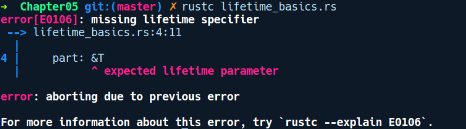
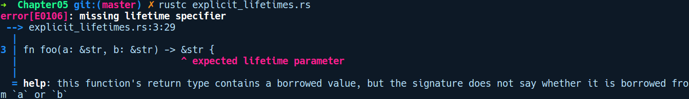
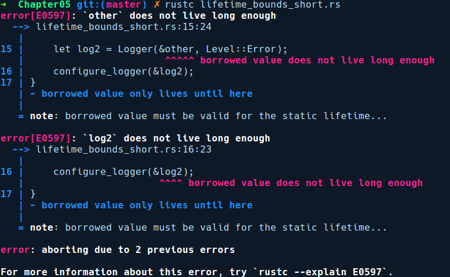

### 5.7.5　生命周期

Rust编译期内存安全难题的第三部分是生命周期的概念和用于在代码中指定生命周期的相关语法注释。在本小节中，我们将简要地介绍一下生命周期的概念。

当我们声明某个变量时，会使用一个值对它进行初始化，该变量具有一个生命周期，超过该生命周期后它就会失效从而无法使用。在一般的编程术语中，变量的生命周期是指代码中的变量指向的有效内存区域。如果你曾经使用过C语言，那么应该会敏锐地意识到变量的生命周期：每次调用malloc分配一个变量时，它应该有一个所有者，并且该所有者应该可靠地确定该变量的生命何时结束，以及何时释放相关的内存。但最糟糕的地方在于，它不是由编译器强制执行的，相反，这是程序员需要担负的责任。

对于在堆栈上分配的数据，我们可以通过查看代码来轻松地判定变量是否存续。但是，对于在堆上分配的值，这一点就不是那么明确了。

Rust中的生命周期是一个具体的构造，而非C语言中概念性的认知。它们执行程序员手动执行的类似分析，即检查值的作用域和引用它的任何变量。

在讨论Rust中的生命周期时，你只需要在有引用时处理它们。Rust中的所有引用都附加了生命周期信息。生命周期定义了引用相对值的原始所有者的生存周期，以及引用作用域的范围。

大多数情况下它是隐式的，编译器通过分析代码来确定变量的生命周期。在某些情况下，编译器却不能确定变量的生命周期，它需要我们的帮助，换句话说，它要求用户明确自己的意图。

到目前为止，我们在之前的示例中一直在讨论如何使用引用和借用规则，接下来让我们尝试编译下列代码后会发生什么：

```rust
// lifetime_basics.rs
struct SomeRef<T> {
    part: &T
}
fn main() {
    let a = SomeRef { part: &43 };
}
```

这段代码非常简单，我们有一个SomeRef结构体，它存储了一个指向泛型T的引用。在main函数中，我们创建了一个该结构体的实例，并使用指向i32类型的引用对它的part字段进行初始化，即&43。

它在编译时给出了如下错误提示信息：


在这种情况下，编译器要求我们输入一个名为生命周期的参数。生命周期参数与泛型参数非常相似。泛型T可以修饰任何类型，生命周期参数表示引用能够有效使用的区域或范围。当借用规则检查器检查、分析代码时，编译器可以稍后填写实际的区域信息。

生命周期纯粹是一个编译期构造，它可以帮助编译器确定某个引用有效的作用域，并确保它遵循借用规则。它可以跟踪诸如引用的来源，以及它们是否比借用值生命周期更长这类事情。Rust中的生命周期能够确保引用的存续时间不超过它指向的值。生命周期并不是你作为开发人员将要用到的，而是编译器使用和推断引用的有效性时会用到的。

#### 生命周期参数

对于编译器无法通过分析代码来确定值的生命周期的情况，我们需要通过在代码中添加一些注释来帮助编译器达到上述目的。为了与标识符区分，生命周期注释带有“'”前缀。因此，为了让我们之前的带参数的代码示例能够通过编译，我们需要在SomeRef之上添加生命周期注释，如下所示：

```rust
// using_lifetimes.rs
struct SomeRef<'a, T> {
    part: &'a T
}
fn main() {
    let _a = SomeRef { part: &43 };
}
```

生命周期由一个“'”进行修饰，后跟任何有效的标识符序列。但是按照惯例，Rust中的大多数生命周期都采用'a、'b、'c这样的名称作为生命周期参数。如果类型上有多个生命周期，则可以使用更长的描述性生命周期名称，例如'ctx、'reader、'writer等。它与泛型参数声明的位置和方式相同。

我们稍后会看到一些通过将生命周期用作泛型参数来解决无效引用的示例，但是其中有一个包含具体值的生命周期，如下列代码所示：

```rust
// static_lifetime.rs
fn main() {
    let _a: &'static str = "I live forever";
}
```

关键字 static 修饰的生命周期意味着这些引用在程序运行期间都是有效的。Rust 中的所有文本字符都具有'static的生命周期，并且它们会被转到已编译对象代码的数据片段中。

#### 生命周期省略规则

只要在函数或类型定义中存在引用，就会涉及生命周期。大多数情况下，你不需要显式使用生命周期注释代码，编译器能够很聪明地推断它，因为很多信息在编译期就可以用于处理引用。

换句话说，以下两个函数签名的效果是相同的：

```rust
fn func_one(x: &u8) → &u8 { .. }
fn func_two<'a>(x: &'a u8) → &'a u8 { .. }
```

通常情况下，编译器会省略func_one中的生命周期参数，我们不需要将其写为func_two的形式。

不过编译器只能在受限制的位置省略生命周期符号，并且存在省略规则。在讨论这些规则之前，我们需要先介绍输入/输出型生命周期，并且仅在函数需要接收引用参数时讨论它们。

+ 输入型生命周期：函数参数上的生命周期注释当作引用时被称为输入型生命周期。
+ 输出型生命周期：函数返回值上的生命周期参数当作引用时被称为输出型生命周期。

值得注意的是，任何输出型生命周期都源自输入型生命周期，我们不能拥有独立于输入型生命周期的输出型生命周期。它只能是一个小于或等于输出型生命周期的生命周期。

以下是省略生命周期时需要遵守的一些规则。

+ 如果输入型生命周期仅包含单个引用，那么假定输出型生命周期也仅包含单个引用。
+ 对于涉及self和&mut self的方法，输入型生命周期是针对&self进行推断的。

但是有时在存在歧义的情况下，编译器不会尝试进行假设。请考虑如下代码：

```rust
// explicit_lifetimes.rs
fn foo(a: &str, b: &str) -> &str {
    b
}
fn main() {
    let a = "Hello";
    let b = "World";
    let c = foo(a, b);
}
```

在上述代码中，c中存储了一个表示任意类型（T）的引用。在这种情况下，返回值的生命周期并不明显，因为涉及两个输入引用。但某些情况下，编译器无法计算引用的生命周期，它需要我们的帮助来指定生命周期参数。请考虑如下不能通过编译的代码：


上述程序没有通过编译，因为Rust无法确定返回值的生命周期，它需要我们的帮助。

现在，当Rust无法为我们代劳时，有很多地方需要用户指定生命周期。

+ 函数签名。
+ 结构体和结构体字段。
+ impl代码块。

#### 自定义类型中的生命周期

如果结构体中包含引用任何类型的字段，我们需要明确指定这些引用的生命周期。该语法和函数签名中的语法类似：我们首先在结构体代码行上声明生命周期名称，然后在字段中使用它们。

以下是最简单形式的语法：

```rust
// lifetime_struct.rs
struct Number<'a> {
    num: &'a u8
}
fn main() {
    let _n = Number {num: &545};
}
```

Number定义的存续时间与num的引用时间一样长。

#### impl代码块中的生命周期

当为包含引用的结构体创建impl代码块时，我们需要再次重复指定生命周期的声明和定义。例如，如果我们为之前定义的结构体Foo构造了一个实现，那么类似的语法将如下所示：

```rust
// lifetime_impls.rs
#[derive(Debug)]
struct Number<'a> {
    num: &'a u8
}
impl<'a> Number<'a> {
    fn get_num(&self) -> &'a u8 {
        self.num
    }
    fn set_num(&mut self, new_number: &'a u8) {
        self.num = new_number
    }
}
fn main() {
    let a = 10;
    let mut num = Number { num: &a };
    num.set_num(&23);
    println!("{:?}", num.get_num());
}
```

在大多数情况下，这是从类型自身进行推断的，然后我们可以使用“<'_>”语法省略签名。

#### 多个生命周期

和泛型参数类似，如果我们有多个具有不同生命周期的引用，那么可以指定多个生命周期。但是，如果必须在代码中使用多个生命周期，那么它很快就会变得杂乱无章。大多数情况下，我们在结构体或函数中只需处理一个生命周期，但是在某些情况下我们需要用到多个生命周期注释。例如，假定我们正在构建一个解码器程序库，它可以根据模式和给定的已编码字节流来解析二进制文件。我们有一个Decoder对象，它包含一个schema对象的引用和一个reader类型的引用。我们的Decoder定义将如下所示：

```rust
// multiple_lifetimes.rs
struct Decoder<'a, 'b, S, R> {
    schema: &'a S,
    reader: &'b R
}
fn main() {}
```

在上述定义中，我们很可能遇到通过网络获取reader，而schema是本地的情况，因此它们在代码中的生命周期可能是不同的。当我们为Decoder提供实现时，可以通过生命周期子类型指定它们的关系，该概念稍后会进行介绍。

#### 生命周期子类型

我们可以指定生命周期之间的关系，以确定是否可以在同一位置使用两个引用。继续我们的Decoder结构体示例，我们可以在impl代码块中声明生命周期之间的关系，如下所示：

```rust
// lifetime_subtyping.rs
struct Decoder<'a, 'b, S, R> {
    schema: &'a S,
    reader: &'b R
}
impl<'a, 'b, S, R> Decoder<'a, 'b, S, R>
where 'a: 'b {
}
fn main() {
    let a: Vec<u8> = vec![];
    let b: Vec<u8> = vec![];
    let decoder = Decoder {schema: &a, reader: &b};
}
```

我们使用where语句在impl代码块中指定了关系：'a:'b。这表示'a的生命周期比'b长，换句话说，'b永远不会比'a存续的时间更长。

#### 在泛型上声明生命周期区间

除了使用特征来限制泛型函数能够接收的类型之外，我们还可以使用生命周期注释来限制泛型参数。例如，考虑我们有一个logger程序库，其中Logger对象的定义如下所示：

```rust
// lifetime_bounds.rs
enum Level {
    Error
}
struct Logger<'a>(&'a str, Level);
fn configure_logger<T>(_t: T) where T: Send + 'static {
    // 此处配置logger
}
fn main() {
    let name = "Global";
    let log1 = Logger(name, Level::Error);
    configure_logger(log1);
}
```

在上述代码中，我们有一个Logger结构体，其中包含其名称和一个Level枚举。我们还有一个名为configure_logger的泛型函数，它接收一个受Send + 'static约束的类型T作为参数。在 main 函数中，我们创建了一个带有'static声明的字符串"Global"，并将它传递给configure_logger函数执行相关调用。

除了Send端点之外（表示可以将此线程发送到其他线程），我们还声明该类型的生命周期必须与'static生命周期一样长。假定我们将Logger引用指向了某个包含较短生命周期的字符串，代码如下所示：

```rust
// lifetime_bounds_short.rs
enum Level {
    Error
}
struct Logger<'a>(&'a str, Level);
fn configure_logger<T>(_t: T) where T: Send + 'static {
    // 这里配置logger
}
fn main() {
    let other = String::from("Local");
    let log2 = Logger(&other, Level::Error);
    configure_logger(&log2);
}
```

这将无法执行，并得到以下错误提示信息：


错误提示信息清楚地表明，借用的值必须对static生命周期有效，但我们已经传递了一个字符串，其生命周期在main函数中被称为'a，它比'static生命周期更短。

了解了生命周期的概念之后，让我们重温一下Rust中的指针类型。

