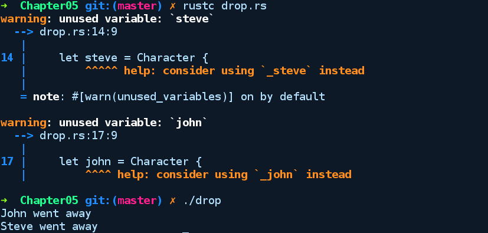
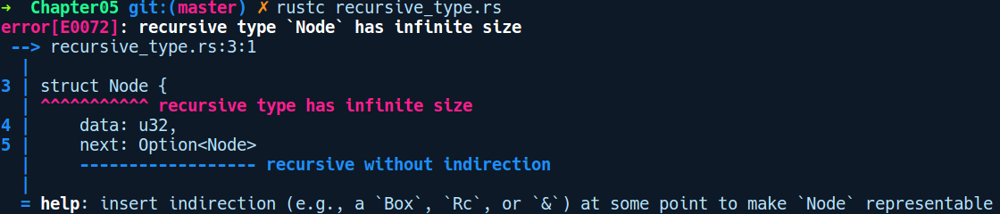

### 5.8.3　智能指针

管理原始指针非常不安全，开发者在使用它们时需要注意很多细节。不恰当地使用它们可能会以非常隐蔽的方式导致诸如内存泄漏、引用挂起，以及大型代码库中的双重释放等问题。为了解决这些问题，我们可以使用C++中广泛采用的智能指针。

Rust中也包含多种智能指针。之所以叫它们智能指针，是因为它们还具有与之相关联的额外元数据和代码，它们会在创建和销毁指针时被调用和执行。智能指针超出作用域时能够自动释放底层资源是采用它们的主要原因之一。

智能指针的大部分特性要归功于两个特征，它们被称为Drop和Deref。在我们介绍Rust中可用的智能指针之前，让我们先了解一下这些特征。

#### Drop

这是我们多次提及的特征，它可以自动释放相关值超出作用域后占用的资源。Drop特征类似于你在其他语言中遇到的被称为对象析构函数的东西。它包含一个drop方法，当对象超出作用域时就会被调用。该方法将&mut self作为参数。使用drop释放值是以LIFO的方式进行的。也就是说，无论最后构建的是什么，都首先会被销毁。以下代码说明了这一点：

```rust
// drop.rs
struct Character {
    name: String,
}
impl Drop for Character {
    fn drop(&mut self) {
        println!("{} went away", self.name)
    }
}
fn main() {
    let steve = Character {
        name: "Steve".into(),
    };
    let john = Character {
        name: "John".into(),
    };
}
```

输出结果如下所示：


如果有需要，drop方法是你为自己的结构体放置清理代码的理想场所。例如使用引用计数值或GC时，它尤其方便。当我们实例化任何Drop实现值时（任意堆分配类型），Rust编译器会在编译后的代码中每个作用域结束的位置插入drop方法调用。因此，我们不需要在这些实例上手动调用drop方法。这种基于作用域的自动回收机制借鉴了C++ RAII原则的某些理念。

#### Deref和DerefMut

为了提供与普通指针类似的行为，也就是说，为了能够解引用被指向类型的调用方法，智能指针类型通常会实现Deref特征，这允许用户对这些类型使用解引用运算符*。虽然Deref只为你提供了只读权限，但是还有DerefMut，它可以为你提供对底层类型的可变引用。Deref具有以下类型签名：

```rust
pub trait Deref {
    type Target: ?Sized;
    fn deref(&self) -> &Self::Target;
}
```

它定义了一个名为Deref的方法，并会通过引用获取self参数，然后返回对底层类型的不可变引用。这与Rust的deref强制性特征结合，能够大幅减少开发者编写代码的工作量。deref强制性特征是指类型自动从一种类型的引用转换成另一种类型的其他引用。我们将第7章详细介绍它。

#### 智能指针的种类

标准库中的智能指针有如下几种。

+ Box<T>：它提供了最简单的堆资源分配方式。Box类型拥有其中的值，并且可用于保存结构体中的值，或者从函数返回它们。
+ Rc<T>：它用于引用计数。每当获取新引用时，计数器会执行递增操作，并在用户释放引用时对计数器执行递减操作。当计数器的值为零时，该值将被移除。
+ Arc<T>：它用于原子引用计数。这与之前的类型类似，但具有原子性以保证多线程的安全性。
+ Cell<T>：它为我们提供实现了Copy特征的类型的内部可变性。换句话说，我们有可能获得多个可变引用。
+ RefCell<T>：它为我们提供了类型的内部可变性，并且不需要实现Copy特征。它用于运行时的锁定以确保安全性。

#### Box<T>

标准库中的泛型Box为我们提供了在堆上分配值的最简单方法。它在标准库中被简单地声明为元组结构体，然后包装任何传递给它的类型，并将其放在堆上。如果你熟悉其他语言中的装箱和拆箱概念，例如Java，其中会把装箱后的整数当作整型类，那么通常较易理解Rust提供的类似的抽象。Box类型的所有权语义取决于包装类型。如果基础类型为Copy，那么Box实例将成为副本，否则默认情况下将发生移动。

要使用Box创建类型T的堆分配值，我们只需调用相关的new方法，并传入值。创建包装类型T的Box值会返回Box实例，该实例是堆栈上指向T的指针，而上述指针在堆上分配。以下示例演示了如何使用Box：

```rust
// box_basics.rs
fn box_ref<T>(b: T) -> Box<T> {
    let a = b;
    Box::new(a)
}
struct Foo;
fn main() {
    let boxed_one = Box::new(Foo);
    let unboxed_one = *boxed_one;
    box_ref(unboxed_one);
}
```

在main函数中，我们通过在boxed_one函数中调用Box::new(Foo)创建了一个堆分配值。

Box类型适用于以下情况。

+ 它可以用于创建递归类型定义。

这里有一个Node类型，它表示单链表中的节点：

```rust
// recursive_type.rs
struct Node {
    data: u32,
    next: Option<Node>
}
fn main() {
    let a = Node { data: 33, next: None };
}
```

在编译上述代码时，我们得到以下错误提示：


我们不能这样定义Node类型，因为next有一个引用自身的类型。如果允许这样定义，编译器将无法分析我们的Node定义，因为编译器将持续对它进行评估计算，直到内存耗尽为止。使用以下代码片段能够更好地说明这一点：

```rust
struct Node {
    data: u32,
    next: Some(Node {
              data: u32,
              next: Node {
                        data: u32,
                        next: ...
                    }
          })
}
```

对Node定义的评估将持续进行，直到编译器内存耗尽为止。此外，由于每个数据片段在编译时都需要确定静态的已知尺寸，因此在Rust中这是一种不可表示的类型。我们需要让next字段具有固定大小，可以通过将next放在指针后面来实现，因为指针总是具有固定大小。如果你看到编译器提供的上述错误消息，我们将使用Box类型来修改Node结构体的定义：

```rust
struct Node {
    data: u32,
    next: Option<Box<Node>>
}
```

当定义需要隐藏在不定长结构后面的递归类型时，也可以使用Box类型。因此，在这种情况下，包含对其自身引用的变体的枚举可以使用Box类型来隐藏变体。

+ 当你需要将类型存储为特征对象时。
+ 当你需要将函数存储在集合中时。

