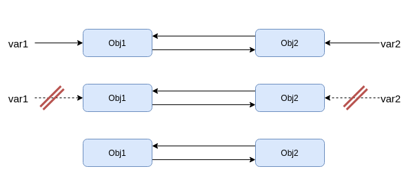
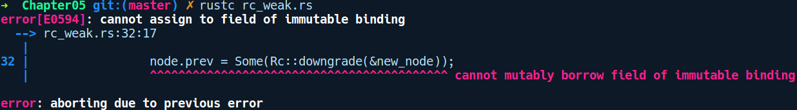
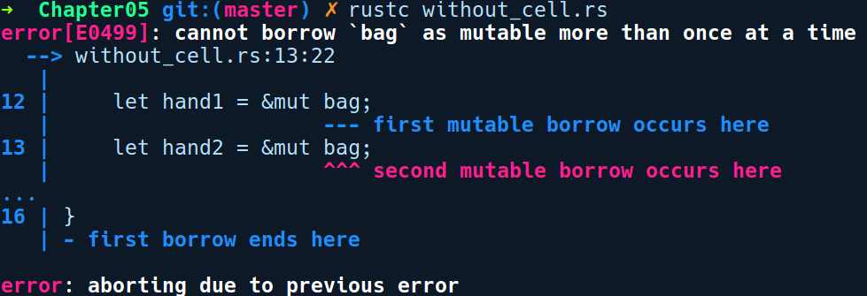

### 5.8.4　引用计数的智能指针

所有权规则只允许某个给定作用域中存在一个所有者。但是，在某些情况下你需要与多个变量共享类型。例如在GUI库中，每个子窗体小部件都需要具有对其父容器窗口小部件的引用，以便基于用户的resize事件来调整子窗口的布局。虽然有时生命周期允许你将父节点存储为&'a Parent，但是它通常受到'a值生命周期的限制，一旦作用域结束，你的引用将失效。在这种情况下，我们需要更灵活的方法，并且需要使用引用计数类型。程序中的这些智能指针类型会提供值的共享所有权。

引用计数类型支持某个粒度级别的垃圾回收。在这种方法中，智能指针类型允许用户对包装值进行多次引用。在内部，智能指针使用引用计数器（这里是refcount）来统计已发放的并且活动的引用数量，不过它只是一个整数值。当引用包装的智能指针值的变量超出作用域时，refcount的值就会递减。一旦该对象的所有引用都消失，refcount的值也会变成0，之后该值会被销毁。这就是引用计数指针的常见工作模式。

Rust为我们提供了两种引用计数指针类型。

+ Rc<T>：这主要用于单线程环境。
+ Arc<T>：这主要用于多线程环境。

让我们先探讨一下单线程的引用。多线程将在第8章详细介绍。

#### Rc<T>

当我们与一个Rc类型交互时，其内部会发生如下变化。

+ 当你通过调用Clone()获取对Rc的一个新共享引用时，Rc会增加其内部引用计数。Rc内部使用Cell类型处理其引用计数。
+ 当引用超出作用域时，它会对引用计数器执行递减操作。
+ 当所有共享引用计数超出作用域时，refcount会变成0。此时，Rc上的最后一次drop调用会执行相关的资源清理工作。

使用引用计数器为我们的实现提供了更大的灵活性：我们可以将值的副本分发为新的副本，而无须精确跟踪引用何时超出作用域，但这并不意味着我们可以对内部的值指定可变别名。

Rc<T>主要通过两种方式使用。

+ 静态方法Rc::new会生成一个新的引用计数器。
+ clone方法会增加强引用计数并分发一个新的Rc<T>。

Rc内部会保留两种引用：强引用（Rc<T>）和弱引用（Weak<T>）。二者都会维护每种类型的引用数量的计数，但是仅在强引用计数值为零时，才会释放该值。这样做的目的是数据结构的实现可能需要多次指向同一事物。例如，树的实现可能包含若干子节点和其父节点的引用，但是为每个引用递增引用计数器可能会导致循环引用。下图说明了循环引用的情况：


在上图中，我们有两个变量var1和var2，它们分别引用资源Obj1和Obj2。除此之外，Obj1还引用了Obj2，而Obj2也引用了Obj1。Obj1和Obj2的引用计数均为2，当var1和var2超出作用域时，Obj1和Obj2的引用计数都会变成1。它们不会被释放，因为它们仍然存在相互引用。

可以使用弱引用打破引用循环。作为另一个示例，链表可以通过如下方式实现，即它通过将引用计数分别指向下一个元素和上一个元素的方式来维护链接。更好的方法是对一个方向使用强引用，而对另一个方向使用弱引用。

让我们看一下它是如何工作的。下面可能是最不实用，却是学习数据结构的最佳材料，即单链表：

```rust
// linked_list.rs
use std::rc::Rc;
#[derive(Debug)]
struct LinkedList<T> {
    head: Option<Rc<Node<T>>>
}
#[derive(Debug)]
struct Node<T> {
    next: Option<Rc<Node<T>>>,
    data: T
}
impl<T> LinkedList<T> {
    fn new() -> Self {
        LinkedList { head: None }
    }
    fn append(&self, data: T) -> Self {
        LinkedList {
            head: Some(Rc::new(Node {
                data: data,
                next: self.head.clone()
            }))
        }
    }
}
fn main() {
    let list_of_nums = LinkedList::new().append(1).append(2);
    println!("nums: {:?}", list_of_nums);
    let list_of_strs = LinkedList::new().append("foo").append("bar");
    println!("strs: {:?}", list_of_strs);
}
```

链表由两种结构组成：LinkedList提供对列表的第一个元素的引用和公共API，Node包含实际的元素。注意思考我们如何使用Rc，并复制每个append方法调用后的下一个数据指针。让我们看看在append方法中发生了什么。

1．LinkedList::new()为我们生成一个新的列表，其中head的值为None。

2．我们将1附加到列表中，head现在是包含数据1的节点，下一个元素是head:None。

3．我们将2附加到列表中，head现在是包含数据2的节点，下一个元素是之前的头节点，即包含数据1的节点。

来自println!宏的调试信息证明了这一点：

```rust
nums: LinkedList { head: Some(Node { next: Some(Node { next: None, data: 1
}), data: 2 }) }
strs: LinkedList { head: Some(Node { next: Some(Node { next: None, data:
"foo" }), data: "bar" }) }
```

这是一种相当实用的结构体应用形式，每个append方法通过将数据添加到头部的方式运行，这意味着我们不必使用引用和实际的列表引用就可以确保不变性。如果我们想要保持这个结构体的简单性，但是仍然拥有一个双链表，就需要改变一下现有的结构。

可以使用downgrade方法将一个Rc<T>类型转换成一个Weak<T>类型。类似地，可以使用upgrade方法将一个Weak<T>类型转换成一个R<T>类型。downgrade方法将始终有效，而在弱引用上调用upgrade方法时，实际的值可能已经被删除，在这种情况下，你将获得的值是None。所以，让我们添加一个指向上一个节点的弱指针：

```rust
// rc_weak.rs
use std::rc::Rc;
use std::rc::Weak;
#[derive(Debug)]
struct LinkedList<T> {
    head: Option<Rc<LinkedListNode<T>>>
}
#[derive(Debug)]
struct LinkedListNode<T> {
    next: Option<Rc<LinkedListNode<T>>>,
    prev: Option<Weak<LinkedListNode<T>>>,
    data: T
}
impl<T> LinkedList<T> {
    fn new() -> Self {
        LinkedList { head: None }
    }
    fn append(&mut self, data: T) -> Self {
        let new_node = Rc::new(LinkedListNode {
            data: data,
            next: self.head.clone(),
            prev: None
        });
        match self.head.clone() {
            Some(node) => {
                node.prev = Some(Rc::downgrade(&new_node));
            },
            None => {
            }
        }
        LinkedList {
            head: Some(new_node)
        }
    }
}
fn main() {
    let list_of_nums = LinkedList::new().append(1).append(2).append(3);
    println!("nums: {:?}", list_of_nums);
}
```

append方法中的内容增加了一些，现在我们需要在返回新创建的头节点之前更新当前头节点的前一个节点。这已经足够好，但并不完备。编译器不允许我们执行无效操作：


我们可以让append接收一个指向self的可变引用，但这意味着如果所有节点的绑定是可变的，那么只能在附加元素时强制要求整个结构体都是可变的。我们真正想要的是这样一种方法，只让结构体的某个部分可变，幸运的是我们可以通过RefCell来做到这一点。

1．为RefCell添加use引用：

```rust
use std::cell::RefCell;
```

2．将之前在LinkedListNode中的字段包装到RefCell中：

```rust
// rc_3.rs
#[derive(Debug)]
struct LinkedListNode<T> {
    next: Option<Rc<LinkedListNode<T>>>,
    prev: RefCell<Option<Weak<LinkedListNode<T>>>>,
    data: T
}
```

3．我们修改了append方法以创建新的RefCell，并通过RefCell可变借用更新之前的引用：

```rust
// rc_3.rs
fn append(&mut self, data: T) -> Self {
    let new_node = Rc::new(LinkedListNode {
        data: data,
        next: self.head.Clone(),
        prev: RefCell::new(None)
    });
    match self.head.Clone() {
        Some(node) => {
            let mut prev = node.prev.borrow_mut();
            *prev = Some(Rc::downgrade(&new_node));
        },
        None => {
        }
    }
    LinkedList {
        head: Some(new_node)
    }
}
```

每当我们使用RefCell借用时，仔细考虑以安全的方式使用它是一个好习惯，因为它出错可能会导致运行时异常。不过在这个实现中，很容易看出我们只采用了单个借用，并且代码运行结束后会立即丢弃。

除了共享所有权之外，我们还可以通过Rust的内部可变性，在运行时获得共享可变性，这些概念由特殊的包装器智能指针类型建模。

#### 内部可变性

如前所述，Rust通过在任何给定作用域中仅允许一个可变引用，从而在编译时保证我们免受指针别名的影响。但是，在某些情况下，它会变得非常严格，因为严格的借用检查使我们知道由于代码的安全性而不能通过编译器的编译。对于这种情况，其中一个解决方法是将借用检查从编译时移动到运行时，这是通过内部可变性实现的。在讨论能够实现内部可变性的类型之前，我们需要了解内部可变性和继承可变性的概念。

+ **继承可变性** ：这是获得某些结构体的&mut引用时默认取得的可变性。这也意味着你可以修改结构体中的任意字段。
+ **内部可变性** ：在这种可变性中，即使你有一个引用某种类型的&SomeStruct，如果其中的字段类型为Cell<T>或RefCell<T>，那么仍然可以修改其字段。

内部可变性允许稍微放宽借用规则的限制，但是它也给程序员提出一些要求，从而确保在运行时不存在两个可变借用。这些类型将多个可变借用的检测从编译时移动到了运行时，如果存在对值的两个可变借用，就会发生异常。当你希望向用户公开不可变API时，通常会遇到内部可变性，不过上述API内部存在部分可变性。标准库中有两个通用的智能指针类型提供了共享可变性：Cell和RefCell。

#### Cell<T>

考虑如下程序，我们需要使用两个可变引用来修改bag中的内容：

```rust
// without_cell.rs
use std::cell::Cell;
#[derive(Debug)]
struct Bag {
    item: Box<u32>
}
fn main() {
    let mut bag = Cell::new(Bag { item: Box::new(1) });
    let hand1 = &mut bag;
    let hand2 = &mut bag;
    *hand1 = Cell::new(Bag {item: Box::new(2)});
    *hand2 = Cell::new(Bag {item: Box::new(2)});
}
```

不过由于借用规则的限制，上述代码不会被编译：


我们可以通过将bag的值封装到Cell中来让它正常运转。上述代码修改之后如下所示：

```rust
// cell.rs
use std::cell::Cell;
#[derive(Debug)]
struct Bag {
    item: Box<u32>
}
fn main() {
    let bag = Cell::new(Bag { item: Box::new(1) });
    let hand1 = &bag;
    let hand2 = &bag;
    hand1.set(Bag { item: Box::new(2)});
    hand2.set(Bag { item: Box::new(3)});
}
```

上述代码能够按照预期运行，唯一增加的成本是需要你多写一点代码。但是，额外的运行时成本为零，且对可变事物的引用仍然是不可变的。

Cell<T>类型是一种智能指针类型，可以为值提供可变性，甚至允许值位于不可引用之后。它以极低的开销提供此功能，并具有最简洁的API。

+ Cell::new方法允许你通过传递任意类型T来创建Cell类型的新实例。
+ get:get方法允许你复制单元（cell）中的值。仅当包装类型T为Copy时，该方法才有效。
+ set：允许用户修改内部的值，即使该值位于某个不可变引用的后面。

#### RefCell<T>

如果你需要某个非Copy类型支持Cell的功能，那么可以使用RefCell类型。

它采用了和借用类似的读/写模式，但是将借用检查移动到了运行时，这很方便，但不是零成本的。RefCell分发值的引用不是像Cell类型那样按值返回。以下是一个示例程序：

```rust
// refcell_basics.rs
use std::cell::RefCell;
#[derive(Debug)]
struct Bag {
    item: Box<u32>
}
fn main() {
    let bag = RefCell::new(Bag { item: Box::new(1) });
    let hand1 = &bag;
    let hand2 = &bag;
    *hand1.borrow_mut() = Bag { item: Box::new(2)};
    *hand2.borrow_mut() = Bag { item: Box::new(3)};
    let borrowed = hand1.borrow();
    println!("{:?}", borrowed);
}
```

如你所见，我们可以从hand1和hand2可变地借用bag，即使它们被声明为不可变变量。为了修改bag中的元素，我们在hand1和hand2上调用了borrow_mut方法。之后，我们对它进行了不可变借用，并将其中的内容输出。

RefCell类型为我们提供了以下两种借用方法。

+ 使用borrow方法会接收一个新的不可变引用。
+ 使用borrow_mut方法会接收一个新的可变引用。

现在，假如我们对上述代码中的最后一行进行修改，尝试在同一作用域中调用上述两种方法，如下所示：

```rust
println!("{:?} {:?}", hand1.borrow(), hand1.borrow_mut());
```

我们会在运行程序时得到如下信息：

```rust
thread 'main' panicked at 'already borrowed: BorrowMutError',
src/libcore/result.rs:1009:5
note: Run with 'RUST_BACKTRACE=1' for a backtrace.
```

上述内容表示出现了运行时故障，这是因为独占可变访问具有相同的所有权规则。但是，对于RefCell，这会在运行时进行检查。对于这种情况，必须明确使用单独的代码块分隔借用，或者使用drop方法删除引用。


**注意**

Cell和RefCell类型不是线程安全（thread-safety）的。这意味着Rust不允许用户在多线程环境中共享这些类型。


