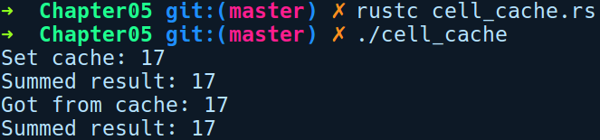

### 5.8.5　内部可变性的应用

在5.8.4小节中，关于Cell和RefCell的应用示例已经经过简化，你可能并不需要在实际工作中以这种形式使用它们。让我们来看看这些类型在实际应用中的优点。

如前所述，绑定的可变性并不是细粒度的，值既可以是不可变的，也可以是可变的，并且如果它是结构体或枚举，那么它还将包括其所有字段。Cell和RefCell可以将不可变的内容转换成可变的，允许我们将不可变的结构体中的某个部分定义为可变的。

下列代码将使用两个整数和sum方法来扩展结构体，以缓存求和的结果，并返回缓存的值（如果存在）：

```rust
// cell_cache.rs
use std::cell::Cell;
struct Point {
    x: u8,
    y: u8,
    cached_sum: Cell<Option<u8>>
}
impl Point {
    fn sum(&self) -> u8 {
        match self.cached_sum.get() {
            Some(sum) => {
                println!("Got from cache: {}", sum);
                sum
            },
            None => {
                let new_sum = self.x + self.y;
                self.cached_sum.set(Some(new_sum));
                println!("Set cache: {}", new_sum);
                new_sum
            }
        }
    }
}
fn main() {
    let p = Point { x: 8, y: 9, cached_sum: Cell::new(None) };
    println!("Summed result: {}", p.sum());
    println!("Summed result: {}", p.sum());
}
```

以下是上述程序的执行结果：


