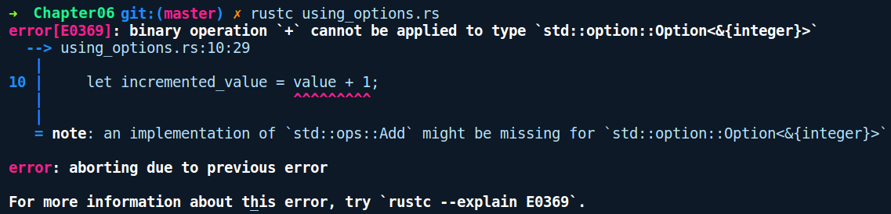

### 6.2.1　Option

在支持空值的编程语言中，程序员采用防御式代码来应对任何值可能为空（null）的操作。以Kotlin/Java为例，它们的代码如下所示：

```rust
// kotlin伪代码
val container = collection.get("some_id")
if (container != null) {
    container.process_item();
} else {
    // no luck
}
```

首先，我们检查container是否为null，然后在其上调用process_item。如果我们忘记了对null的安全性检查，那么在尝试调用container.process_item()时，就可能会得到NullPointerException 异常——只有在运行时抛出相应的异常你才会知道这一点。另外，我们无法通过查看代码立即推断出container是否为null。为了避免这一点，代码库中需要添加这些null值检查，这在很大程度上影响了代码的可读性。

Rust中没有null值的概念，这被Tony Hoare称为价值10亿美元的错误，他于1965年在ALGOLW语言中引入了空引用的概念。在Rust中，可能失败并希望指示缺失相应值的API会返回Option。当我们的任何API及其后续值想要表示缺少值时，此错误类型就是合适的。简而言之，它与null值类似。不过这里的null值检查是显式的，并且在编译期由类型系统强制执行。

Option包含以下类型签名：

```rust
pub enum Option<T> {
    /// 没有值
    None,
    /// 包含某些值'T'
    Some(T),
}
```

它是一个包含两个变体的枚举，并且T是泛型。我们可以使用“let wrapped_i32 = Some(2);”或者“let empty: Option<i32> = None;”创建一个Option值。

操作成功时可以使用Some(T)存储任意值T，或者使用None变量来表示操作失败的情况下该值为null。虽然我们不太可能显式地创建None值，但是当我们需要创建None值时，需要在赋值表达式的左侧指定类型，因为Rust无法从右侧推断出类型。我们也可以在右边初始化它，例如使用“None::<i32>;”或者使用turbofish运算符，指定左侧的类型会被当作常见的Rust代码。

如前所述，我们没有通过完整的语法创建Option值，即Option::Some(2)，而是直接使用Some(2)。这是因为它的两个变体都会自动从std程序库（Rust标准库程序包）中重新导出，作为prelude模块的一部分。prelude模块包含常用的类型、函数和任意标准库模块的重新导出。这些重新导出只是标准库程序包提供的便捷方式，没有它们，我们每次使用这些常见类型时都必须编写完整的语法。因此，这允许我们直接通过变体实例化Option值，Result类型也是如此。

因此，创建它们很容易，但是当你与Option值交互时它会如何呢？在标准库中，我们在HashMap类型上有一个get方法，它会返回一个Option：

```rust
// using_options.rs
use std::collections::HashMap;
fn main() {
    let mut map = HashMap::new();
    map.insert("one", 1);
    map.insert("two", 2);
    let value = map.get("one");
    let incremented_value = value + 1;
}
```

这里，我们创建了一个新的HashMap映射，其中&str作为键，i32作为值，然后我们检索"one"键对应的值，并将其分配给变量value。编译时，我们得到以下错误提示信息：


为什么我们不能将value的值加1呢？对熟悉命令式语言的用户来说，我们希望调用p.get()后，如果存在值，则返回一个i32值，否则返回null。但是这里的value是一个Option<&i32>。get()方法返回的是一个Option<&i32>，而不是其内部的值（&i32），因为我们可能没有找到相应的键值，因此这种情况下get会返回None。但是，它给出了一个误导性的错误提示信息，Rust不知道如何将i32添加到Option<&i32>，而上述两种类型都没有添加Add特征的实现。但是，确实存在两个i32或两个&i32的结果。

因此，为了给value的值加1，我们需要从Option中提取i32。这里我们可以看到Rust的显式错误处理行为开始发挥作用。在检查map.get()的返回结果是Some变体，还是None变体之后，我们只能与内部的i32值进行交互。

为了检查变体，我们有两种方法，它们分别是模式匹配和if let语句：

```rust
// using_options_match.rs
use std::collections::HashMap;
fn main() {
    let mut map = HashMap::new();
    map.insert("one", 1);
    map.insert("two", 2);
    let incremented_value = match map.get("one") {
        Some(val) => val + 1,
        None => 0
    };
    println!("{}", incremented_value);
}
```

使用此方法，我们将匹配map.get()的返回值，并根据变体执行相应的操作。返回None时，我们只把0分配给incremented_value。我们可以达到上述目的的另一种方法是使用if let语句：

```rust
let incremented_value = if let Some(v) = map.get("one") {
    v + 1
} else {
    0
};
```

当我们对值的某个变体感兴趣并希望对其他变体进行常规的操作时，推荐使用这种方法。在这种情况下，if let语句的表述更简洁。

** **Unwrapping** ** ：另一种不太安全的方法是在Option上调用解压缩方法，即unwrap()和expect()方法。如果返回的结果是Some，那么调用这些方法后将提取内部的值；如果返回的结果是None，则会发生异常。仅当我们确定Option值确实包含某个值时，才推荐使用这些方法：

```rust
// using_options_unwrap.rs
use std::collections::HashMap;
fn main() {
    let mut map = HashMap::new();
    map.insert("one", 1);
    map.insert("two", 2);
    let incremented_value = map.get("three").unwrap() + 1;
    println!("{}", incremented_value);
}
```

运行上述代码会出现异常，并显示以下提示信息，因为我们对None值执行了解压缩，系统提示无法找到“three”键对应的值：

```rust
thread 'main' panicked at 'called `Option::unwrap()` on a `None` value',
libcore/option.rs:345:21
note: Run with `RUST_BACKTRACE=1` for a backtrace.
```

在二者之间，expect()是首选方法，因为它允许你传递一个字符串作为发生异常时输出的提示信息，同时显示源文件发生异常时的确切代码行号，而unwrap()不允许你将调试信息作为参数进行传递，并显示在标准库源文件中Option下定义unwrap()的代码行号，否则这样它的功能就逊色不少。这些方法会出现在Result类型中。

接下来，让我们看一看Result类型。

