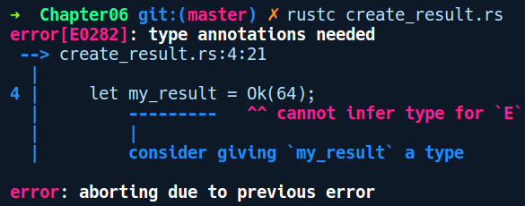
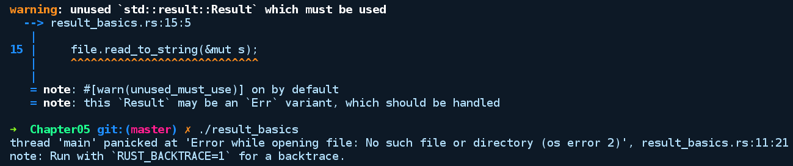

### 6.2.2　Result

Result和Option类似，但具有一些额外的优点，即能够存储和错误上下文有关的任意异常值，而不只是None。当我们希望知道操作失败的原因时，此类型是合适的。以下是Result的类型签名：

```rust
enum Result<T, E> {
   Ok(T),
   Err(E),
}
```

它包含两个变体，并且都是泛型。Ok(T)是用于表示成功状态时放入任意值T的变体，而Err(E)是用于表示执行失败时放入任何异常值T的变体。我们可以像这样创建它们：

```rust
// create_result.rs
fn main() {
    let my_result = Ok(64);
    let my_err = Err("oh no!");
}
```

但是，上述代码不能成功编译，我们将收到以下错误提示信息：


由于Result包含两个泛型变体，我们只给出my_result的Ok变体的具体类型，但是没有指定E的具体类型。my_err值的情况也类似。我们需要为两者指定具体类型，如下所示：

```rust
// create_result_fixed.rs
fn main() {
    let _my_result: Result<_, ()> = Ok(64);
    // or
    let _my_result = Ok::<_, ()>(64);
    // 同样，我们可以创建Err类型的变量
    let _my_err = Err::<(), f32>(345.3);
    let _other_err: Result<bool, String> = Err("Wait, what ?".to_string());
}
```

在创建Ok变体值的第1种情况下，我们使用()来指定Err变体的类型E。在代码段的第2部分中，我们以类似的方式创建了Err变体的值，这一次指定了Ok变体的具体类型。在显而易见的情况下，我们可以使用下画线来要求Rust为我们推断具体的类型。

接下来，我们将看到如何与Result值进行交互。标准库中的许多文件操作API都会返回Result类型，因为可能存在不同的操作失败原因，例如找不到文件（file not found）、目录不存在（directory does not exists），以及权限错误（permission errors）等。上述内容可以放入Err变体中，让用户知道确切的原因。对于上述示例，我们将尝试打开某个文件，将其中的内容写入一个String，之后输出，如下列代码所示：

```rust
// result_basics.rs
use std::fs::File;
use std::io::Read;
use std::path::Path;
fn main() {
    let path = Path::new("data.txt");
    let file = File::open(&path);
    let mut s = String::new();
    file.read_to_string(&mut s);
    println!("Message: {}", s);
}
```

这是编译器的输出结果：


我们通过调用File的open方法创建了一个新文件，并提供了data.txt的路径，不过该路径并不存在。当我们在文件上调用read_to_string，并尝试将其读入s时，得到了前面的错误提示信息。通过错误提示信息可以知道，该文件的类型貌似是Result<File, Error>。根据说明文档，open方法的定义如下所示：

```rust
fn open<P: AsRef<Path>>(path: P) -> Result<File>
```

细心的读者可能会感到疑惑，因为看起来Result缺少错误变体的泛型E，实际上它只是被type别名隐藏了。我们查看std::io模块中的类型别名定义，如下所示：

```rust
type Result<T> = Result<T, std::io::Error>;
```

因此，它是包含通用错误类型std::io::Error的类型别名。这是因为标准库中的许多API都将此作为错误类型使用。这是类型别名的另一个好处，我们可以从类型签名中提取公共部分。抛开该错误提示信息，为了能够在文件上调用read_to_string方法，我们需要提取内部File实例，即对变体进行模式匹配。为此，前面的代码需要进行修改，如下所示：

```rust
// result_basics_fixed.rs
use std::fs::File;
use std::io::Read;
use std::path::Path;
fn main() {
    let path = Path::new("data.txt");
    let mut file = match File::open(&path) {
        Ok(file) => file,
        Err(err) => panic!("Error while opening file: {}", err),
    };
    let mut s = String::new();
    file.read_to_string(&mut s);
    println!("Message: {}", s);
}
```

在这里，我们进行了两处修改。首先，我们让file变量可变。为什么呢？因为read_to_string的函数签名如下所示：

```rust
fn read_to_string(&mut self, buf: &mut String) -> Result<usize>
```

第1个参数是&mut self，这意味着调用此方法的实例需要是可变的，因为读取文件会更改文件句柄的内部指针。

其次，我们需要处理两个变体，在Ok的情况下，如果执行成功，那么会返回实际的File对象；如果执行失败，那么将会得到Err值和一条错误提示信息。

经过上述改动，让我们编译并运行该程序：


出现上述错误提示信息是因为我们的目录中没有一个名为data.txt的文件。尝试在其中创建一个包含任意文本的同名文件，然后再次运行该程序，以查看它是否成功执行。首先，让我们来处理这些警告。警告始终是代码质量不佳的标志。理想情况下我们应该让它们都消失。出现警告是因为File::read_to_string（一个来自Read 特征的方法）返回了一个Result<usize>类型的值。只要忽略函数调用后返回的值，Rust 就会发出警告。这里，Result<usize>中的usize值告诉我们向字符串中写入了多少字节。

我们有两种方法处理此警告。

+ 像之前通过read_to_string返回Result值那样处理Ok和Err的情况。
+ 将返回值分配给特殊的变量_（下画线），这使编译器知道我们要忽略该值。

对于我们不关心值的情况，可以采用第2种方法，所以read_to_string代码行可以进行如下修改：

```rust
let _ = file.read_to_string(&mut s);
```

经过上述修改之后，代码可以在没有警告的情况下成功编译。但是你应该处理返回值，并尽量不要使用宽泛的下画线变量。

