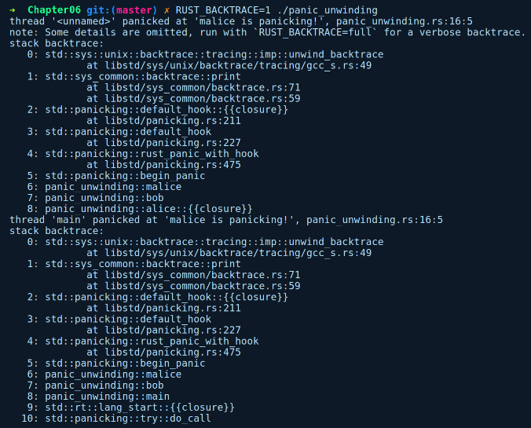
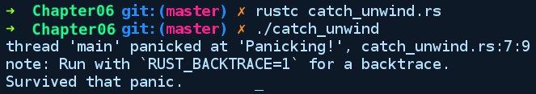

### 6.5　不可恢复的异常

当处于执行阶段的代码遇到错误或某个变体不合法时，如果忽略它们，就有可能以意想不到的方式破坏程序的状态。这些情况被认为是不可恢复的，因为它们的程序状态不一致，这可能导致输出错误或者后续出现意外的行为。这意味着某种失败-终止（fail-stop）是从中恢复的最佳方式，不会间接影响其他部件或系统。对于这类情况，Rust为我们提供了一种被称为panic（故障）的机制，它会终止调用它的线程，而不会影响任何其他线程。如果主线程是出现灾难性故障的线程之一，那么程序将返回非零退出代码101终止程序运行。如果它是一个子线程，那么灾难性故障不会传播到父线程，且会在线程边界处停止。一个线程中的灾难性故障不会影响其他线程，且该故障会被隔离，除非它会破坏某些共享数据上的互斥锁；它也被实现为具有相同机制的panic!宏。

当panic!宏被调用时，发生灾难性故障的线程开始展开函数调用堆栈，从调用它的位置开始，一直到线程的入口点。和异常类似，它还为此过程中调用的所有函数生成堆栈跟踪或回溯。但在这种情况下，它不需要查找任何异常处理程序，因为这些程序在Rust中并不存在。展开是在清理或释放资源时从每个函数调用堆栈向上移动函数调用链的过程，这些资源可以是在堆栈或堆上分配的。一旦函数执行完毕，堆栈上分配的资源会自动释放。对于在堆上分配资源的变量，Rust会对它们执行drop方法，从而释放相关资源占用的内存。这种清理是必要的，以便避免内存泄漏。除了显式调用panic代码之外，如果存在任何对失败的值进行解包的代码，Result/Option错误类型也会调用panic代码，即Err/None。panic也是在单元测试中处理失败断言的选择，并且鼓励用户使用#[should_panic]属性进行灾难性故障测试。

如果单线程代码在主线程上出现灾难性故障，那么展开不会带来太多好处，因为操作系统会在进程终止后回收所有内存。幸运的是，有一些选项可以关闭在发生灾难性故障时的展开操作，这对嵌入式系统这样的平台是必需的。我们有一个主线程完成所有工作，而展开是一种开销非常昂贵的操作，并且没有多大用处。

为了找出导致灾难性故障的一系列调用，我们可以通过运行任何发生灾难性故障的程序，并在命令行Shell上设置环境变量RUST_BACKTRACE=1来查看线程中的回溯。以下是一个包含两个线程的示例，它们都出现了灾难性故障：

```rust
// panic_unwinding.rs
use std::thread;
fn alice() -> thread::JoinHandle<()> {
    thread::spawn(move || {
    bob();
    })
}
fn bob() {
    malice();
}
fn malice() {
    panic!("malice is panicking!");
}
fn main() {
    let child = alice();
    let _ = child.join();
    bob();
    println!("This is unreachable code");
}
```

alice使用thread::spawn生成一个新线程，并在闭包内调用bob。bob会调用malice，这会导致灾难性故障：main也会调用bob，这也会导致灾难性故障。

以下是运行该程序的输出结果：


我们通过调用join()来加入线程，并期望子线程保持正常运行，但事实并非如此。我们得到两个回溯，一个是子线程中发生了灾难性故障，一个是主线程中调用了bob。

如果你需要更精细地控制如何在线程中处理灾难性故障后的堆栈展开，那么可以使用std::panic::catch_unwind函数。建议通过Option/Result机制处理错误，你也可以使用此方法来处理工作线程中的致命性错误；可以通过恢复任何违规的常量，让相应的程序终止，然后恢复它们。不过catch_unwind并不能阻止灾难性故障的发生，它只允许自定义与灾难性故障有关的堆栈展开行为。建议不要将具有catch_unwind的灾难性故障处理方案作为Rust程序通用的错误处理方法。

catch_unwind函数会接收一个闭包并处理其中发生的灾难性故障。以下是它的类型签名：

```rust
fn catch_unwind<F: FnOnce() -> R + UnwindSafe, R>(f: F) -> Result<R>
```

如你所见，catch_unwind的返回值还有一个附加约束UnwindSafe。这意味着闭包中的变量必须是异常安全的（exception-safe），至少对大多数类型如此，但值得注意的例外是可变引用（&mut T）。如果抛出异常的代码不会导致值处于不一致状态，那么值是异常安全的。这意味着闭包内的代码必定不是panic!()自身。

以下是一个使用catch_unwind的简单示例：

```rust
// catch_unwind.rs
use std::panic;
fn main() {
    panic::catch_unwind(|| {
        panic!("Panicking!");
    }).ok();
    println!("Survived that panic.");
}
```

这是运行上述程序后的输出结果：


如你所见，catch_unwind并不会阻止灾难性故障的发生，它只是停止发生灾难性故障的线程中的堆栈展开。注意，catch_unwind不是Rust中处理错误的推荐方案。它不能确保捕获所有灾难性故障，例如让程序终止运行的故障。在Rust代码与其他语言（例如C语言）交互的情况下，捕获发生灾难性故障的堆栈展开是必要的，其中展开C代码是未定义的行为。在这种情况下，程序员必须通过返回的错误代码来处理展开并执行C语言期望的操作。然后程序可以通过使用来自相同panic模块的resume_unwind函数恢复展开。

发生灾难性故障后默认的展开行为会导致内存开销过于昂贵的极端情况，例如为微控制器编写程序时，编译器包含一个可以将之配置为终止处理所有灾难性故障的标志。为此，你的项目下的Cargo.toml文件中需要在profile.release下添加以下属性：

```rust
[profile.release]
panic = "abort"
```

