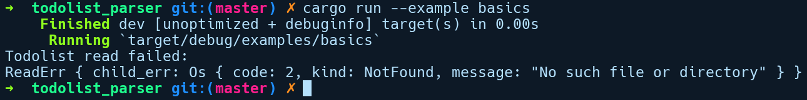

### 6.6　自定义错误和Error特征

包含多种功能的优秀项目通常由多个模块构成。通过组织结构，它为用户提供了更多特定于某个模块的错误信息。Rust允许我们创建自定义错误类型，以帮助我们从应用程序中获得更详细的错误报告。如果没有特定于我们项目的自定义错误类型，就可能必须使用标准库中现有的错误类型，这也许与我们的API操作无关，并且如果模块中操作出现问题，则不会向用户提供准确的信息。

在包含异常的语言中（例如Java）创建自定义异常的方式是从基础的Exception类继承并覆盖其方法和成员变量。虽然Rust没有类型层级继承，但它具有特征继承，并为我们提供了任何类型都可以实现的Error特征，从而构造自定义错误类型。当使用诸如Box<dyn Error>这样的特征对象作为Err变量函数返回类型返回Result时，此类型可以与现有的标准库错误类型组合。以下是Error特征的类型签名：

```rust
pub trait Error: Debug + Display {
    fn description(&self) -> &str { ... }
    fn cause(&self) -> Option<&dyn Error> { ... }
}
```

为了创建自定义错误类型，该类型必须实现Error特征。如果我们查看该特征的定义，会发现它还要求我们为自定义类型实现Debug和Display特征。description方法会返回一个字符串切片引用，它是描述错误内容的可读形式。cause方法返回一个Error特征对象的可选引用，用于表示可能导致错误发生的底层原因。自定义错误类型的cause方法允许用户从问题源头获取有关错误的一系列信息，从而精确地记录错误。例如，让我们将HTTP查询作为操作失败的示例。我们的hypothetical库包含一个get方法来执行GET请求。导致查询失败的原因有多种。

+ 由于网络故障或地址不正确，可能使DNS查询失败。
+ 可能是因为实际的数据包传输失败。
+ 可能会正确地接收数据，但收到的HTTP首部存在问题等。

如果是第1种情况，我们可以考虑包含3个层级的错误，并且由cause字段连接在一起。

+ 由于网络宕机导致UDP连接失败（cause = None）。
+ 由于UDP连接失败导致DNS查找失败（cause = UDPError）。
+ 由于DNS查找失败导致GET请求失败（cause = DNSError）。

当开发人员想要知道导致失败的根本原因时，cause方法就会派上用场。

现在，为了演示将自定义错误类型集成到项目中，我们使用cargo创建了一个名为todolist_parser的程序库，它公开了一个用于解析文本文件中待办事项列表的API。todos的解析操作可能会由于多种原因而失败，例如找不到文件，待办事项列表是空的，或者因为它包含非文本字符。我们将使用自定义错误类型来模拟这些情况。在src/error.rs文件中，我们定义了以下错误类型：

```rust
// todolist_parser/src/error.rs
use std::error::Error;
use std::fmt;
use std::fmt::Display;
#[derive(Debug)]
pub enum ParseErr {
    Malformed,
    Empty
}
#[derive(Debug)]
pub struct ReadErr {
    pub child_err: Box<dyn Error>
}
// Error特征要求的
impl Display for ReadErr {
    fn fmt(&self, f: &mut fmt::Formatter) -> fmt::Result {
        write!(f, "Failed reading todo file")
    }
}
// Error特征要求的
impl Display for ParseErr {
    fn fmt(&self, f: &mut fmt::Formatter) -> fmt::Result {
        write!(f, "Todo list parsing failed")
    }
}
impl Error for ReadErr {
    fn description(&self) -> &str {
        "Todolist read failed: "
    }
    fn cause(&self) -> Option<&dyn Error> {
        Some(&*self.child_err)
    }
}
impl Error for ParseErr {
    fn description(&self) -> &str {
        "Todolist parse failed: "
    }
    fn cause(&self) -> Option<&Error> {
        None
    }
}
```

目前为止，我们正在对两类非常基本的错误进行建模。

+ 未能读取被建模为ReadErr的todos列表。
+ 无法解析被建模为ParseErr的todos。它有两种变体，一种是文件为空（Empty），另一种是包含非二进制文本符号的文件，这意味着todos格式不正确（Malformed）。

接下来，我们实现Error特征和所需的超级特征，即Display和Debug。lib.rs包含必要的解析方法，以及TodoList结构体的声明，如以下代码所示：

```rust
// todolist_parser/src/lib.rs
//! 该程序库提供了一个解析todos列表的API
use std::fs::read_to_string;
use std::path::Path;
mod error;
use error::ParseErr;
use error::ReadErr;
use std::error::Error;
/// 该结构体包含一个解析为Vec<String>的todos列表
#[derive(Debug)]
pub struct TodoList {
    tasks: Vec<String>,
}
impl TodoList {
    pub fn get_todos<P>(path: P) -> Result<TodoList, Box<dyn Error>>
    where
    P: AsRef<Path>, {
        let read_todos: Result<String, Box<dyn Error>> = read_todos(path);
        let parsed_todos = parse_todos(&read_todos?)?;
        Ok(parsed_todos)
    }
}
pub fn read_todos<P>(path: P) -> Result<String, Box<dyn Error>>
where
    P: AsRef<Path>,
{
    let raw_todos = read_to_string(path)
        .map_err(|e| ReadErr {
            child_err: Box::new(e),
        })?;
    Ok(raw_todos)
}
pub fn parse_todos(todo_str: &str) -> Result<TodoList, Box<dyn Error>> {
    let mut tasks: Vec<String> = vec![];
    for i in todo_str.lines() {
        tasks.push(i.to_string());
    }
    if tasks.is_empty() {
        Err(ParseErr::Empty.into())
    } else {
        Ok(TodoList { tasks })
    }
}
```

我们有read_todos和 parse_todos这两个顶层函数，它会被TodoList的get_todos方法调用。

我们在examples/basics.rs中有一个TodoList的示例用法，如下所示：

```rust
// todolist_parser/examples/basics.rs
extern crate todolist_parser;
use todolist_parser::TodoList;
fn main() {
    let todos = TodoList::get_todos("examples/todos");
    match todos {
        Ok(list) => println!("{:?}", list),
        Err(e) => {
            println!("{}", e.description());
            println!("{:?}", e)
        }
    }
}
```

如果我们通过cargo run --example basics命令执行basics.rs示例，那么将得到以下输出结果：


如果你查找输出结果中的错误值，将会发现导致错误的实际原因会被附加到ReadErr值中。

Rust内置了很多函数来帮助用户构造自定义错误类型。如果你正在编写自己的软件包，那么使用自定义错误类型调试程序将会更容易。但是，为所有自定义类型实现Error特征将会变得“笨拙”并且耗时。幸运的是，我们有一个来自Rust社区名为failure的软件包，它能够自动构建自定义错误类型，并通过程序宏自动化实现必要的特征。如果你并不满足于此，那么建议你重构此软件包来使用failure库。

