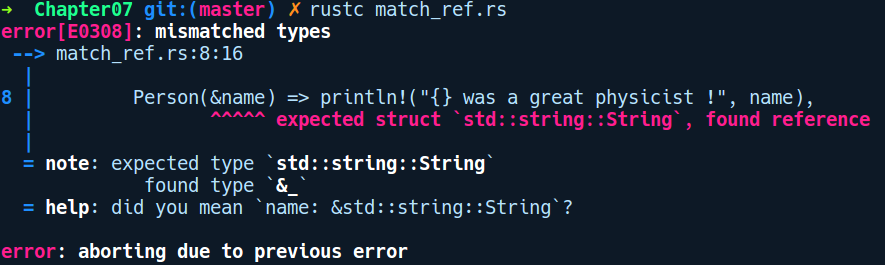
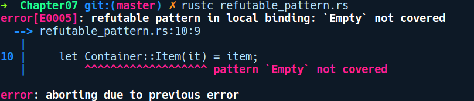

### 7.1.2　let语句

在第1章中，我们已经简要介绍过let语句，它用于创建新的变量绑定——但是let的功能并不仅限于此。事实上，let语句是一个模式匹配语句。模式匹配是一种主要在类似Haskell等函数式语言中出现的结构，它允许我们根据内部结构对值进行操作和判断，或者可以用于从代数数据类型中提取值。我们有如下代码：

```rust
let a = 23;
let mut b = 403;
```

第一行代码是let语句的最简单应用形式，它声明了一个不可变的变量绑定a。在第二行代码中，我们在let后面添加了mut关键字来声明变量b，mut是let模式的一部分，在这种情况下，它是将b可变地绑定到i32类型的模式。mut使b能够再次绑定到其他i32类型。另一个可以和let搭配使用但不常见的关键字是ref。通常我们会使用运算符“&”来创建指向任何值的引用/指针。创建对任何值的引用的另一种方法是使用带有关键字ref的let语句。为了说明关键字ref和mut，我们有以下代码片段：

```rust
// let_ref_mut.rs
#[derive(Debug)]
struct Items(u32);
fn main() {
    let items = Items(2);
    let items_ptr = &items;
    let ref items_ref = items;
    assert_eq!(items_ptr as *const Items, items_ref as *const Items);
    let mut a = Items(20);
    // 通过作用域将b对a的改动限制在内部代码块中
    {
        // 也可以像这样使用可变引用
        let ref mut b = a; // same as: let b = &mut a;
        b.0 += 25;
    }
    println!("{:?}", items);
    println!("{:?}", a);      // 没有上述作用域的限制，代码将无法通过编译
                              // 尝试将上述作用域删除，看看结果如何？
}
```

这里，item_ref是使用普通的运算符“&”创建的引用。接下来的一行是使用ref创建了指向相同items值的items_ref引用的代码。我们可以使用后续的assert_eq!调用来确认这一点，这两个指针变量指向了相同的items值。转换为*const Items是为了比较两个指针是否指向相同的内存地址，其中*const Items是Items的原始指针类型。另外，代码倒数第二部分是为了组合ref和mut，除了通常使用&mut运算符的方式之外，我们可以获得任何已有值的可变引用。但是我们必须在内部作用域中通过b来修改a。

使用模式匹配的语言不仅限于可以在“=”的左侧提供标识符，还可以具有涉及类型结构的模式。因此，let语句能够为我们提供的另一个便捷功能是可以从代数数据类型的字段中提取值，例如将结构体或枚举作为新的变量。在这里，我们有一个代码片段来演示它：

```rust
// destructure_struct.rs
enum Food {
    Pizza,
    Salad
}
enum PaymentMode {
    Bitcoin,
    Credit
}
struct Order {
    count: u8,
    item: Food,
    payment: PaymentMode
}
fn main() {
    let food_order = Order { count: 2,
                             item: Food::Salad,
                             payment: PaymentMode::Credit };
    // let可以通过模式匹配将内部字段添加到新的变量中
    let Order { count, item, .. } = food_order;
}
```

这里我们创建了一个Order的实例，它被绑定到变量food_order。假设我们从某个方法调用中得到food_order，并且希望访问count和item的值。我们可以直接使用let语句单独提取count和item字段。count和item会成为保存Order实例中相应字段值的新变量。

这种技术被称为let的解构语法。变量被解构的方式取决于右边的值是不可变引用、可变引用，还是拥有所有权的值，或者我们如何使用ref或mut模式在左侧引用它。在前面的代码中，它被值捕获，因为food_order拥有Order实例，我们匹配的左侧成员没有使用任何ref或mut关键字进行修饰。如果想通过不可变引用来构造成员，那么可以在food_order之前放置一个运算符“&”或者使用关键字ref或mut进行修饰：

```rust
let Order { count, item, .. } = &food_order;
//或者
let Order { ref count, ref item, .. } = food_order;
```

第一种风格通常是首选，因为它比较简洁。如果我们想要一个可变引用，那么必须在food_order之前添加&mut，以便让其自身成为可变的引用：

```rust
let mut food_order = Foo { count: 2,
                           item: Food::Salad,
                           payment: PaymentMode::Credit };
let Order { count, item, .. } = &mut food_order;
```

我们不关心的字段可以使用“..”予以忽略，如上述代码所示。另外，解构的轻微限制在于我们不能自由选择单个字段的可变性。所有变量必须具有相同的可变性——要么都是不可变的，要么都是可变的。请注意，ref通常不用于声明变量绑定，而主要用于match表达式中，当我们希望通过引用匹配值时，运算符“&”在匹配中不起作用，如下所示：

```rust
// match_ref.rs
struct Person(String);
fn main() {
    let a = Person("Richard Feynman".to_string());
    match a {
        Person(&name) => println!("{} was a great physicist !", name),
         _ => panic!("Oh no !")
    }
    let b = a;
}
```

如果我们想通过一个不可变引用来使用Person结构体中的内部值，直觉会告诉我们在匹配臂中对类似Person(&name)的结构体应该通过引用进行匹配。但是我们在编译代码时会得到以下错误提示信息：


这是一条具有误导性的错误提示信息，因为&name正在创建一个name之外的引用（&是一个运算符），编译器认为我们想要匹配Person(&String)，但a的值实际上是Person(String)。因此，在这种情况下，必须使用ref来将其解构为引用。为了让代码能够通过编译，我们相应地将左侧的内容改为Person(ref name)。

解构语法也适用于枚举类型：

```rust
// destructure_enum.rs
enum Container {
    Item(u64),
    Empty
}
fn main() {
    let maybe_item = Container::Item(0u64);
    let has_item = if let Container::Item(0) = maybe_item {
        true
    } else {
        false
    };
}
```

这里我们将maybe_item作为Container枚举。结合if let语句和模式匹配，我们可以使用if let <destructure pattern> = expression {}有条件地将值分配给has_item变量。

解构语法也可以用在函数参数中。例如对于自定义类型，可以将结构体用作函数参数：

```rust
// destructure_func_param.rs
struct Container {
    items_count: u32
}
fn increment_item(Container {mut items_count}: &mut Container) {
    items_count += 1;
}
fn calculate_cost(Container {items_count}: &Container) -> u32 {
    let rate = 67;
    rate * items_count
}
fn main() {
    let mut container = Container {
        items_count: 10
    };
    increment_item(&mut container);
    let total_cost = calculate_cost(&container);
    println!("Total cost: {}", total_cost);
}
```

这里，calculate_cost函数有一个参数，它被解构为一个结构体，其中的字段被绑定到items_count变量。如果我们想要可变地进行解构，那么需要在成员字段前面添加关键字mut，就像使用increment_item函数那样。

可验证模式：可验证模式是let模式中左侧和右侧不兼容匹配，在这种模式下，必须使用穷举match表达式。到目前为止，我们看到的所有let模式都是不需要验证的模式。不需要验证意味着它们能够作为有效模式正确匹配“=”右侧的值。

不过有时由于模式失效，它与let的模式匹配可能会失败，例如，在匹配具有两个变体的枚举Container时：

```rust
// refutable_pattern.rs
enum Container {
    Item(u64),
    Empty
}
fn main() {
    let mut item = Container::Item(56);
    let Container::Item(it) = item;
}
```

理想情况下，我们希望it从item中解构后存储56作为其值。如果我们尝试编译它，将会得到以下输出结果：


该匹配不能成功的原因是Container包含两个变体，即Item(u64)和Empty。即使我们知道item包含Item变体，但let模式也不能根据这个事实进行匹配，因为如果item是可变的，那么某些代码可以在稍后分配一个Empty变量，这将使解构出现未定义的操作。我们必须涵盖所有可能的情况。直接针对单个变体进行解构违反了详尽模式匹配的语义，因此我们的匹配会失败。

