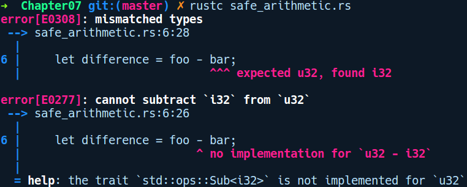

### 7.1.4　数字类型中的类型清晰度和符号区分

虽然主流语言区分数字基元（例如整数、双精度及字节），而且很多较新的语言（如Golang）也开始区分有符号和无符号的数字类型。Rust通过区分有符号和无符号的数字类型来顺应潮流，并将它们作为单独的类型予以提供。从类型检查的角度来看，这为我们的程序提供了另一层安全性保护。这允许我们编写精确指定其需求的代码。例如数据库连接池的结构体：

```rust
struct ConnectionPool {
    pool_count: usize
}
```

对于提供有符号和无符号的通用整型的语言，你可以将poll_count的类型指定为整数，它可以存储负值。pool_count为负值时没有意义。在Rust中，我们可以通过使用无符号类型（例如u32或usize）在代码中清楚地指定它。

关于基元类型需要注意的另一个方面是，当算术运算中混合包含有符号和无符号的数字类型时，Rust 不会执行自动强制类型转换。你必须明确这一点，并手动转换值。C/C++中意外自动类型转换的示例如下所示：

```rust
#include <iostream>
int main(int argc, const char * argv[]) {
    uint foo = 5;
    int bar = 6;
    auto difference = foo - bar;
    std::cout << difference;
    return 0;
}
```

上述代码的输出结果是4294967295。这里foo减去bar的差值结果不是−1；相反，C++在未经程序员同意的情况下自行做了一些事情。int（有符号整型）自动转换为uint（无符号整型），并将unit类型的最大值提升为4294967295。此代码继续运行，并且没有提示数据向下溢出。

在Rust中构造相同的程序，我们可得到以下代码：

```rust
// safe_arithmetic.rs
fn main() {
    let foo: u32 = 5;
    let bar: i32 = 6;
    let difference = foo - bar;
  println!("{}", difference);
}
```

以下是输出结果：


Rust不会编译它并提示错误信息。你必须根据自己的意图显式地转换其中某个值。另外，如果我们对两个无符号或有符号类型执行上溢/下溢操作，当在debug模式下构建和运行程序时，Rust将会调用panic!()并终止程序。当在release模式下构建程序时，它会执行包装算法。


**注意**

通过包装算法，我们将1和255（u8）相加后得到的结果将是0。


在调试模式下出现灾难性故障是正常的，因为如果允许这些任意值传播到代码的其他部分，可能会影响你的业务逻辑，并在程序中引入难以追踪的错误。因此，在用户意外执行上溢/下溢操作，并且在调试模式下捕获这类问题时，采用失败-终止这种解决方案可能更好。当程序员想要允许在算术运算上包装语义时，可以选择忽略灾难性故障，并在预览版模式下进行代码编译。这是该语言为用户提供的另一种安全特性。

