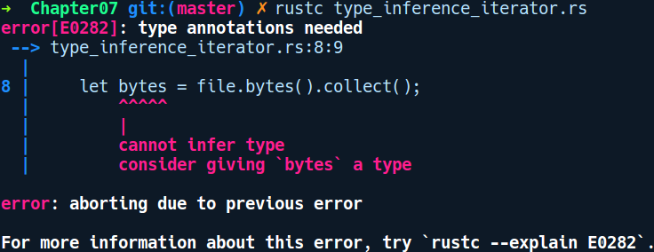

### 7.1.5　类型推断

类型推断对静态类型语言来说非常有用，因为这使代码更易于编写、维护及重构。当你不指定字段、方法、局部变量及大多数泛型参数时，Rust的类型系统可以自动推断出其类型。在底层，被称为类型检查器的编译器组件使用Hindley Milner类型推断算法来确定具体的局部变量的类型。它是一组根据其用法建立表达式类型的规则。实际上，它可以根据环境和类型的使用方式来推断类型。类似的示例如下所示：

```rust
let mut v = vec![];
v.push(2);    // 可以将“v”的类型判定为Vec<i32>
```

如果只初始化第1行代码，那么Rust的类型检查器将无法确定v的类型是什么。当出现下一行代码“v.push(2)”时，Rust的类型检查器才知道v的类型是Vec<i32>。现在v的类型被确定为Vec<i32>。

如果我们添加另一行代码“v.push(2.4f32);”，那么编译器会警告用户类型不匹配，因为它已经从前一行推断出v的类型为Vec<i32>。有时类型检查器无法在复杂情况下推断出变量类型，但在程序员的帮助下，类型检查器将能够推断。例如，对于接下来的代码片段，我们将读取文件foo.txt，其中包含一些文本，并且我们会以字节的方式读取它们：

```rust
// type_inference_iterator.rs
use std::fs::File;
use std::io::Read;
fn main() {
    let file = File::open("foo.txt").unwrap();
    let bytes = file.bytes().collect();
}
```

编译代码后会看到以下错误提示信息：


迭代器上的collect方法基本上是一个聚合器方法，我们将在本章的后续内容中讨论迭代器。它收集的结果类型可以是任何集合类型，如LinkedList、VecDeque或Vec。Rust并不能明确了解程序员的意图，由于这种模糊性，它需要我们的帮助。现在对main函数中的第2行代码进行如下修改：

```rust
let bytes: Vec<Result<u8, _>> = file.bytes().collect();
```

调用bytes()时返回Result<u8, std::io::Error>。在添加了一些关于收集内容的类型提示（这里是Vec）之后，程序代码顺利通过编译。请注意Result错误变体上的_，这足以让Rust暗示我们需要一个Result为u8类型的Vec。此外，它能够推断出Result的错误类型需要的是std::io::Error类型。能够做出这类判断是因为这里不存在模糊性，并且能够从bytes()方法签名中获得信息。

