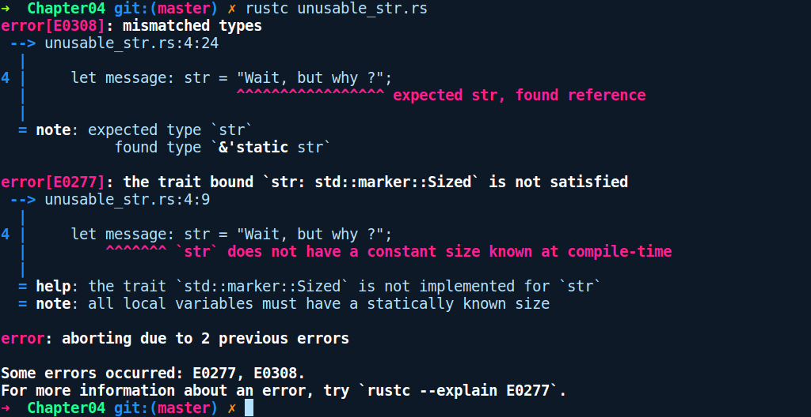

### 7.2.2　借用字符串—— &str

我们可以将字符串用作被称为字符串切片的引用。它们一般用&str表示，表示对str类型的引用。与String类型相反，str是编译器能够识别的内置类型，并且不属于标准库。字符串切片默认创建为&str —— 一个指向UTF-8编码字节序列的指针。我们无法创建和使用裸str类型的值，因为它表示有限但大小未知的UTF-8编码的连续字节序列。这在技术上被称为不定长类型。我们将在本章后续内容中介绍不定长类型。

str只能创建为引用类型。假定我们尝试通过在左侧提供类型签名的方式来强制创建str类型：

```rust
// str_type.rs
fn main() {
    let message: str = "Wait, but why ?";
}
```

我们将会得到一个令人困惑的错误提示信息：


它提示说：所有局部变量都必须具有静态的已知大小（all local variables must have a statically known size）。这表示我们使用let语句定义的每个局部变量都需要具有在堆栈上分配的大小，并且在堆栈上具有固定的大小。众所周知，所有声明的变量在进入堆栈时都是以值本身或者指向堆分配类型的指针的形式存在的。所有堆栈分配的值都需要具有已知的适当大小，因此无法初始化str。

str基本意味着一个固定大小的字符串序列，这与其所在的位置无关。它既可以是一个堆分配的字符串引用，也可以是驻留在程序存续期内进程数据段上的&'static str字符串。这就是'static生命周期所修饰的内容。

但是，我们可以创建一个借用版本的str，就像在&str中那样，这是我们在编写字符串文本时默认创建的。因此字符串切片仅在指针之后创建和使用，即&str。作为一个引用，它们会根据变量所属的作用域而存在不同的生命周期。'static生命周期是其中之一，它表示字符串文本的生命周期。

字符串文本是你在双引号之内声明的任意字符序列。例如，我们可以这样创建它们：

```rust
// borrowed_strings.rs
fn get_str_literal() -> &'static str {
    "from function"
}
fn main() {
    let my_str = "This is borrowed";
    let from_func = get_str_literal();
    println!("{} {}", my_str, from_func);
}
```

在上述代码中，我们有一个返回字符串文本的函数get_str_literal。我们还在main函数中创建了一个字符串变量my_str。my_str和get_str_literal返回的字符串包含&'static str类型。'static生命周期修饰符表示字符串在程序存续期间保持不变。&表示它是指向字符串文本的指针，而str表示不定长类型。你碰到的任何其他&str类型都是在堆上借用任何拥有String类型的字符串切片。&str类型一旦创建就无法更改，因为默认情况下它是不可变的。

我们也可以获得字符串的可变切片，将类型改为&mut str即可，除了标准库中的一些方法之外，以这种形式使用它们并不常见。&str类型是将自身传递给函数或其他变量时推荐使用的类型。

