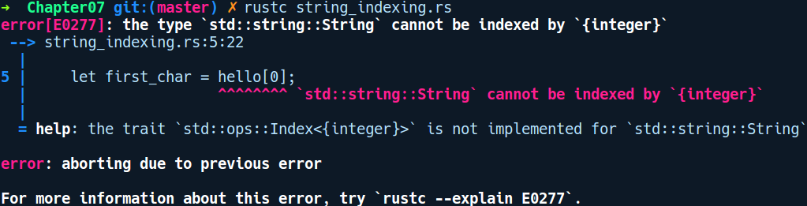

### 7.2.3　字符串切片和分块

默认情况下，Rust中的所有字符串都保证是UTF-8格式的，并且Rust中的字符串不能像在其他语言中那样通过索引访问字符串。让我们尝试访问字符串中的单个字符：

```rust
// strings_indexing.rs
fn main() {
    let hello = String::from("Hello");
    let first_char = hello[0];
}
```

在编译代码后，我们得到以下错误提示信息：


这些并不是十分有用的信息，但是它们涉及被称为Index的特征。Index特征是在集合类型上实现的，其元素可以通过将索引类型作为usize值由索引运算符[]进行访问。字符串是有效的UTF-8编码字节序列，单个字节并不等同于单个字符。在UTF-8中，单个字符也可以由多个字节表示。因此索引不适用于字符串。

相反，我们可以有字符串切片。这可以通过如下方式实现：

```rust
// string_range_slice.rs
fn main() {
    let my_str = String::from("Strings are cool");
    let first_three = &my_str[0..3];
    println!("{:?}", first_three);
}
```

但是，与所有索引操作的情况类似，如果开始或结束的索引位置不在有效的字符区间，那么会发生灾难性故障。

对字符串的所有字符进行迭代访问的另一种方法是使用chars方法，该方法将字符串转换为字符上的迭代器。让我们对前面的代码进行修改，进而用chars方法替代：

```rust
// strings_chars.rs
fn main() {
    let hello = String::from("Hello");
    for c in hello.chars() {
        println!("{}", c);
    }
}
```

chars方法会以适当的Unicode边界返回字符串中的字符。我们还可以调用其他迭代器方法来跳过或获取其中的某些字符。

