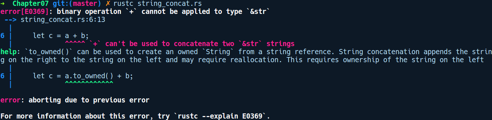

### 7.2.5　字符串拼接

在Rust中处理字符串时，另一个会让人感到困惑的地方是将两个字符串拼接到一起。在其他语言中，你可以使用非常直观的语法将两个字符串拼接到一起，如只需将"Foo"+"Bar"就可以获得"FooBar"。但是在Rust中并非如此：

```rust
// string_concat.rs
fn main() {
    let a = "Foo";
    let b = "Bar";
    let c = a + b;
}
```

如果我们编译上述代码，将会得到以下错误提示信息：


上述错误提示信息在这里非常有用。拼接操作分为两步：首先，你需要分配一个字符串，然后迭代访问它们，并将其字节复制到新分配的字符串中。这涉及隐式的堆分配操作，该操作隐藏在运算符“+”后面。Rust不鼓励隐式堆分配。相反，编译器建议我们通过显式地将第1个字符串转换成包含所有权的字符串来实现两个字符串的拼接，所以我们会对代码进行一些修改，如下所示：

```rust
// string_concat.rs
fn main() {
    let foo = "Foo";
    let bar = "Bar";
    let baz = foo.to_string() + bar;
}
```

因此我们通过调用to_string()方法让foo成为一个String类型。这种修改使我们的代码得以通过编译。

String和&str之间主要的差异在于，&str自身能够被编译器识别，而String是标准库中的自定义类型。你可以在Vec<u8>之上实现自定义的类似String抽象。

