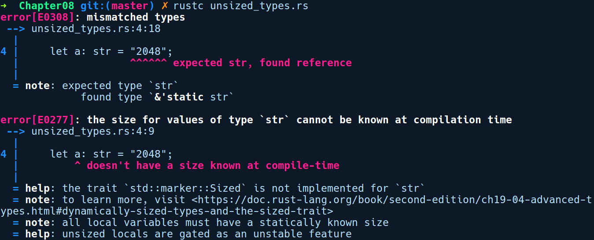

### 7.5.1　不定长类型

不定长类型是我们在尝试创建str类型时首次遇到的类型。我们知道只能在诸如&str之类的引用之后创建和使用字符串引用。如果尝试创建一个str类型，让我们看看得到的错误提示信息：

```rust
// unsized_types.rs
fn main() {
    let a: str = "2048";
}
```

编译上述代码后出现以下错误提示信息：


默认情况下，Rust将str的引用类型创建为'static str。错误提示信息提示我们在堆栈中的所有局部变量值必须在编译期具有静态的已知大小。这是因为堆栈的内存是有限的，我们不能支持包含无限或动态大小的类型。同样，还有其他不定长类型的实例。

+ [T]：这是类型T切片，它们只能用作&[T]或者&mut [T]。
+ dyn Trait：这是一个特征对象，它们只能用作&dyn Trait或者&mut dyn Trait类型。
+ 任何将不定长类型作为其最后一个字段的结构体也被视为不定长类型。
+ 我们已经介绍过 str 了，其内部只有一个[u8]，但是能够保证其中的字节都是有效的UTF-8格式。

