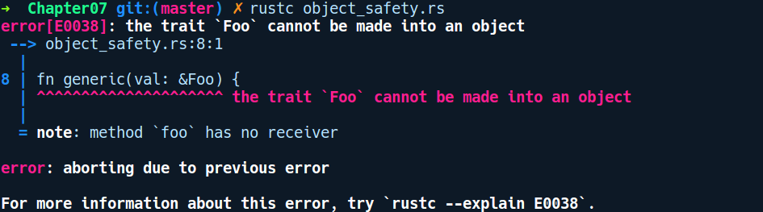

### 7.6.5　特征对象和对象安全性

对象安全性是指一组规则和限制，不允许违反上述规则构造相关的特征对象。请考虑如下代码：

```rust
// object_safety.rs
trait Foo {
    fn foo();
}
fn generic(val: &Foo) {
}
fn main() {
}
```

编译后出现了以下错误提示信息：


这让我们想到了对象安全性，它是一组禁止从某个特征创建特征对象的限制规则。在此示例中，由于我们的类型没有self引用，因此无法从中创建特征对象。在这种情况下，要想将任何类型转换为特征对象，类型上的方法必须是一个实例——通过引用获取self。因此，我们将特征方法声明foo改成如下形式：

```rust
trait Foo {
    fn foo(&self);
}
```

这使代码能够顺利编译。

