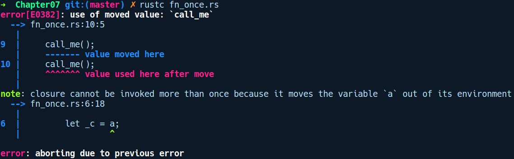

### 7.7.3　FnOnce闭包

从执行环境中获取数据的所有权的闭包实现了FnOnce特征。该名称表示此闭包只能被调用一次。因此，相关的变量只能使用一次。这是构造和使用闭包最不推荐的方法，因为后续不能使用其引用的变量：

```rust
// fn_once.rs
fn main() {
    let mut a = Box::new(23);
    let call_me = || {
        let c = a;
    };
    call_me();
    call_me();
}
```

此操作执行失败，并显示如下错误提示信息：


但是有些场景是只有 FnOnce 闭包才能胜任的。一个这样的例子是标准库中用于生成新线程的thread::spawn方法。

