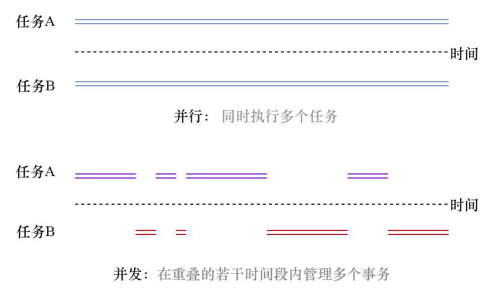

### 8.2　并发

程序同时管理多个事务从而让人以为它们是同时发生的能力被称为并发，这种程序被称为并发程序。并发允许将一个问题分解为多个子问题，以这种方式构建的程序执行效率更高。在讨论并发时，我们经常会碰到一个被称为并行的术语，关键在于我们需要知道它们之间的差异，因为这些术语经常会被混用。并行是指每个任务在独立的CPU内核上同步运行，并且没有重叠的时间段。下图说明了并发和并行之间的区别：

换句话说，并发和构建同时管理多个事务的程序有关，而并行是指将该程序交给多个内核处理，以增加它在一定时间内完成的工作量。通过这个定义，可以发现正确地遵循并发规则后，程序能够更高效地使用CPU；而并行可能并非在所有情况下都能付诸实践，如果你的程序并行运行，但只处理一个特定任务，那么吞吐量并不高。也就是说，当并发程序在多核硬件上运行时，我们能够两全其美。

通常，操作系统已经在底层提供了对并发的支持，而且开发人员主要针对编程语言提供的更高级别的抽象进行编程。除了底层支持之外，还有其他不同的并发方法。

