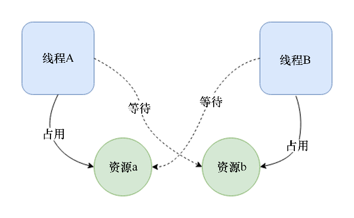

### 8.2.2　缺陷

并发的优点有很多，但它带来的复杂性和缺陷是我们必须处理的。编写并发程序代码时会遇到的一些问题如下所示。

+ 条件竞争：由于线程是由操作系统调度的，所以我们对它以什么顺序执行，以及如何访问共享数据没有发言权。多线程代码中的常见用例是从多个线程中更新全局状态。这需要经过3个步骤——读取、修改、写入。如果这3个操作不是由线程原子执行的，那么我们最终可能会遇到条件竞争问题。


**注意**

如果一组操作以不可分割的方式一起执行，那么它们是原子的。对于一组原子操作，不得在执行过程中抢先执行，它必须完全执行或根本不执行。


如果两个线程同时尝试更新内存位置上的某个值，它们可能最终会覆盖彼此的值，并且只会将其中一个更新记录写入内存，否则相应的值可能根本不会被更新。这是条件竞争的典型示例。这两个线程都在竞争更新值，而没有任何协调机制。这会导致其他问题，例如数据竞争。

+ **数据竞争**：当多个线程尝试将数据写入内存的某个位置，并且当两个线程同时对上述位置执行写入时，将很难预测会写入哪些值，内存中的最终结果可能是垃圾值。数据竞争是条件竞争导致的，因为读取、修改、更新操作必须由线程原子执行，以确保任何线程读取或写入数据的一致性。
+ **内存不安全性和未定义的行为**：竞争条件可能导致未定义的行为，请考虑如下伪代码：

```rust
// Thread A
Node get(List list) {
    if (list.head != NULL) {
        return list.head
    }
}
// Thread B
list.head = NULL
```

我们有两个线程A和B，它们作用于链表。线程A尝试检索链表的头部。为了安全地执行此操作，它首先检查列表的头部是否为NULL，再返回它。线程B将链表的头部设置为NULL。这两者几乎是同时发生的，并且可能会被操作系统按照不同的顺序进行调度。例如，在其中一个执行实例时，线程A首先运行，并断言list.head不为NULL。在此之后，线程A被操作系统挂起，然后线程B被安排运行。现在，线程B将list.head设置为NULL，接下来，当线程A有机会运行时将尝试返回list.head，它是一个NULL值。当读取list.head时，这将导致分段错误。在这种情况下，由于这些操作执行的顺序是随机的，因此可能发生内存不安全的问题。

前面提到的问题有一个通用的解决方案——同步或序列化对共享数据和代码进行访问，或者确保线程以原子方式运行关键的部分。这是通过同步原语（如互斥锁、信号量或条件变量）实现的。但是即使使用这些原语也可能导致其他问题，例如死锁。

死锁：除了条件竞争之外，线程面临的另一个问题是在保持锁定资源的同时缺乏资源。死锁是线程A持有资源a并正在等待资源b的情况，另一个线程B持有资源b并正在等待资源a。下图描绘了这种情况：


死锁很难被发现，但可以通过以正确的顺序获取锁来解决它们。在前面的情况下，如果线程A和线程B都尝试先锁定，我们可以确保正确地释放锁。

了解并发的优点和缺点之后，让我们通过Rust提供的API来编写并发程序。

