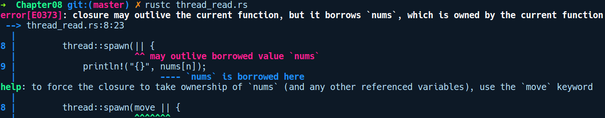
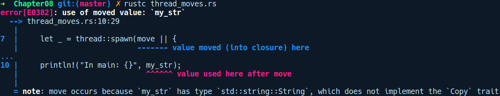

### 8.3.3　访问线程中的数据

不与父线程交互的子线程是非常少见的。让我们采用一种比较常见的应用模式，即使用多线程同时访问列表中的元素以执行某些计算。请考虑如下代码：

```rust
// thread_read.rs
use std::thread;
fn main() {
    let nums = vec![0, 1, 2, 3, 4];
    for n in 0..5 {
        thread::spawn(|| {
            println!("{}", nums[n]);
        });
    }
}
```

在上述代码中，我们的vec中包含5个数字，然后我们生成5个线程，其中每个线程都会访问vec中的数据。接下来让我们编译程序，得到以下错误提示信息：


上述错误提示信息很有趣，如果从借用的角度来考虑这些信息，这个错误就变得有意义了。nums来自主线程，当我们生成一个线程时，它不能保证在父线程之前退出，并且有可能比父线程存续时间更长。当父线程返回时，nums变量已经失效，它指向的Vec也会被释放。如果Rust允许前面的代码通过编译，那么子线程可能已经访问了主线程返回后包含一些垃圾值的nums，并且可能导致分段错误。

如果你查阅了编译器的帮助信息，它会建议我们在闭包内移动或捕获nums。这样一来主线程引用的nums变量将会被移动到闭包内部，并且会在主线程中失效。

这里使用关键字move从父线程中将值移动到其子线程中：

```rust
// thread_moves.rs
use std::thread;
fn main() {
    let my_str = String::from("Damn you borrow checker!");
    let _ = thread::spawn(move || {
        println!("In thread: {}", my_str);
    });
    println!("In main: {}", my_str);
}
```

在上述代码中，我们尝试再次访问my_str，此操作将失败，并显示以下错误提示信息：


从前面的错误提示信息可以看出，使用关键字move，即使我们只是从子线程中读取my_str，该数据也不再有效。当然，我们还需要感谢编译器。如果子线程释放数据，并且我们从main函数中访问my_str，那么我们将会访问一个已被释放的值。

如你所见，相同的所有权和借用规则也适用于多线程环境。这是其设计独具特色的地方之一，不需要额外的构造来强制执行正确的并发代码。但是，我们如何实现上述从线程访问数据的用例呢？因为线程可能比它们父级的生命周期更长，所以我们不能在线程中包含引用。相反，Rust为我们提供了同步原语，它允许我们在线程之间安全地共享和传递数据。让我们来探索一下这些原语。它们通常根据需要分层组成，你只需要关心能够满足自己需要的部分即可。

