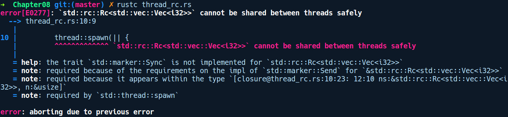
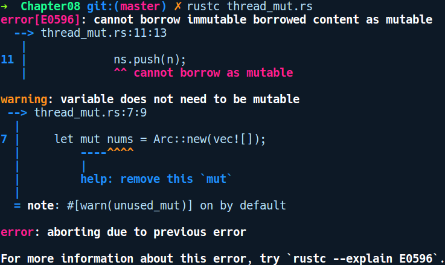

### 8.4.1　状态共享模型

通过共享状态将值传递给线程是最普遍的做法，并且实现此目的的同步原语存在于大多数主流语言中。同步原语是允许多个线程以线程安全的方式访问或操作值的类型或语言构造。Rust还有许多同步原语可以包装类型以便使它们成为对线程安全的。

如前所述，我们无法共享多个线程中任何值的访问权限，我们需要共享所有权。在第5章中，我们介绍了Rc类型，它可以提供值的共享所有权。让我们尝试将此类型应用到之前的多线程读取数据的示例：

```rust
// thread_rc.rs
use std::thread;
use std::rc::Rc;
fn main() {
    let nums = Rc::new(vec![0, 1, 2, 3, 4]);
    let mut childs = vec![];
    for n in 0..5 {
        let ns = nums.clone();
        let c = thread::spawn(|| {
            println!("{}", ns[n]);
        });
        childs.push(c);
    }
    for c in childs {
        c.join().unwrap();
    }
}
```

上述代码没能通过编译，我们得到了以下错误提示信息：


在这里Rust又再次帮助了我们。如前所述，Rc类型并不是线程安全的，因为引用计数更新操作不是原子的。我们只能在单线程代码中使用Rc类型。如果我们想在多线程环境中共享相同类型的所有权，那么可以使用Arc类型，它和Rc类型类似，但是具有原子引用计数功能。

#### 通过Arc类型共享所有权

可以在上述代码中应用多线程的Arc类型，如下所示：

```rust
// thread_arc.rs
use std::thread;
use std::sync::Arc;
fn main() {
    let nums = Arc::new(vec![0, 1, 2, 3, 4]);
    let mut childs = vec![];
    for n in 0..5 {
        let ns = Arc::clone(&nums);
        let c = thread::spawn(move || {
            println!("{}", ns[n]);
        });
        childs.push(c);
    }
    for c in childs {
        c.join().unwrap();
    }
}
```

在上述代码中，我们只是简单地将vector的包装器由Rc类型替换为Arc类型。另一个变化是，在我们从子线程引用nums之前，需要使用Arc::clone()来复制它，这为我们提供了一个包含所有权的Arc<Vec<i32>>值，该值引用相同的Vec。通过这些变更，我们的程序将通过编译，提供对共享Vec的安全访问，并得到以下输出结果：

```rust
$ rustc thread_arc.rs
$./thread_arc
0
2
1
3
4
```

现在，多线程代码中的另一个用例是改变多线程中的共享值。接下来我们看看如何做到这一点。

#### 修改线程中的共享数据

我们将看到一个示例程序，其中5个线程将数据推送到共享Vec。以下程序将尝试执行相同的操作：

```rust
// thread_mut.rs
use std::thread;
use std::sync::Arc;
fn main() {
    let mut nums = Arc::new(vec![]);
    for n in 0..5 {
        let mut ns = nums.clone();
        thread::spawn(move || {
            nums.push(n);
        });
    }
}
```

现在我们有通过Arc包装的相同nums，但是无法改变它，因为编译器给出了以下错误提示信息：


它不能正常运作是因为复制Arc分发了对内部值的不可变引用。要改变来自多线程的数据，我们需要使用一种提供共享可变性的类型，就像RefCell那样。但与Rc类似，RefCell不能跨多个线程使用。

因此，我们需要使用它们的线程安全的变体，例如Mutex或RwLock包装器类型。接下来让我们来探讨它们。

