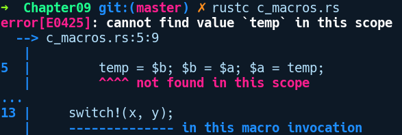

### 9.1　什么是元编程？

“Lisp不是一种语言，它是一种建筑材料。”

——Alan Kay

无论使用何种语言构造的程序一般都包含两个实体：数据和操作数据的指令。通常程序的运行过程都涉及操纵数据。但是程序指令的问题在于，一旦你编写完毕，它们就像被刻在石头上一样，因此是不可塑的。如果我们将指令视为数据并使用代码生成新指令，那么程序的功能会更强大。元编程就是为此而生的。

元编程是一种编程技术，你可以编写能够生产新代码的代码。根据语言的不同，实现的方式有两种：在运行时或在编译期。运行时元编程可用于动态语言，例如Python、JavaScript及Lisp。编译型语言不可能在运行时生成指令，因为这些语言会执行程序预编译。但是，你可以选择在编译期生成代码，这是C宏提供的代码。Rust还提供编译期代码生成功能，它们比C宏的功能更强大、更健壮。

在很多语言中，元编程构造通常会用伞形术语宏表示。对某些语言来说，这是一种内置特性。而对另一些语言来说，它们会作为单独的编译阶段予以提供。通常，宏将任意代码序列作为输入，并输出可由语言编译或执行的有效代码和其他代码。宏的输入不需要是有效的语法，你可以自由地为宏输入定义语法。此外，调用宏的方式和定义它们的语法也因语言而异。例如，C宏在预处理阶段工作，该阶段读取以#define开头的标记，并在源文件添加到编译器之前展开它们。这里的展开意味着通过替换提供宏的输入来生成代码。另一方面，Lisp提供了使用defmacro定义（宏本身）的类函数宏，它使用正在创建的宏名称和一个或多个参数，然后返回新的Lisp代码。

但是，C宏和Lisp宏缺少被称为“卫生”的属性。它们是“不卫生”的，因为它们可以在扩展时捕获并干扰宏之外的代码，这可能导致在代码中的某些地方调用宏时出现意外的行为和逻辑错误。

为了演示“不卫生”这个问题，我们将以C宏为例。这些宏只是简单地使用变量替换来复制/粘贴代码，并且不能识别上下文。用C语言编写的宏由于能够引用在任意位置定义的变量，所以它们是“不卫生”的。例如，以下是在C语言中定义的SWITCH宏，它可以交换两个变量的值，但是在下列代码中则会修改其他变量的值：

```rust
// c_macros.c
#include <stdio.h>
#define SWITCH(a, b) { temp = b; b = a; a = temp; }
int main() {
    int x=1;
    int y=2;
    int temp = 3;
    SWITCH(x, y);
    printf("x is now %d. y is now %d. temp is now %d\n", x, y, temp);
}
```

使用gcc c_macros.c -o macro && ./macro命令编译上述代码并运行后得到以下输出：

```rust
x is now 2. y is now 1. temp is now 2
```

在上面的代码中，除非在SWITCH宏中声明我们自己的temp变量，否则main函数中的原始temp变量会被SWITCH宏的扩展代码修改。这种“不卫生”的性质使得C宏不可靠且脆弱，除非采取特殊的预防措施，例如在宏中使用不同的临时变量名称，否则很容易造成混乱。

另外，Rust宏是“卫生”的，并且比仅执行简单的字符串替换和扩展更具有识别上下文环境的能力。它们知道宏中引用的变量的作用域，并且不会隐藏已经在外部声明的任何标识符。考虑如下Rust程序，它试图实现之前使用的宏：

```rust
// c_macros_rust.rs
macro_rules! switch {
    ($a:expr, $b:expr) => {
        temp = $b; $b = $a; $a = temp;
    };
}
fn main() {
    let x = 1;
    let y = 2;
    let temp = 3;
    switch!(x, y);
}
```

在上述代码中，我们创建了一个名为switch!的宏，然后在main函数中使用x和y对它进行了调用。我们将跳过解释宏定义的细节，本章后续的内容将会详细介绍它们。

不过让我们惊讶的是，上述代码无法通过编译，并出现以下错误提示信息：


根据上述错误提示信息可以知道，我们的switch!宏对在main函数中声明的temp变量一无所知。如前所述，Rust宏不会从执行环境中捕获变量，因为它与C宏的工作方式不同。即使它会，我们也将在修改处保存，因为程序中声明的temp是不可变的。

在我们开始编写更多这样的Rust宏之前，我们应该知道何时该为你的问题使用基于宏的解决方案。

