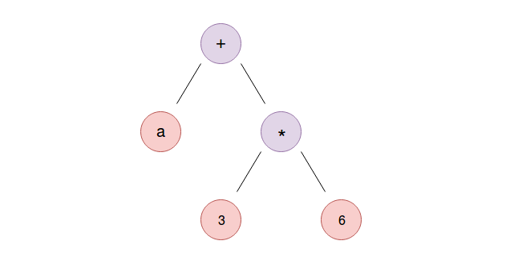

### 9.3　Rust中的宏及其类型

在程序编译为二进制目标文件之前，Rust的宏可以完成代码生成。它们接收被称为标记树的输入，并在抽象语法树（Abstract Syntax Tree，AST）构造期间的第二次解析过程结束时进行扩展。这些是编译器世界的一些术语，所以我们需要对它们进行一些解释。要了解宏的工作原理，我们需要熟悉编译器如何处理源代码。这将有助于我们理解程序，理解宏如何处理其输入，以及当我们错误地使用它们时，它们给出的恰当的错误提示信息。我们将介绍与宏有关的内容。

首先，编译器逐字节地读取源代码，并将字符分组为有意义的块，这些块被称为令牌。这是由编译器的一个组件完成的，该组件通常被称为标记器。因此，表达式a+3*6会被转换为“a”“+”“3”“*”“6”，这样的一系列标记。其他标记可以是关键字fn、任何标识符、{}、()及赋值运算符“=”等。这些标记在宏的用语中被称为标记树。还有可以对其他标记进行分组的标记树，例如“(”“)”“}”“{”。目前这个阶段，标记序列本身并没有传达如何处理和解释程序的任何含义。为此，我们需要一个解析器。

解析器将这个平坦的标记流转换为层次结构，以便引导编译器解析程序。标记树被传递给解析器，它将构造被称为抽象语法树的程序内存表示。例如，当a为2时，我们的标记序列a+3*6（表达式）执行算术运算后的结果是20。

但是编译器不知道如何正确地计算这个表达式，除非我们将运算符的优先级（即将*的优先级排在+前面）分开并使用树结构表示它们，如下图所示。


当我们将表达式表示为树结构以便在进行加法运算之前进行乘法运算时，就可以对此树进行后序遍历以正确计算表达式。那么，基于这个解释，我们的宏扩展适用于哪些场景呢？Rust宏是在抽象语法树构造的第二阶段结束时解析的，这是进行名称解析的阶段。名称解析是在作用域中查找在表达式中定义的变量是否存在的阶段。在上述表达式中，将对变量a进行名称解析。如果我们前面的表达式中的某个变量被赋给一个宏调用的值，例如“let a= foo!(2+0);”，那么解析器将在处理名称解析之前继续扩展宏。名称解析阶段将捕获程序中的错误，例如使用了某个未在作用域的变量，不过还有比这更复杂的情况。

这需要Rust宏能够识别上下文，并根据宏扩展相应的内容，它们只能出现在支持的位置，如语言的语法定义。例如，你不能在项目级别（即模块内部）编写let语句。


**注意**

语法定义了编写程序的有效方法，就像口语中的语法指导人们构造出有意义的句子一样。对那些好奇心较强的读者来说，Rust的语法定义可以参考官方文档。


我们多次见过的一个宏的用例就是println!宏。它被实现为一个宏，因为它允许Rust在编译时检查它的参数是否有效，以及传递给它的字符串插值变量的数目是否正确。使用宏来输出字符串的另一个好处是，它允许我们向println!宏传递尽可能多的参数，如将其作为常规的函数予以实现，那么这将是不可能的。这是因为Rust不支持传递函数的可变参数。请考虑如下示例：

```rust
println("The result of 1 + 1 is {}", 1 + 1);
println!("The result of 1 + 1 is {}");
```

如前所述，第二种形式将在编译期报错，因为它缺少与格式化字符串匹配的参数，这是在编译期报告的。这种方式比C语言的printf函数更安全，因为printf可能导致内存漏洞，例如格式化字符串攻击。println!宏的另一个特性是，我们可以自定义想要在字符串中输出值的方式：

```rust
// print_formatting.rs
use std::collections::HashMap;
fn main() {
    let a = 3669732608;
    println!("{:p}", &a);
    println!("{:x}", a);
    // 美化输出
    let mut map = HashMap::new();
    map.insert("foo", "bar");
    println!("{:#?}", map);
}
```

在上述代码中，我们可以分别输出以"{:p}"和"{:x}"形式存储的值的内存地址和其十六进制表示形式。这些被称为格式声明符。我们可以在println！宏中使用格式声明符"{:#?}"输出非基本类型的类JSON格式的值。让我们编译并运行之前的程序：

```rust
error[E0277]: the trait bound `{integer}: std::fmt::Pointer` is not
satisfied
 --> print_formatting.rs:7:22
  |
7 |     println!("{:p}", a);
  |                   ^ the trait `std::fmt::Pointer` is not implemented
for `{integer}`
```

这里我们得到一个错误提示信息。你可能已经注意到，在第一个println!宏调用中，我们尝试使用"{:p}"声明符输出a的地址，但是我们采用的变量是一个数字，所以我们需要将诸如&a之类的引用传递给格式声明符。通过此修改，上述程序将通过编译。所有这些字符串格式化和检查字符串差值的正确性的操作都发生在编译期，这要归功于宏是作为解析阶段的一部分进行实现的。

