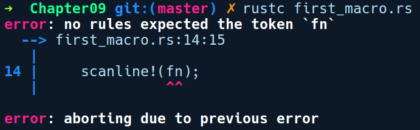
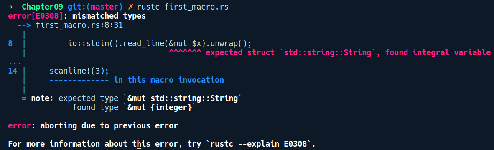

### 9.4　使用macro_rules!创建宏

让我们首先使用macro_rules!宏构造第1个声明式宏。Rust中已经有了println!宏，它用于将内容以标准格式输出。但是，它没有用于从标准输入读取输入的等效宏。

要从标准输入中读取内容，你必须编写如下代码：

```rust
let mut input = String::new();
io::stdin().read_line(&mut input).unwrap();
```

这些代码可以通过宏轻松地抽象出来。我们将该宏命名为scanline!。以下代码展示了使用该宏的一些例子：

```rust
// first_macro.rs
fn main() {
    let mut input = String::new();
    scanline!(input);
    println!("{:?}", input);
}
```

我们希望能够创建一个String实例并将其传递给scanline!宏。该宏处理从标准输入读取的所有细节。如果通过运行rustc first_macro.rs编译上述代码，将会得到以下错误提示信息：

```rust
error: cannot find macro `scanline!` in this scope
 --> first_macro.rs:5:5
  |
5 |     scanline!(input);
  |     ^^^^^^^^
error: aborting due to previous error
```

rustc找不到scanline!宏，因为我们还没有定义它，所以我们需要添加如下代码：

```rust
// first_macro.rs
use std::io::stdin;
// 一个方便的宏，用于将输入作为字符串读入缓冲区
macro_rules! scanline {
    ($x:expr) => ({
        stdin().read_line(&mut $x).unwrap();
        $x.trim();
    });
}
```

为了创建scanline!宏，我们使用了macro_rules!宏，其后跟了宏名称scanline，然后紧跟着的是一对花括号。在花括号内部，我们有类似的匹配规则。每个匹配规则由3个部分组成。首先是模式匹配器，即($x:expr)，然后跟一个=>符号，最后是代码生成块，可以用()、{}，甚至[]进行分隔。当有多个规则要匹配时，匹配规则必须以分号作为结束标志。

对于上述代码中的($x:expr)，括号中符号$位于左侧，右侧的部分是规则，其中$x是一个标记树变量，需要在冒号（:）后面指定一个类型，即expr标记树类型。它们的语法类似于我们在函数中指定参数的语法。当我们调用scanline!宏时，会将任意标记序列作为输入，并在$x中捕获，然后由右侧代码生成块中的相同变量引用。expr标记类型意味着此宏只能接收表达式。稍后我们将介绍macro_rules!宏能够兼容的其他标记类型。在代码生成块中，我们有多行代码用于生成代码，因此我们需要一个花括号，它可以用于解释多行表达式。匹配规则以分号作为结束标志。如果我们只需生成一个行代码，那么可以省略花括号。我们想要生成的代码如下所示：

```rust
io::stdin().read_line(&mut $x).unwrap();
```

请注意，read_line接收的内容看起来不像某个标识符的正确可变引用，也就是说，它是&mut $x。$x会被替换为我们在调用时传递给宏的实际表达式。现在我们已经构造了第一个宏，完整的代码如下所示：

```rust
// first_macro.rs
use std::io;
// 一个简便的宏，用于将输入作为字符串读入缓冲区
macro_rules! scanline {
    ($x:expr) => ({
        io::stdin().read_line(&mut $x).unwrap();
    });
}
fn main() {
    let mut input = String::new();
    scanline!(input);
    println!("I read: {:?}", input);
}
```

在main函数中，我们首先创建了字符串变量input，它将用于储存来自用户的输入。接下来，我们调用了scanline!宏，并将input变量传递给它。在该宏的内部，这会被引用为$x，正如我们在前面定义中看到的那样。调用scanline!宏之后，当编译器看到该调用时，会将它替换为如下内容：

```rust
io::stdin().read_line(&mut input).unwrap();
```

以下是使用标准输入的字符串"Alice"运行上述代码后的结果：

```rust
$ Alice
I read: "Alice\n"
```

代码生成后，编译器还会检查生成的代码是否有意义。例如，如果我们在调用scanline!宏时传入了匹配规则但未曾考虑到的其他元素（例如，传递关键字 fn、scanline!(fn)），那么将会得到以下错误提示信息：


此外，假如我们传递一个表达式（例如2，它也是一个expr），它虽然是有效的，但是在宏的上下文中没有意义，那么Rust将捕获它，并报告如下错误提示信息：


这对开发者来说是非常方便的。现在，我们还可以为宏添加多个匹配规则。让我们添加一个空规则，以便涵盖这种情况，那就是我们只想scanline!宏获得一个String，从stdin读取然后返回这个字符串。要添加新规则，我们需要对代码做一些修改，如下所示：

```rust
// first_macro.rs
macro_rules! scanline {
    ($x:expr) => ({
        io::stdin().read_line(&mut $x).unwrap();
    });
    () => ({
        let mut s = String::new();
        stdin().read_line(&mut s).unwrap();
        s
    });
}
```

我们添加了一个空匹配规则，() => {}。在花括号中，我们生成了一堆代码，首先在s中创建了一个String实例，调用read_line，然后传递给&mut；最后，我们将s返回给调用者。现在，我们可以在不预先分配字符串缓冲区的情况下调用scanline!宏：

```rust
// first_macro.rs
fn main() {
    let mut input = String::new();
    scanline!(input);
    println!("Hi {}",input);
    let a = scanline!();
    println!("Hi {}", a);
}
```

同样需要注意的是，我们无法在函数之外的任何地方调用此宏。例如，在模块的根目录下调用scanline!宏将失败，因为在mod中声明的let语句是无效的。

