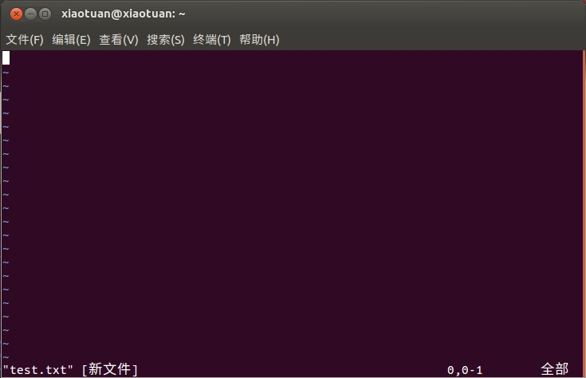
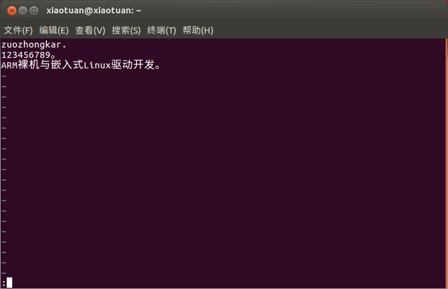
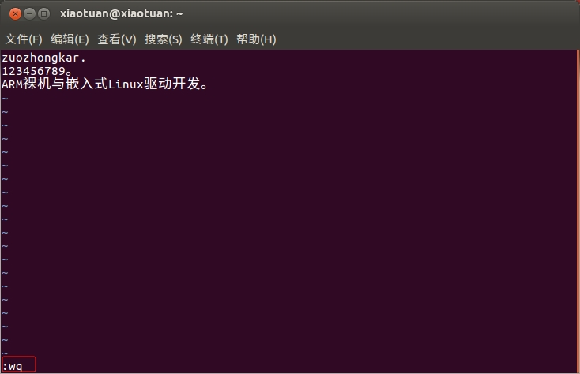
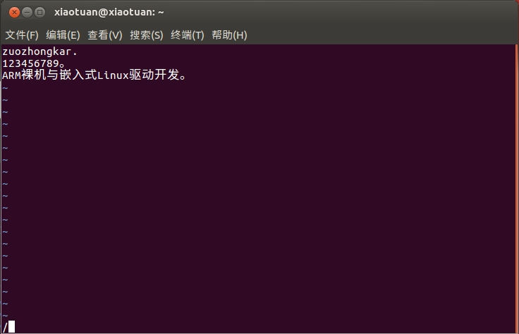
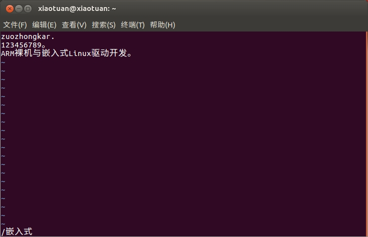
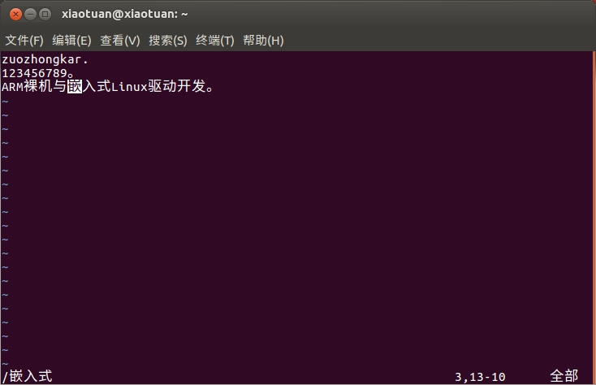

我们就以编辑一个文本文档为例讲解 vim 编辑器的使用。打开终端，输入命令：

```shell
$ vim test.txt
```

在终端中输入上面命令以后就会创建一个 test.txt 文档，并且用 vim 打开：



因为 vim 默认是以只读模式打开的文档，因此我们要切换到输入模式，切换到输入模式的命令如下：

+ `i`：在当前光标所在的字符的前面，转换为输入模式。
+ `I`：在当前光标所在的行的行首转换为输入模式
+ `a`：在当前光标所在的字符的后面转换为输入模式。
+ `A`：在光标所在行的行尾转换为输入模式。
+ `o`：在当前光标所在行的下方，新建一行，并转换为输入模式。
+ `O`：在当前光标所在的行的上方，新建一行，并转换为输入模式。
+ `s`：删除光标所在的字符。
+ `r`：替换光标处字符。

如果需要保存文件，我们需要从 vim 现在的输入模式切换到指令模式，方式就是按下键盘的 <kbd>ESC</kbd> 键，按下 <kbd>ESC</kbd> 键以后终端左下角的 "插入" 字样就会消失，此时你就不能再输入任何文本了，如果向再次输入文本的话就按下 <kbd>a</kbd> 键重新进入到输入模式。指令模式顾名思义就是输入指令的模式，这些指令是控制文本的指令，我们将这些指令进行分类，如下所示：

**1、移动光标指令**

+ **h（或左方向键）**：光标左移一个字符。
+ **I（或右方向键）**：光标右移一个字符。
+ **j（或下方向键）**：光标下移一行。
+ **k（或上方向键）**：光标上移一行。
+ **nG**：光标移动到第 n 行首。
+ **n+**：光标下移 n 行。
+ **n-**：光标上移 n 行。

**2. 屏幕翻滚指令**

+ <kbd>Ctrl</kbd>+<kbd>f</kbd>：屏幕向下翻一页，相当于下一页。
+ <kbd>Ctrl</kbd>+<kbd>b</kbd>：屏幕向上翻一页，相当于上一页。

**3、复制、删除和粘贴指令**

+ **cc**：删除整行，并且修改整行内容。
+ **dd**：删除该行，不提供修改功能。
+ **ndd**：删除当前行向下 n 行。
+ **x**：删除光标所在的字符。
+ **X**：删除光标前面的一个字符。
+ **nyy**：复制当前行及其下面 n 行。
+ **p**：粘贴最近复制的内容。

从上面的命令可以看出，并没有保存文本的命令，那是因为保存文档的命令是在底行模式中，我们要先进入到指令模式，进入底行模式的方式是先进入指令模式下，然后在指令模式下输入 `:` 进入底行模式。



当进入底行模式以后会在终端的左下角就会出现符号 `:`，我们可以在 `:` 后面输入命令，常用的命令如下：

+ `x`：保存当前文档并且退出。
+ `q`：退出。
+ `w`：保存文档。
+ `q!`：退出 vi/vim，不保存文档。

如果我们要退出并保存文本的话需要在 `:` 底行模式下输入 `wq`：



在上面讲解进入 vim 的底行模式的时候说了在指令模式下输入 `:` 的方法，还可以在指令模式下输入 `/` 进入底行模式：



在 `/` 底行模式下我们可以在文本中搜索指定的内容，比如搜索 test.txt 文件中 "嵌入式" 三个字：



在 `/` 后面输入要搜索的内容，然后按下回车键就会在 test.txt 中找到与字符串 "嵌入式" 匹配的部分：

