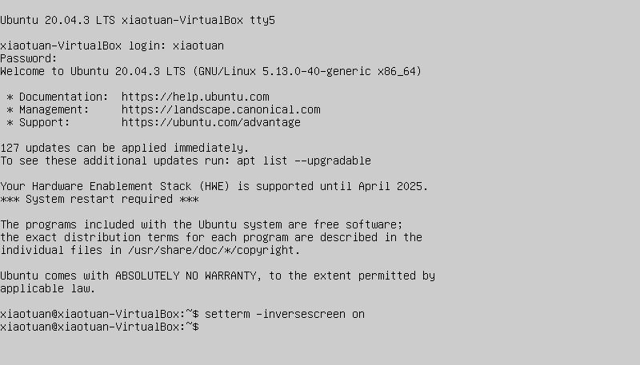
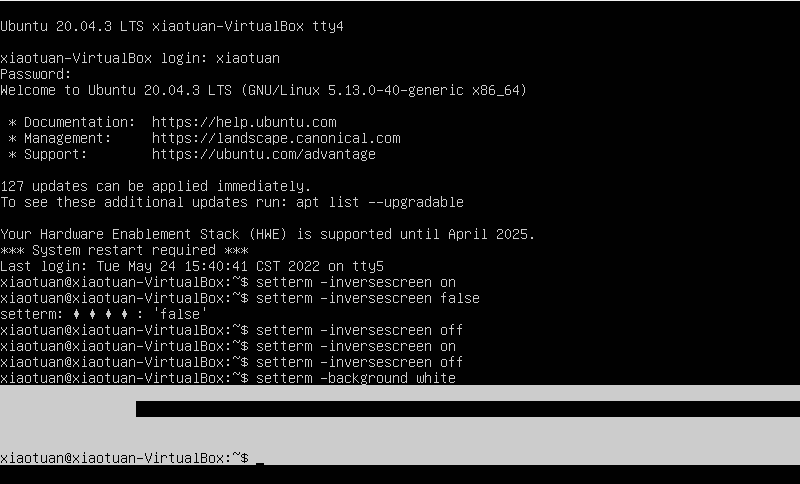

[toc]

### 1. 反转控制台颜色

可以通过如下命令反转控制字体颜色和背景颜色：

```shell
setterm -inversescreen on
```

效果如下：



可以通过如下命令关闭反转颜色：

```shell
setterm -inversescreen off
```

### 2. 设置控制台前景色和背景色

#### 2.1 设置前景色

设置前景色命令如下：

```shell
setterm -foreground black
```

#### 2.2 设置背景颜色

设置背景颜色命令如下：

```shell
setterm -background white
```

> 注意：通过上面的命令设置后并不能使虚拟控制台整个背景都变成白色。实际效果如下：
>
> 

可供选择的颜色有 `black`、`red`、`green`、`yellow`、`blue`、`magenta`、`cyan` 和 `white`。

### 3. 用于设置前景色和背景色的 setterm 选项

| 选项           | 参数                                                         | 描述                                               |
| -------------- | ------------------------------------------------------------ | -------------------------------------------------- |
| -background    | black、red、green、yellow、<br />blue、magenta、cyan 或 white | 将终端的背景色改为指定颜色                         |
| -foreground    | black、red、green、yellow、<br />blue、magenta、cyan 或 white | 将终端的前景色改为指定颜色                         |
| -inversescreen | on 或 off                                                    | 交换背景色和前景色                                 |
| `-reset`       | 无                                                           | 将终端外观恢复成默认设置并清屏                     |
| -store         | 无                                                           | 将终端当前的前景色和背景色设置成 `-reset` 选项的值 |

