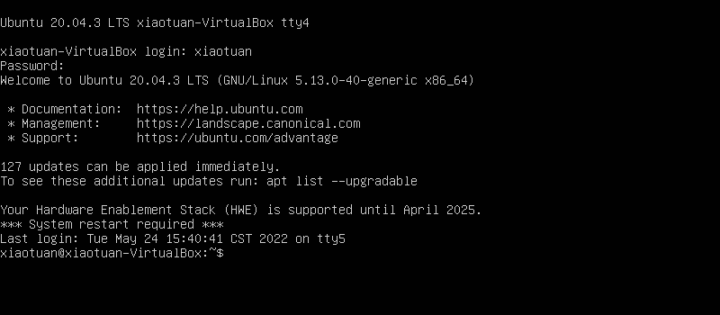

在 `Linux` 图形化环境中，可以通过按下 <kbd>Ctrl</kbd>+ <kbd>Alt</kbd> 组合键，然后按功能键 <kbd>F1</kbd> ~ <kbd>F7</kbd> 进入要使用的虚拟控制台。功能键 <kbd>F1</kbd> 生成虚拟控制台 1，<kbd>F2</kbd> 键生成虚拟控制台 2，<kbd>F3</kbd> 键生成虚拟控制台 3，<kbd>F4</kbd> 键生成虚拟控制台 4，依次类推。

> 提示：`Linux` 发行版通常使用 `<kbd>Ctrl</kbd> + <kbd>Alt</kbd> 组合键配合 <kbd>F1</kbd> 或 <kbd>F7</kbd> 来进入图形界面。

文本模式的虚拟控制采用全屏的方式显示文本登录界面。

