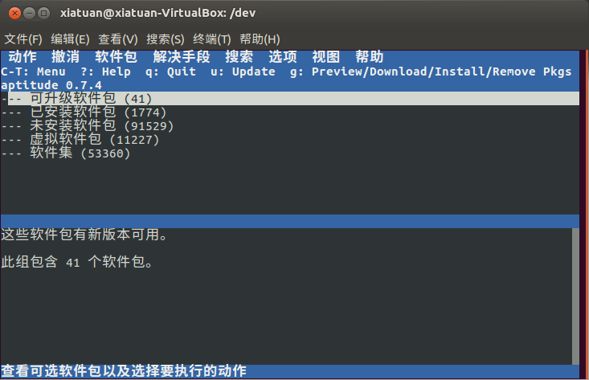

[toc]

`dpkg` 命令是基于 `Debian` 系 PMS 工具的核心。包含在这个 PMS 中的其他工具有：

+ apt-get
+ apt-cache
+ aptitude

到目前为止，最常用的命令行工具是 `aptitude`。

### 1. 用 aptitude 管理软件包

如果使用的 Linux 发行版中已经安装了 `aptitude`，只需要在 shell 提示符键入 `aptitude` 并按下回车键就行了。紧接着就会进入 `aptitude` 的全屏模式。

可以用方向键在菜单上移动。选择菜单选项 `已安装软件包` 来查看已安装了什么软件包。
