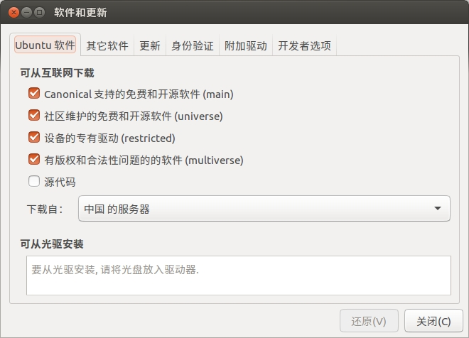

`apt` 命令可以实现软件自动下载、配置、安装二进制或者源码的功能。`apt` 命令和 `install` 命令结合在一起构成了 Ubuntu 下最常用的下载和安装软件方法。

`apt` 命令采用的 C/S 模式，也就是客户端/服务器模式，我们的 PC 机作为客户端，当需要下载软件的时候就向服务器请求，因此我们需要知道服务器的地址，也叫做安装源或者更新源。打开系统设置，打开 "软件和更新" 设置：



"Ubuntu 软件" 选项卡下面的 "下载自" 就是 `apt` 命令的安装源。`apt` 工具常用的命令如下：

### 1. 更新本地数据库

如果向查看本地哪些软件可以更新的话可以使用如下命令：

```shell
sudo apt-get update
```

例如：

```shell
$ sudo apt-get update
[sudo] xiaotuan 的密码： 
命中:1 http://cn.archive.ubuntu.com/ubuntu xenial InRelease
命中:2 http://cn.archive.ubuntu.com/ubuntu xenial-updates InRelease            
命中:3 http://cn.archive.ubuntu.com/ubuntu xenial-backports InRelease          
命中:4 http://security.ubuntu.com/ubuntu xenial-security InRelease             
正在读取软件包列表... 完成 
```

### 2. 检查依赖关系

有时候本地某些软件可能存在依赖关系，所谓依赖关系就是 A 软件依赖于 B 软件。通过如下命令可以查看依赖关系，如果存在依赖关系的话 `apt` 会剔除解决方案：

```shell
sudo apt-get check
```

例如：

```shell
$ sudo apt-get check
正在读取软件包列表... 完成
正在分析软件包的依赖关系树       
正在读取状态信息... 完成
```

### 3. 软件安装

安装软件使用如下命令：

```shell
sudo apt-get install package-name
```

例如：

```shell
$ sudo apt-get install minicom
正在读取软件包列表... 完成
正在分析软件包的依赖关系树       
正在读取状态信息... 完成       
下列软件包是自动安装的并且现在不需要了：
  openjdk-9-jdk-headless
使用'sudo apt autoremove'来卸载它(它们)。
将会同时安装下列软件：
  lrzsz
下列【新】软件包将被安装：
  lrzsz minicom
升级了 0 个软件包，新安装了 2 个软件包，要卸载 0 个软件包，有 41 个软件包未被升级。
需要下载 302 kB 的归档。
解压缩后会消耗 1,428 kB 的额外空间。
您希望继续执行吗？ [Y/n] Y
获取:1 http://mirrors.tuna.tsinghua.edu.cn/ubuntu xenial-updates/universe amd64 lrzsz amd64 0.12.21-10~build0.16.04.1 [70.5 kB]
获取:2 http://mirrors.tuna.tsinghua.edu.cn/ubuntu xenial-updates/universe amd64 minicom amd64 2.7-1+deb8u1build0.16.04.1 [232 kB]
已下载 302 kB，耗时 1秒 (219 kB/s)
正在选中未选择的软件包 lrzsz。
(正在读取数据库 ... 系统当前共安装有 226559 个文件和目录。)
正准备解包 .../lrzsz_0.12.21-10~build0.16.04.1_amd64.deb  ...
正在解包 lrzsz (0.12.21-10~build0.16.04.1) ...
正在选中未选择的软件包 minicom。
正准备解包 .../minicom_2.7-1+deb8u1build0.16.04.1_amd64.deb  ...
正在解包 minicom (2.7-1+deb8u1build0.16.04.1) ...
正在处理用于 man-db (2.7.5-1) 的触发器 ...
正在设置 lrzsz (0.12.21-10~build0.16.04.1) ...
正在设置 minicom (2.7-1+deb8u1build0.16.04.1) ...
```

### 4. 软件更新

更新软件使用如下命令：

```shell
sudo apt-get upgrade package-name
```

例如：

```shell
$ sudo apt-get upgrade minicom
正在读取软件包列表... 完成
正在分析软件包的依赖关系树       
正在读取状态信息... 完成       
minicom 已经是最新版 (2.7-1+deb8u1build0.16.04.1)。
正在计算更新... 完成
下列软件包是自动安装的并且现在不需要了：
  openjdk-9-jdk-headless
使用'sudo apt autoremove'来卸载它(它们)。
下列软件包的版本将保持不变：
  apt apt-utils dpkg libapt-pkg5.0 ubuntu-advantage-tools update-notifier
  update-notifier-common
升级了 0 个软件包，新安装了 0 个软件包，要卸载 0 个软件包，有 7 个软件包未被升级。
```

### 5. 卸载软件

卸载软件使用如下命令：
```shell
sudo apt-get remove package-name
```

例如：

```shell
$ sudo apt-get remove minicom
正在读取软件包列表... 完成
正在分析软件包的依赖关系树       
正在读取状态信息... 完成       
下列软件包是自动安装的并且现在不需要了：
  lrzsz openjdk-9-jdk-headless
使用'sudo apt autoremove'来卸载它(它们)。
下列软件包将被【卸载】：
  minicom
升级了 0 个软件包，新安装了 0 个软件包，要卸载 1 个软件包，有 7 个软件包未被升级。
解压缩后将会空出 928 kB 的空间。
您希望继续执行吗？ [Y/n] Y
(正在读取数据库 ... 系统当前共安装有 226651 个文件和目录。)
正在卸载 minicom (2.7-1+deb8u1build0.16.04.1) ...
正在处理用于 man-db (2.7.5-1) 的触发器 ...
```

