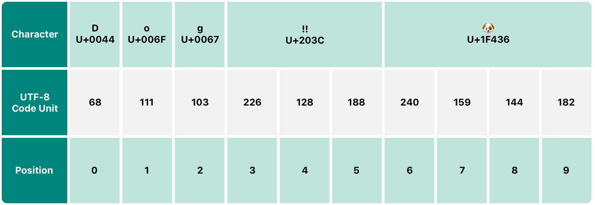
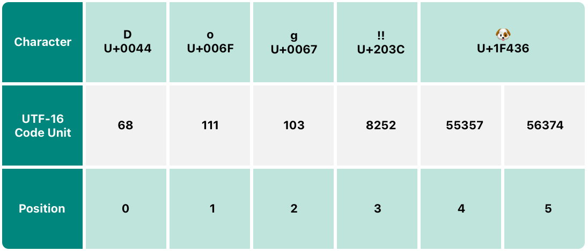
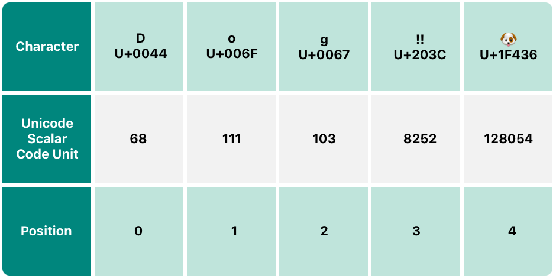

Swift 提供了几种不同的方式来访问字符串的 Unicode 表示。 您可以使用 for-in 语句遍历字符串，以访问作为 Unicode 扩展字素簇的各个字符值。 [使用角色](https://docs.swift.org/swift-book/documentation/the-swift-programming-language/stringsandcharacters#Working-with-Characters)中描述了此过程。

或者，以其他三种符合 Unicode 的表示形式之一访问 String 值：

+   UTF-8 代码单元的集合（使用字符串的 `utf8` 属性访问）

+   UTF-16 代码单元的集合（使用字符串的 `utf16` 属性访问）

+   21 位 Unicode 标量值的集合，相当于字符串的 UTF-32 编码形式（使用字符串的 `unicodeScalars` 属性访问）

下面的每个示例显示了以下字符串的不同表示形式，它由字符 D、o、g、‼（双感叹号，或 Unicode 标量 U+203C）和 🐶 字符（DOG FACE，或 Unicode 标量）组成 U+1F436):

```swift
let dogString = "Dog‼🐶"
```

**UTF-8 表示**

你可以通过遍历字符串的 `utf8` 属性来访问其 `UTF-8` 表示形式的字符。此属性的类型为 `String.UTF8View`，它是一组无符号的 8 位（ `UInt8` ）类型，每个字节对应字符串的 `UTF-8` 表示形式：



```swift
for codeUnit in dogString.utf8 {
    print("\(codeUnit) ", terminator: "")
}
print("")
// Prints "68 111 103 226 128 188 240 159 144 182 "
```

在上面的示例中，前三个十进制 `codeUnit` 值 (68、111、103) 表示字符 D、o 和 g，其 `UTF-8` 表示与其 `ASCII` 表示相同。 接下来的三个十进制 `codeUnit` 值（226、128、188）是双感叹号字符的三字节 `UTF-8` 表示形式。 最后四个 `codeUnit` 值（240、159、144、182）是 DOG FACE 字符的四字节 `UTF-8` 表示形式。

**UTF-16 表示**

您可以通过迭代其 `utf16` 属性来访问 `String` 的 `UTF-16` 表示形式。 此属性的类型为 `String.UTF16View`，它是一组无符号 `16` 位 ( `UInt16` ) 值，每个值对应字符串的  `UTF-16` 表示中的每个 `16` 位代码单元：



```swift
for codeUnit in dogString.utf16 {
    print("\(codeUnit) ", terminator: "")
}
print("")
// Prints "68 111 103 8252 55357 56374 "
```

同样，前三个 `codeUnit` 值（68、111、103）表示字符 D、o 和 g，其 `UTF-16` 代码单元与字符串的 `UTF-8` 表示中的值相同（因为这些 `Unicode` 标量表示 `ASCII` 字符 ).

第四个 `codeUnit` 值 (8252) 是十六进制值 203C 的十进制等效值，表示双感叹号字符的 `Unicode` 标量 U+203C。 该字符可以表示为 `UTF-16` 中的单个代码单元。

第五个和第六个 `codeUnit` 值（55357 和 56374）是 DOG FACE 字符的 UTF-16 代理项对表示形式。 这些值是 U+D83D 的高代理值（十进制值 55357）和 U+DC36 的低代理值（十进制值 56374）。

**Unicode 标量表示**

您可以通过迭代其 `unicodeScalars` 属性来访问 `String` 值的 `Unicode` 标量表示。 此属性的类型为 `UnicodeScalarView`，它是 `UnicodeScalar` 类型的值的集合。

每个 `UnicodeScalar` 都有一个 value 属性，它返回标量的 21 位值，用 `UInt32` 值表示：



```swift
for scalar in dogString.unicodeScalars {
    print("\(scalar.value) ", terminator: "")
}
print("")
// Prints "68 111 103 8252 128054 "
```

前三个 `UnicodeScalar` 值（68、111、103）的值属性再次表示字符 D、o 和 g。

第四个 `codeUnit` 值 (8252) 也是十六进制值 `203C` 的十进制等效值，表示双感叹号字符的 `Unicode` 标量 `U+203C`。

第五个也是最后一个 `UnicodeScalar` 的值属性 128054 是十六进制值 1F436 的十进制等效值，表示 DOG FACE 字符的 `Unicode` 标量 `U+1F436`。

作为查询其值属性的替代方法，每个 `UnicodeScalar` 值也可用于构造一个新的 `String` 值，例如使用字符串插值：

```swift
for scalar in dogString.unicodeScalars {
    print("\(scalar) ")
}
// D
// o
// g
// ‼
// 🐶
```

