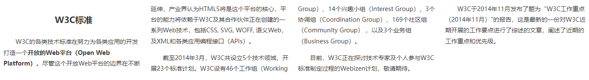
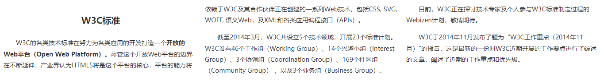
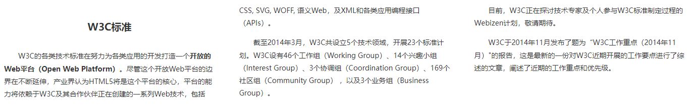
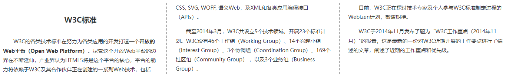
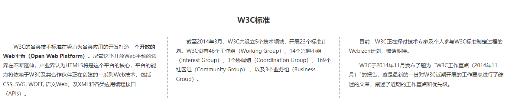
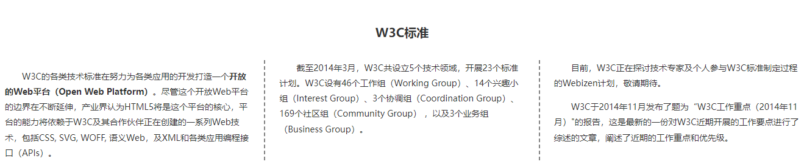

[toc]

CSS3 新增 `columns` 属性，用来设计多列布局，它允许网页内容跨栏显示，适合设计正文版式。

> 提示：权威参考：<http://www.w3.org/TR/css3-multicol/>。

### 1. 设置列宽

`column-width` 属性可以定义单列显示的宽度，基本语法如下：

```css
column-width: <length> | auto
```

取值简单说明如下：

+ `<length>`：用长度值来定义列宽。不允许为负值。
+ `auto`：根据 `<'column-count'>` 自定分配宽度，为默认值。

**示例代码：**

```html
<!DOCTYPE html>
<html>
    <head>
        <title>设置列宽</title>
        <style type="text/css">
        	/* 定义网页列宽为 300px，则网页中每个栏目的最大宽度为 300px */
            body {
                column-width: 300px;
            }
            h1 {
                color: #333333;
                padding: 5px 8px;
                font-size: 20px;
                text-align: center;
                padding: 12px;
            }
            h2 {
                font-size: 16px;
                text-align: center;
            }
            p {
                color: #333333;
                font-size: 14px;
                line-height: 180%;
                text-indent: 2em;
            }
        </style>
    </head>
    <body>
        <h1>W3C标准</h1>
		<p>W3C的各类技术标准在努力为各类应用的开发打造一个<strong>开放的Web平台（Open Web Platform）</strong>。尽管这个开放Web平台的边界在不断延伸，产业界认为HTML5将是这个平台的核心，平台的能力将依赖于W3C及其合作伙伴正在创建的一系列Web技术，包括CSS, SVG, WOFF, 语义Web，及XML和各类应用编程接口（APIs）。</p>
		<p>截至2014年3月，W3C共设立5个技术领域，开展23个标准计划。W3C设有46个工作组（Working Group）、14个兴趣小组（Interest Group）、3个协调组（Coordination Group）、169个社区组（Community Group） ，以及3个业务组（Business Group）。</p>
		<p>目前，W3C正在探讨技术专家及个人参与W3C标准制定过程的Webizen计划，敬请期待。</p>
		<p>W3C于2014年11月发布了题为&ldquo;W3C工作重点（2014年11月）"的报告，这是最新的一份对W3C近期开展的工作要点进行了综述的文章，阐述了近期的工作重点和优先级。</p>
    </body>
</html>
```

运行效果如下：



### 2. 设置列数

`column-count` 属性可以定义显示的列数。基本语法如下：

```css
column-count: <integer> | auto
```

取值说明如下：

+ `<integer>`：用整数值来定义列数。不允许为负值。
+ `auto`：根据 `<column-width'>` 自定分配宽度，为默认值。

示例代码：

```html
<!DOCTYPE html>
<html>
    <head>
        <title>设置列数</title>
        <style type="text/css">
        	/* 定义网页列数为 3，这样整个页面总是显示为 3 列 */
            body {
                column-count: 3;
            }
        	h1 {
                color: #333333;
                padding: 5px 8px;
                font-size: 20px;
                text-align: center;
                padding: 12px;
            }
            h2 {
                font-size: 16px;
                text-align: center;
            }
            p {
                color: #333333;
                font-size: 14px;
                line-height: 180%;
                text-indent: 2em;
            }
        </style>
    </head>
    <body>
        <h1>W3C标准</h1>
		<p>W3C的各类技术标准在努力为各类应用的开发打造一个<strong>开放的Web平台（Open Web Platform）</strong>。尽管这个开放Web平台的边界在不断延伸，产业界认为HTML5将是这个平台的核心，平台的能力将依赖于W3C及其合作伙伴正在创建的一系列Web技术，包括CSS, SVG, WOFF, 语义Web，及XML和各类应用编程接口（APIs）。</p>
		<p>截至2014年3月，W3C共设立5个技术领域，开展23个标准计划。W3C设有46个工作组（Working Group）、14个兴趣小组（Interest Group）、3个协调组（Coordination Group）、169个社区组（Community Group） ，以及3个业务组（Business Group）。</p>
		<p>目前，W3C正在探讨技术专家及个人参与W3C标准制定过程的Webizen计划，敬请期待。</p>
		<p>W3C于2014年11月发布了题为&ldquo;W3C工作重点（2014年11月）"的报告，这是最新的一份对W3C近期开展的工作要点进行了综述的文章，阐述了近期的工作重点和优先级。</p>
    </body>
</html>
```

运行效果如下：



### 3. 设置间距

`column-gap` 属性可以定义两栏之间的间距，基本语法如下：

```css
column-gap: <length> | normal
```

取值说明如下：

+ `<length>`：用长度值来定义列与列之间的间隙。不允许为负值。
+ `normal`：与 `<'font-size'>` 大小相同。

示例代码：

```html
<!DOCTYPE html>
<html>
    <head>
        <title>设置间距</title>
        <style type="text/css">
            body {
                /* 定义网页列数为 3，这样整个页面总是显示为 3 列 */
                column-count: 3;
                /* 定义列间距为 3em，默认为 1em */
                column-gap: 3em;
                /* 定义页面文本行高 */
                line-height: 2.5em;
            }
        	h1 {
                color: #333333;
                padding: 5px 8px;
                font-size: 20px;
                text-align: center;
                padding: 12px;
            }
            h2 {
                font-size: 16px;
                text-align: center;
            }
            p {
                color: #333333;
                font-size: 14px;
                line-height: 180%;
                text-indent: 2em;
            }
        </style>
    </head>
    <body>
        <h1>W3C标准</h1>
		<p>W3C的各类技术标准在努力为各类应用的开发打造一个<strong>开放的Web平台（Open Web Platform）</strong>。尽管这个开放Web平台的边界在不断延伸，产业界认为HTML5将是这个平台的核心，平台的能力将依赖于W3C及其合作伙伴正在创建的一系列Web技术，包括CSS, SVG, WOFF, 语义Web，及XML和各类应用编程接口（APIs）。</p>
		<p>截至2014年3月，W3C共设立5个技术领域，开展23个标准计划。W3C设有46个工作组（Working Group）、14个兴趣小组（Interest Group）、3个协调组（Coordination Group）、169个社区组（Community Group） ，以及3个业务组（Business Group）。</p>
		<p>目前，W3C正在探讨技术专家及个人参与W3C标准制定过程的Webizen计划，敬请期待。</p>
		<p>W3C于2014年11月发布了题为&ldquo;W3C工作重点（2014年11月）"的报告，这是最新的一份对W3C近期开展的工作要点进行了综述的文章，阐述了近期的工作重点和优先级。</p>
    </body>
</html>
```



### 4. 设置列边框

`column-rule` 属性可以定义每列之间边框的宽度、样式和颜色。基本语法如下：

```css
column-rule: <'column-rule-width'> || <'column-rule-style'> || <'column-rule-color'>
```

取值说明如下：

+ `<'column-rule-width'>`：设置对象的列与列之间的边框厚度。
+ `<'column-rule-style'>`：设置对象的列与列之间的边框样式。
+ `<'column-rule-color'>`：设置对象的列与列之间的边框颜色。

`column-rule-style` 属性的取值与 `border-style` 一样：

```css
column-rule-style: none | hidden | dotted | dashed | solid | double | groove | ridge | inset | outset
```

示例代码：

```html
<!DOCTYPE html>
<html>
    <head>
        <title>设置列的边框</title>
        <style type="text/css">
            body {
                /* 定义网页列数为 3，这样整个页面总是显示为 3 列 */
                column-count: 3;
                /* 定义列间距为 3em，默认为 1em */
                column-gap: 3em;
                /* 定义页面文本行高 */
                line-height: 2.5em;
                /* 定义列边框为 2 像素宽的灰色虚线 */
                column-rule: dashed 2px gray;
            }
        	h1 {
                color: #333333;
                padding: 5px 8px;
                font-size: 20px;
                text-align: center;
                padding: 12px;
            }
            h2 {
                font-size: 16px;
                text-align: center;
            }
            p {
                color: #333333;
                font-size: 14px;
                line-height: 180%;
                text-indent: 2em;
            }
        </style>
    </head>
    <body>
        <h1>W3C标准</h1>
		<p>W3C的各类技术标准在努力为各类应用的开发打造一个<strong>开放的Web平台（Open Web Platform）</strong>。尽管这个开放Web平台的边界在不断延伸，产业界认为HTML5将是这个平台的核心，平台的能力将依赖于W3C及其合作伙伴正在创建的一系列Web技术，包括CSS, SVG, WOFF, 语义Web，及XML和各类应用编程接口（APIs）。</p>
		<p>截至2014年3月，W3C共设立5个技术领域，开展23个标准计划。W3C设有46个工作组（Working Group）、14个兴趣小组（Interest Group）、3个协调组（Coordination Group）、169个社区组（Community Group） ，以及3个业务组（Business Group）。</p>
		<p>目前，W3C正在探讨技术专家及个人参与W3C标准制定过程的Webizen计划，敬请期待。</p>
		<p>W3C于2014年11月发布了题为&ldquo;W3C工作重点（2014年11月）"的报告，这是最新的一份对W3C近期开展的工作要点进行了综述的文章，阐述了近期的工作重点和优先级。</p>
    </body>
</html>
```

运行效果如下：



### 5. 设置跨列显示

`column-span` 属性可以定义跨列显示，基本语法如下：

```html
column-span: none | all
```

取值如下：

+ `none`：不跨列。
+ `all`：横跨所有列。

示例代码：

```html
<!DOCTYPE html>
<html>
    <head>
        <title>设置跨列显示</title>
        <style type="text/css">
            body {
                /* 定义网页列数为 3，这样整个页面总是显示为 3 列 */
                column-count: 3;
                /* 定义列间距为 3em，默认为 1em */
                column-gap: 3em;
                /* 定义页面文本行高 */
                line-height: 2.5em;
                /* 定义列边框为 2 像素宽的灰色虚线 */
                column-rule: dashed 2px gray;
            }
            /* 设置一级标题跨越所有列显示 */
        	h1 {
                color: #333333;
                padding: 5px 8px;
                font-size: 20px;
                text-align: center;
                padding: 12px;
                /* 跨越所有列显示 */
                column-span: all;
            }
            h2 {
                font-size: 16px;
                text-align: center;
            }
            p {
                color: #333333;
                font-size: 14px;
                line-height: 180%;
                text-indent: 2em;
            }
        </style>
    </head>
    <body>
        <h1>W3C标准</h1>
		<p>W3C的各类技术标准在努力为各类应用的开发打造一个<strong>开放的Web平台（Open Web Platform）</strong>。尽管这个开放Web平台的边界在不断延伸，产业界认为HTML5将是这个平台的核心，平台的能力将依赖于W3C及其合作伙伴正在创建的一系列Web技术，包括CSS, SVG, WOFF, 语义Web，及XML和各类应用编程接口（APIs）。</p>
		<p>截至2014年3月，W3C共设立5个技术领域，开展23个标准计划。W3C设有46个工作组（Working Group）、14个兴趣小组（Interest Group）、3个协调组（Coordination Group）、169个社区组（Community Group） ，以及3个业务组（Business Group）。</p>
		<p>目前，W3C正在探讨技术专家及个人参与W3C标准制定过程的Webizen计划，敬请期待。</p>
		<p>W3C于2014年11月发布了题为&ldquo;W3C工作重点（2014年11月）"的报告，这是最新的一份对W3C近期开展的工作要点进行了综述的文章，阐述了近期的工作重点和优先级。</p>
    </body>
</html>
```

运行效果如下：



### 6. 设置列高度

`column-fill` 属性可以定义栏目的高度是否统一，基本语法如下：

```css
column-fill: auto | balance
```

取值说明如下：

+ `auto`：列高度自适应内容。
+ `balance`：所有列的高度以其中最高的一列统一。

示例代码：

```html
<!DOCTYPE html>
<html>
    <head>
        <title>设置跨列显示</title>
        <style type="text/css">
            body {
                /* 定义网页列数为 3，这样整个页面总是显示为 3 列 */
                column-count: 3;
                /* 定义列间距为 3em，默认为 1em */
                column-gap: 3em;
                /* 定义页面文本行高 */
                line-height: 2.5em;
                /* 定义列边框为 2 像素宽的灰色虚线 */
                column-rule: dashed 2px gray;
                /* 设置各列高度一致 */
                column-fill: balance;
            }
            /* 设置一级标题跨越所有列显示 */
        	h1 {
                color: #333333;
                padding: 5px 8px;
                font-size: 20px;
                text-align: center;
                padding: 12px;
                /* 跨越所有列显示 */
                column-span: all;
            }
            h2 {
                font-size: 16px;
                text-align: center;
            }
            p {
                color: #333333;
                font-size: 14px;
                line-height: 180%;
                text-indent: 2em;
            }
        </style>
    </head>
    <body>
        <h1>W3C标准</h1>
		<p>W3C的各类技术标准在努力为各类应用的开发打造一个<strong>开放的Web平台（Open Web Platform）</strong>。尽管这个开放Web平台的边界在不断延伸，产业界认为HTML5将是这个平台的核心，平台的能力将依赖于W3C及其合作伙伴正在创建的一系列Web技术，包括CSS, SVG, WOFF, 语义Web，及XML和各类应用编程接口（APIs）。</p>
		<p>截至2014年3月，W3C共设立5个技术领域，开展23个标准计划。W3C设有46个工作组（Working Group）、14个兴趣小组（Interest Group）、3个协调组（Coordination Group）、169个社区组（Community Group） ，以及3个业务组（Business Group）。</p>
		<p>目前，W3C正在探讨技术专家及个人参与W3C标准制定过程的Webizen计划，敬请期待。</p>
		<p>W3C于2014年11月发布了题为&ldquo;W3C工作重点（2014年11月）"的报告，这是最新的一份对W3C近期开展的工作要点进行了综述的文章，阐述了近期的工作重点和优先级。</p>
    </body>
</html>
```

运行效果如下：

