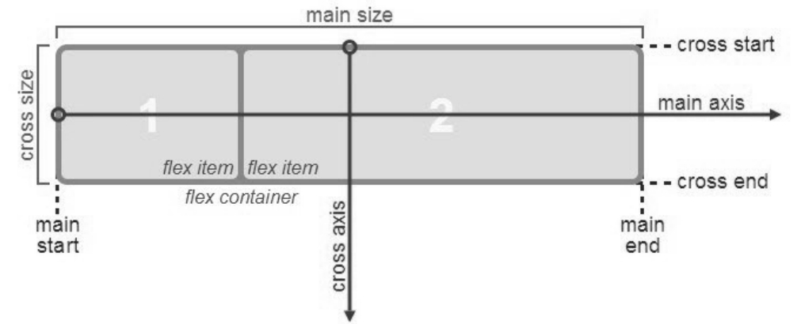
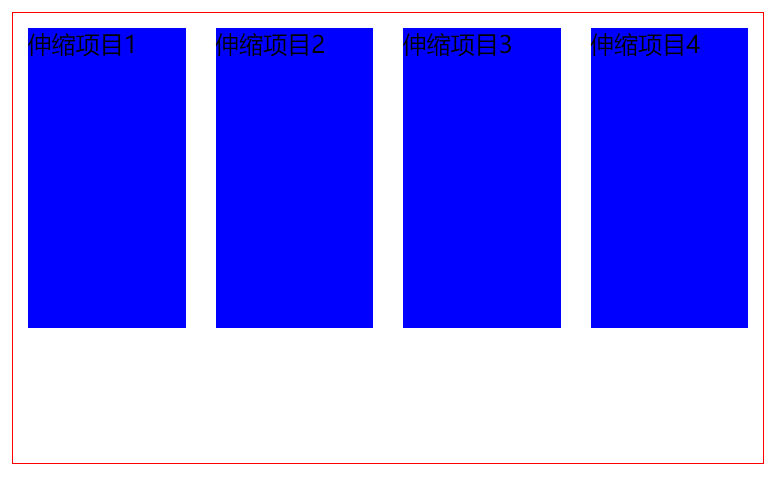
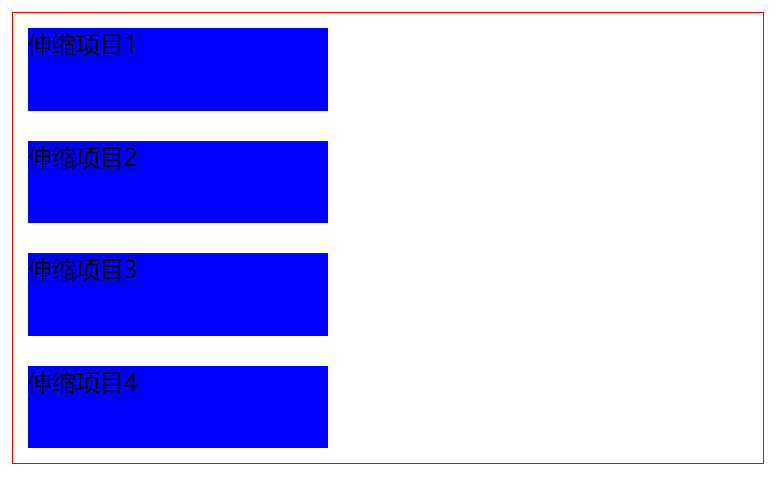
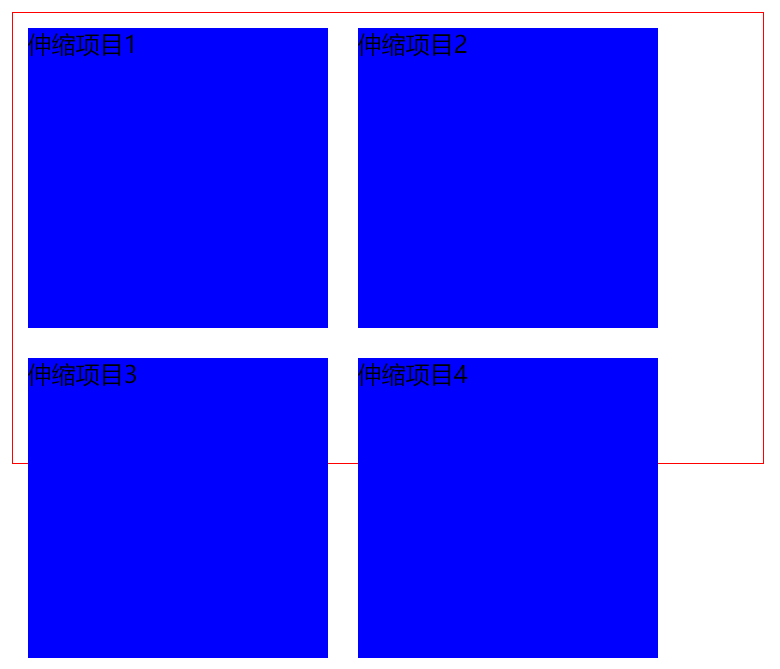
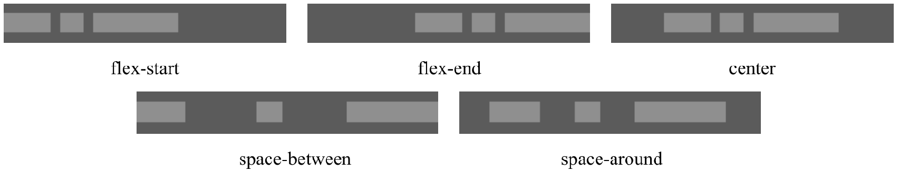
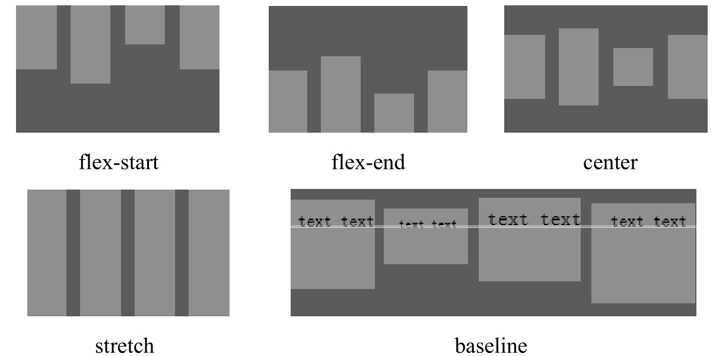
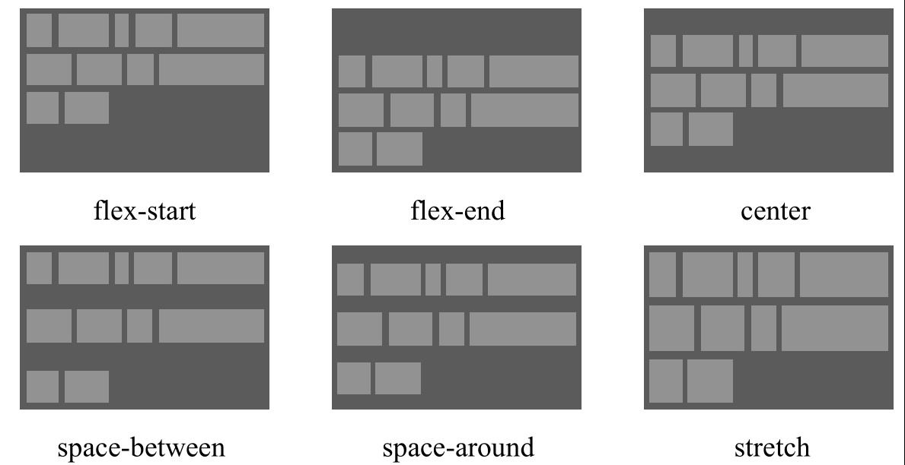
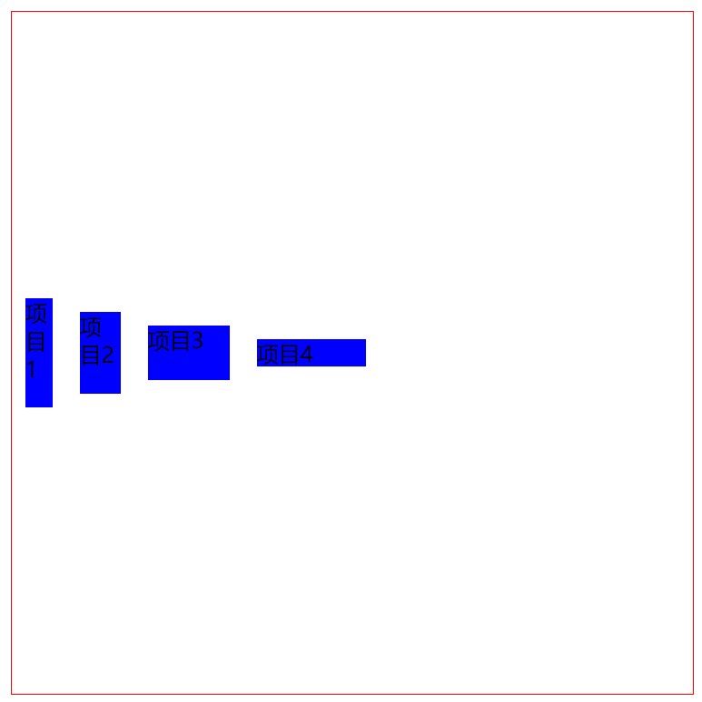
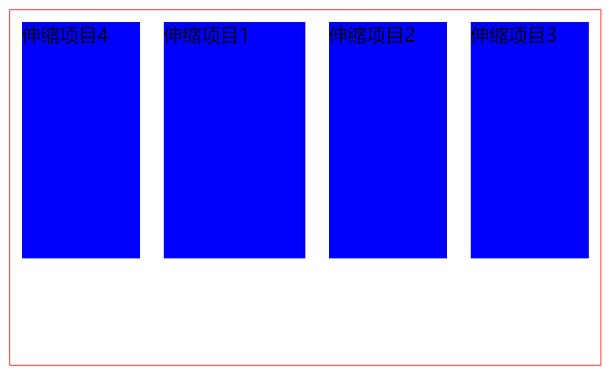

[toc]

### 1. 认识 Flexbox 系统

常规布局是基于块和文本流方向，而 `Flex`布局是基于 `flex-flow` 流。如下图所示是 W3C 规范对 `Flex` 布局的解释。



伸缩项目是沿着主轴（main axis），从主轴起点（main-start）到主轴终点（main-end），或者沿着侧轴（cross axis），从侧轴起点（cross-start）到侧轴终点（cross-end）排列。

+ 主轴：伸缩容器的主轴，伸缩项目主要沿着这条轴进行排列布局。注意，它不一定是水平的，这主要取决于 `justify-content` 属性设置。　

+ 主轴起点和主轴终点：伸缩项目放置在伸缩容器内，从主轴起点向主轴终点方向。　

+ 主轴尺寸（main size）：伸缩项目在主轴方向的宽度或高度就是主轴的尺寸。伸缩项目主要的大小属性要么是宽度，要么是高度，由哪一个对着主轴方向决定。　

+ 侧轴：垂直于主轴的轴称为侧轴。它的方向主要取决于主轴方向。　

+ 侧轴起点和侧轴终点：伸缩行的配置从容器的侧轴起点边开始，往侧轴终点边结束。　

+ 侧轴尺寸（cross size）：伸缩项目在侧轴方向的宽度或高度就是项目的侧轴长度，伸缩项目的侧轴长度属性是 `width` 或 `height` 属性，由哪一个对着侧轴方向决定。

### 2. 启动伸缩盒

通过设置元素的 `display` 属性为 `flex` 或 `inline-flex` 可以定义一个伸缩容器。设置为 `flex` 的容器被渲染为一个块级元素，而设置为 `inline-flex` 的容器则被渲染为一个行内元素。具体语法如下：

```css
display: flex | inline-flex;
```

属性值决定容器是行内显示还是块显示，它的所有子元素将变成flex文档流，被称为伸缩项目。

此时，CSS 的 `columns` 属性在伸缩容器上没有效果，同时 `float`、`clear` 和 `vertical-align` 属性在伸缩项目上也没有效果。

**示例代码：**

```html
<!doctype html>
<html> 
<head>
<meta charset="utf-8">
<title></title>
<style type="text/css">
.flex-container {
    display: -webkit-flex;
    display: flex;
    width: 500px;
    height: 300px;
    border: solid 1px red;
}
.flex-item {
    background-color: blue;
    width: 200px;
    height: 200px;
    margin: 10px;
}
</style>
</head>
<body>
<div class="flex-container">
    <div class="flex-item">伸缩项目1</div>
    <div class="flex-item">伸缩项目2</div>
    <div class="flex-item">伸缩项目3</div>
    <div class="flex-item">伸缩项目4</div>
</div>
</body>
</html> 
```

运行效果：



### 3. 设置主轴方向

使用 `flex-direction` 属性可以定义主轴方向，它适用于伸缩容器。具体语法如下：

```css
flex-direction: row | row-reverse | column | column-reverse
```

取值说明如下。　

+ `row`：主轴与行内轴方向作为默认的书写模式，即横向从左到右排列（左对齐）。　

+ `row-reverse`：对齐方式与 `row` 相反。　

+ `column`：主轴与块轴方向作为默认的书写模式，即纵向从上往下排列（顶对齐）。　

+ `column-reverse`：对齐方式与 `column` 相反。

**示例代码：**

```html
<!doctype html>
<html>
<head>
<meta charset="utf-8">
<title></title>
<style type="text/css">
.flex-container {
    display: -webkit-flex;
    display: flex;
    -webkit-flex-direction: column;
    flex-direction: column;
    width: 500px;
    height: 300px;
    border: solid 1px red;
}
.flex-item {
    background-color: blue;
    width: 200px;
    height: 200px;
    margin: 10px;
}
</style> 
</head>
<body>
<div class="flex-container">
    <div class="flex-item">伸缩项目1</div>
    <div class="flex-item">伸缩项目2</div>
    <div class="flex-item">伸缩项目3</div>
    <div class="flex-item">伸缩项目4</div>
</div>
</body>
</html> 
```

运行效果如下：



### 4. 设置行数

`flex-wrap` 定义伸缩容器是单行还是多行显示伸缩项目，侧轴的方向决定了新行堆放的方向。具体语法格式如下：

```css
flex-wrap: nowrap | wrap | wrap-reverse
```

取值说明如下。　

+ `nowrap`：`flex`容器为单行。该情况下 `flex` 子项可能会溢出容器。　

+ `wrap`：`flex` 容器为多行。该情况下 `flex` 子项溢出的部分会被放置到新行，子项内部会发生断行。　

+ `wrap-reverse`：反转 `wrap` 排列。

> 提示：`flex-flow` 属性是 `flex-direction` 和 `flex-wrap` 属性的复合属性，适用于伸缩容器。该属性可以同时定义伸缩容器的主轴和侧轴。其默认值为 `row nowrap`。具体语法如下：
>
> ```css
> flex-flow: <'flex-direction'> || <'flex-wrap'>
> ```
>
> 取值说明如下。　
>
> + `<'flex-direction'>`：定义弹性盒子元素的排列方向。　
>
> + `<'flex-wrap'>`：控制 `flex` 容器是单行或者多行。

**示例代码：**

```html
<!doctype html>
<html>
<head>
<meta charset="utf-8">
<title></title>
<style type="text/css">
.flex-container {
    display: -webkit-flex;
    display: flex;
    -webkit-flex-wrap: wrap;
    flex-wrap: wrap;
    width: 500px;
    height: 300px;
    border: solid 1px red;
}
.flex-item {
    background-color: blue;
    width: 200px;
    height: 200px;
    margin: 10px;
}


</style>
</head> 
<body>
<div class="flex-container">
    <div class="flex-item">伸缩项目1</div>
    <div class="flex-item">伸缩项目2</div>
    <div class="flex-item">伸缩项目3</div>
    <div class="flex-item">伸缩项目4</div>
</div>
</body>
</html> 
```

运行效果如下：



### 5. 设置对齐方式

1. 主轴对齐
    `justify-content` 定义伸缩项目沿着主轴线的对齐方式，该属性适用于伸缩容器。具体语法如下：

  ```css
  justify-content: flex-start | flex-end | center | space-between | space-around
  ```

  取值说明如下。　

  + `flex-start`：默认值，伸缩项目向一行的起始位置靠齐。　

  + `flex-end`：伸缩项目向一行的结束位置靠齐。　

  + `center`：伸缩项目向一行的中间位置靠齐。　

  + `space-between`：伸缩项目会平均地分布在行里。第一个伸缩项目在一行中的开始位置，最后一个伸缩项目在一行中的终点位置。　

  + `space-around`：伸缩项目会平均地分布在行里，两端保留一半的空间。

  效果如下图：

  

2. 侧轴对齐

   `align-items` 定义伸缩项目在侧轴上的对齐方式，该属性适用于伸缩容器。具体语法如下：

   ```css
   align-items: flex-start | flex-end | center | baseline | stretch
   ```

   取值说明如下。　

   + `flex-start`：伸缩项目在侧轴起点边的外边距紧靠住该行在侧轴起始的边。　

   + `flex-end`：伸缩项目在侧轴终点边的外边距靠住该行在侧轴终点的边。　

   + `center`：伸缩项目的外边距盒在该行的侧轴上居中放置。　

   + `baseline`：伸缩项目根据它们的基线对齐。　

   + `stretch`：默认值，伸缩项目拉伸填充整个伸缩容器。此值会使项目的外边距盒的尺寸在遵照 `min/max-width/height` 属性的限制下尽可能接近所在行的尺寸。
   
   效果如下图：
   
   

3. 伸缩行对齐

   `align-content` 定义伸缩行在伸缩容器里的对齐方式，该属性适用于伸缩容器。类似于伸缩项目在主轴上使用 `justify-content` 属性，但本属性在只有一行的伸缩容器上没有效果。具体语法如下：

   ```css
   align-content: flex-start | flex-end | center | space-between | space-around | stretch
   ```

   取值说明如下。　

   + `flex-start`：各行向伸缩容器的起点位置堆叠。　

   + `flex-end`：各行向伸缩容器的结束位置堆叠。　

   + `center`：各行向伸缩容器的中间位置堆叠。　

   + `space-between`：各行在伸缩容器中平均分布。　

   + `space-around`：各行在伸缩容器中平均分布，在两边各有一半的空间。　

   + `stretch`：默认值，各行将会伸展，以占用剩余的空间。

   效果如下图：

   

**示例代码：**

```html
<!doctype html>
<html>
<head>
<meta charset="utf-8">
<title></title>
<style type="text/css">
.flex-container { 
    display: -webkit-flex;
    display: flex;
    -webkit-flex-wrap: wrap;
    flex-wrap: wrap;
    -webkit-align-items:  center  ;
    align-items:   center  ;

    width: 500px;
    height: 500px;
    border: solid 1px red;
}
.flex-item {
    background-color: blue;
    margin: 10px;
    overflow:hidden;
}


</style>
</head>
<body>
<div class="flex-container">
    <div class="flex-item" style="width:20px; height:80px;">项目1</div>
    <div class="flex-item" style="width:30px; height:60px;">项目2</div>
    <div class="flex-item" style="width:60px; height:40px;">项目3</div>
    <div class="flex-item" style="width:80px; height:20px;">项目4</div>
</div>
</body>
</html> 
```

运行效果如下：



### 6. 设置伸缩项目

伸缩项目都有一个主轴长度（Main Size）和一个侧轴长度（Cross Size）。主轴长度是伸缩项目在主轴上的尺寸，侧轴长度是伸缩项目在侧轴上的尺寸。一个伸缩项目的宽或高取决于伸缩容器的轴，可能就是它的主轴长度或侧轴长度。下面属性适用于伸缩项目，可以调整伸缩项目的行为。

1. 显示位置

   `order` 属性可以控制伸缩项目在伸缩容器中的显示顺序，具体语法如下：

   ```css
   order: <integer>
   ```

   其中 `<integer>` 用整数值来定义排列顺序，数值小的排在前面。可以为负值。

2. 扩展空间

   `flex-grow` 可以定义伸缩项目的扩展能力，决定伸缩容器剩余空间按比例应扩展多少空间。具体语法如下：

   ```css
   flex-grow: <number>
   ```

   其中 `<number>` 用数值来定义扩展比率。不允许为负值，默认值为0。

3. 收缩空间

   `flex-shrink` 可以定义伸缩项目收缩的能力，与 `flex-grow` 功能相反。具体语法如下：

   ```css
   flex-shrink: <number>
   ```

   其中 `<number>` 用数值来定义收缩比率。不允许为负值，默认值为 1。

4. 伸缩比率

   `flex-basis` 可以设置伸缩基准值，剩余的空间按比率进行伸缩。具体语法如下：

   ```css
   flex-basis: <length> | <percentage> | auto | content
   ```

   取值说明如下。　

   + `<length>`：用长度值来定义宽度。不允许为负值。　

   + `<percentage>`：用百分比来定义宽度。不允许为负值。　

   + `auto`：无特定宽度值，取决于其他属性值。　

   + `content`：基于内容自动计算宽度。

   > 提示：`flex` 是 `flex-grow`、`flex-shrink` 和 `flex-basis` 3 个属性的复合属性，该属性适用于伸缩项目。其中第 2 个和第 3 个参数（ `flex-shrink` 和 `flex-basis`）是可选参数。默认值为 “0 1 auto”。具体语法如下：
   >
   > ```css
   > flex: none | [<'flex-grow'> <'flex-shrink'> ?  || <'flex-basis'>]
   > ```

5. 对齐方式

   `align-self` 用来在单独的伸缩项目上覆写默认的对齐方式。具体语法如下：

   ```css
   align-self: auto | flex-start | flex-end | center | baseline | stretch
   ```

   属性值与 `align-items` 的属性值相同。

**示例代码：**

```html
<!doctype html>
<html>
<head>
<meta charset="utf-8">
<title></title>
<style type="text/css">
.flex-container {
    display: -webkit-flex;
    display: flex;
    width: 500px;
    height: 300px;
    border: solid 1px red;
}
.flex-item {
    background-color: blue;
    width: 100px;
    height: 200px;
    margin: 10px;
}
.flex-item:nth-child(0){
    -webkit-order: 4;
    order: 4;   
}
.flex-item:nth-child(1){
    -webkit-order: 1;
	-webkit-flex-grow: 2;
    order: 1;
	flex-grow: 2;
}
.flex-item:nth-child(2){
    -webkit-order: 2;
    order: 2;   
} 
.flex-item:nth-child(3){
    -webkit-order: 3;
    order: 3;   
}
</style>
</head>
<body>
<div class="flex-container">
    <div class="flex-item">伸缩项目1</div>
    <div class="flex-item">伸缩项目2</div>
    <div class="flex-item">伸缩项目3</div>
    <div class="flex-item">伸缩项目4</div>
</div>
</body>
</html> 
```

运行效果如下：


